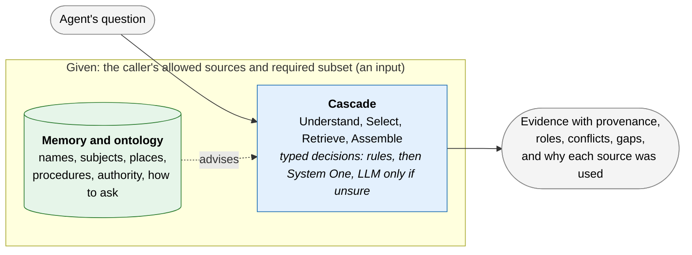
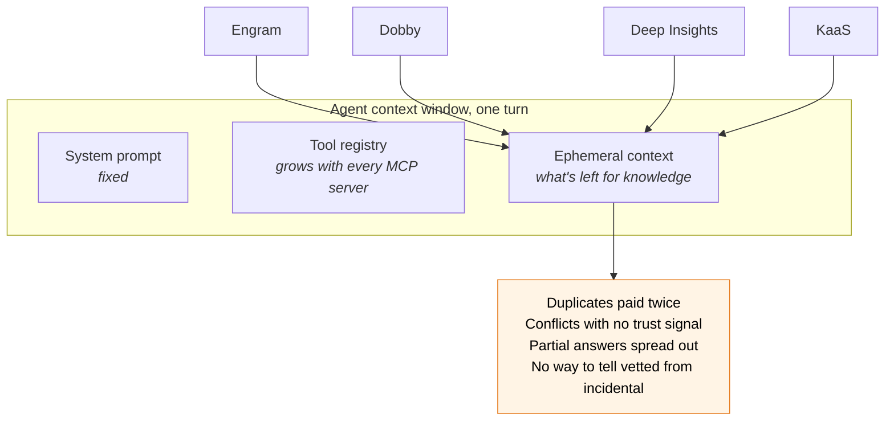
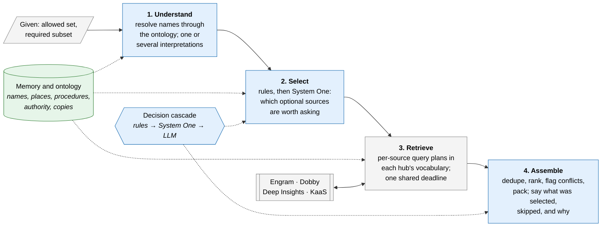
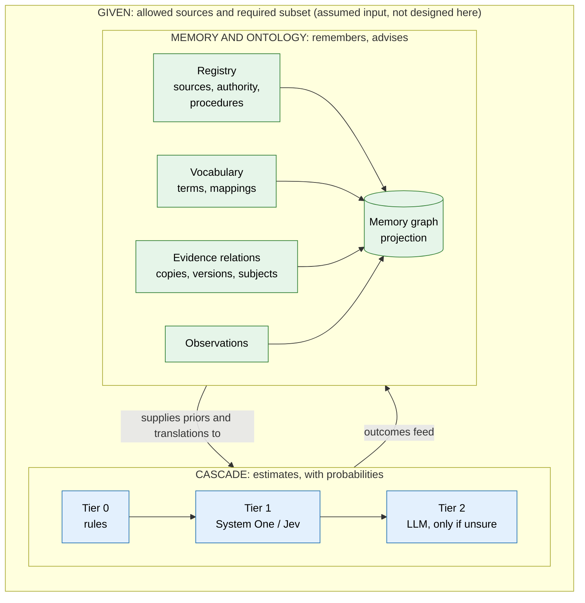
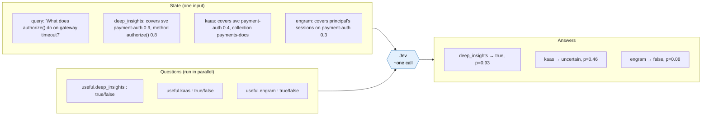
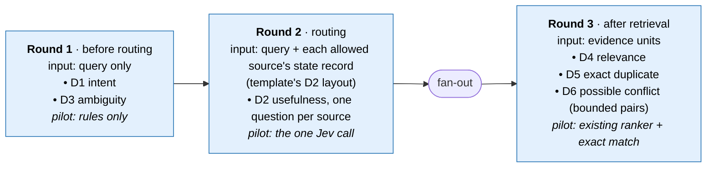
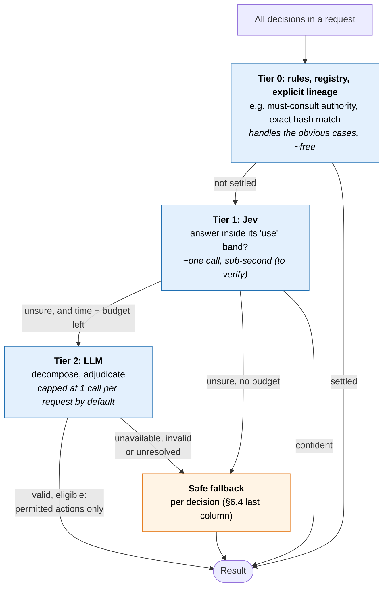
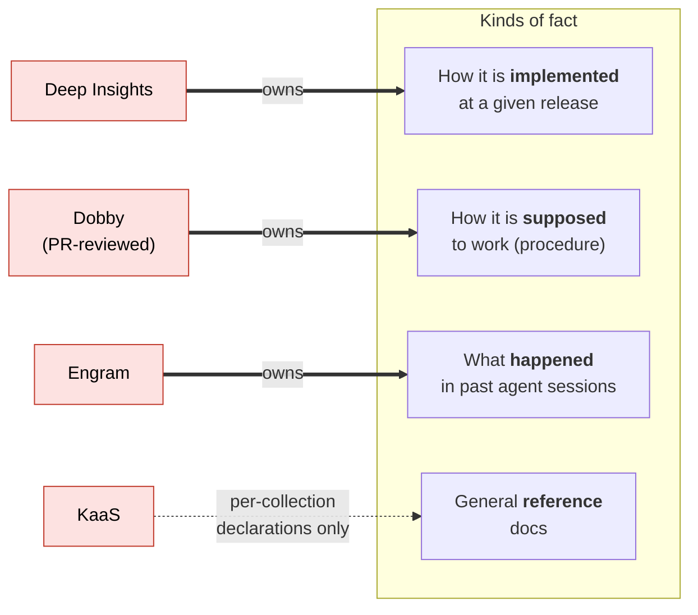
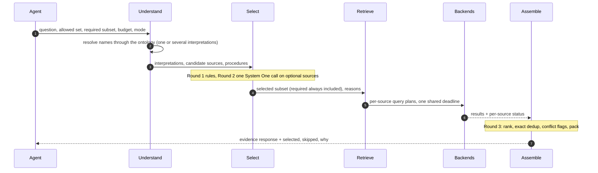

# Sanctum intelligence layer — architectural proposal

[Overview and reading guide](README.md) · [Section map](section-map.md)

> Status: proposed research design, version v5.3.1. Scope: routing intelligence. Policy and access control are assumed inputs, not designed here ([§5](hld.md#section-5)). Lab work is experimental.

This proposal expands the engineering team's initial Sanctum proposal with evidence routing inside a given allowed set of sources, a System One decision interface, and governed memory about knowledge sources. It is a research design for discussion. The original team proposal has not been supplied as part of this restructuring; compatibility with it remains open, rather than an assumed agreement.

**Review focus:** the routing stages, the memory and ontology, evidence and fact-kind authority semantics, failure honesty, and the questions in §10. The lab investigates the design's hypotheses; its implementation does not establish production readiness.

## Memory in the overall architecture

Sanctum memory connects source names, canonical subjects, storage locations, procedures, and evidence relationships. A name identifying a service, a document discussing that service, and a repository containing its material have different meanings. Only reviewed identity mappings establish identity. Memory advises routing within the given allowed set and remains separate from Engram's agent memory.

The complete [memory design](memory-design.md) owns ontology, resolution, procedures, governance, releases, and the improvement loop. [Contracts and scenarios](contracts-and-scenarios.md) owns wire details and the complete behavioral examples. The lab owns the hypotheses and evaluation protocol.

---

<a id="section-1"></a>

## 1. Summary

**What Sanctum is today.** One MCP endpoint between agent harnesses (inner and outer loop) and several knowledge backends: Engram (agent memory), Dobby (SME-reviewed domain skills), Deep Insights (code and repo knowledge), KaaS (RAG over documents). Today it fans a question out and returns what comes back.

**What we want it to become.** *An evidence router: inside the sources a caller is allowed to use, it picks version-aware evidence, fits it into the caller's token budget, and explains what it selected and what it left out.*

**Two pillars inside a given boundary:**



- **The allowed set is given.** Which sources a caller may use, and which of them are required, are inputs. The router never widens either; access control is assumed, not designed here ([§5](hld.md#section-5)).
- **The cascade** answers small routing questions with probabilities, inside the allowed set. Cheap tier first, LLM only when unsure.
- **Memory and ontology** are Sanctum's own notebook *about sources*, not about content: where knowledge lives, what each source calls things (the meta-taxonomy), who owns which kind of fact, and how to query each source. They advise the cascade, never decide what is true, and are separate from Engram.

**Research stance.** Every intelligent piece must beat a strong rules-only baseline on the same traffic before it is switched on. If rules are enough, we keep rules.

**How memory improves.** Through a closed loop: observe traffic, diagnose gaps, propose fixes, test them on a frozen benchmark, promote by risk. It learns, but it cannot change its own rules or grade its own homework ([§12.10](memory-design.md#section-12-10)).

**What is small in v0.** Memory v0 has five node types, populated only from source structure, reviewed configuration, and exact matches, for one pilot service, and ships as versioned releases. Learned priors, non-identity mappings and automatic promotion are backlog ([§11.9](memory-design.md#section-11-9)).

**The rule to remember.** A *name* for a thing, a document *about* a thing, and a *place* where material about a thing lives are three different relations. Only reviewed names establish identity ([§11.5](memory-design.md#section-11-5)).

**How we test it.** A Sanctum Lab runs Sanctum against simulated knowledge hubs built from one synthetic world, with auto-derived gold answers, before moving to a thin slice of real traffic.

---

<a id="section-2"></a>

## 2. Problem

An agent's context per turn is roughly fixed. Only the ephemeral part carries knowledge, and every connected MCP server competes for it.



| Problem | Effect on the agent |
|---|---|
| Many tool definitions | Less room for task context (to be measured per harness) |
| Same content in several sources | Same fact paid for twice in tokens |
| Conflicting content | Agent must adjudicate with no trust or version signal |
| Partial answers spread across sources | No single call is complete |
| Uneven rigor (SME-reviewed vs. open-indexed) | Agent cannot tell authoritative from incidental |
| Fan-out latency and failures | Slow or silently incomplete turns |

Re-ranking fixes **relevance**. It does not establish **validity**, remove **redundancy**, or respect **authority**. Sanctum needs all four, and must say so when it cannot deliver them.

---

<a id="section-3"></a>

## 3. Goals

### Goals

- G1. Return the smallest set of **valid** evidence from the allowed sources that supports the query, within budget, and **say when it is partial or insufficient**.
- G2. Call the fewest backends likely to be needed, **without silently omitting a required source**.
- G3. Surface conflicts and provenance explicitly.
- G4. Keep the fast path cheap. Latency is measured end to end, not a design target at this stage ([§5.1](hld.md#section-5-1)).
- G5. Explain each response (which sources were selected or skipped, and why) so routing can be evaluated against a rules baseline.
- G6. Onboard a backend through an adapter contract and a manifest, not core-path edits.

### Non-goals

- NG1. Sanctum does not decide truth. Synthesis is opt-in.
- NG2. Sanctum does not replace a backend's own retrieval or indexing.
- NG3. Sanctum does not mirror backend content.
- NG4. No model output is an authorization decision.
- NG5. The MVP is read-only; access control is an assumed input, and writes and replay are not part of this design.

---

<a id="section-4"></a>

## 4. Principles

1. **Allowed set before prediction.** The allowed set is given before any judgment; models only rank options inside it (F01).
2. **Decisions, not generations.** Every intelligent step is a typed question, and every answer can also be `unknown`, `abstained`, `unavailable`, or `invalid` (F02, F04).
3. **Each decision fails safely in its own way.** Uncertain relevance keeps a candidate. Uncertain contradiction stays unresolved. Uncertain supersession never hides evidence (F05).
4. **Memory advises, never authorizes.** The graph gives priors and explanations only (F06, F07).
5. **Versions and known invalidity are respected now.** Disputes are shown, not resolved (F11).
6. **Baseline first.** One change at a time against a strong rules baseline (F20).
7. **Library-first.** Logical components inside the existing Sanctum service until scale says otherwise.

---

<a id="section-5"></a>

## 5. Architecture

**Assumed inputs.** This design takes four things as given and does not design or validate them:

1. The router receives an **allowed set** of sources for the caller and a **required subset**, and never widens either.
2. **No model output is an authorization decision.** A model only chooses among allowed, optional candidates.
3. **Names the caller cannot see are not resolved for them** ([§12.2](memory-design.md#section-12-2)).
4. **Which providers may see which data classes is given.** Provider eligibility by data class is an input, not designed here.

Access control, identity and credentials are assumed, not designed or validated by this MVP.

<a id="section-5-1"></a>

### 5.1 The journey of one question

Every request passes through four routing stages, inside the given allowed set.



The explanation in Assemble (every source selected or skipped, with its reason, and the decisions behind it) is part of the response and is recorded per request, because it is how routing is evaluated against a baseline. Latency is measured end to end and reported, not a design target at this stage.

**Color key used throughout:** blue = cascade (typed decisions), green = memory and ontology (advises), grey = given inputs and plumbing. Red, where it remains in older diagrams, marks a given rule a model never challenges.

<a id="section-5-2"></a>

### 5.2 Two pillars inside a given boundary



These are modules inside the existing Sanctum service in the pilot, not new services.

<a id="section-5-3"></a>

### 5.3 Components

| Component | Layer | Does | Does not |
|---|---|---|---|
| Source registry | Memory | Lists backends, adapters, owners, fact-kind authority, procedures | Learn anything |
| Route planner | Cascade | Chooses a subset of the allowed sources under budget | Add sources outside the allowed set |
| Evidence assembly | Cascade | Versioned units; exact dedup; rank; flag conflicts; pack; explain selected and skipped sources | Drop a conflict witness silently |
| Decision layer | Cascade | Typed questions via rules, System One, LLM | Decide access |
| Sanctum memory | Memory | Source map, vocabulary, procedures, artifact relations and subjects, observations | Hold content, grant access, or share a store with Engram |
| Adapters | Plumbing | Translate the contract per backend; timeouts; caps | Invent missing provenance |

---

<a id="section-6"></a>

## 6. Decision layer

<a id="section-6-1"></a>

### 6.1 Why a System One model

Sanctum's decisions are small, discrete, and frequent: *is this source worth calling? is this chunk relevant? are these two passages the same?* A System One model takes a **state** plus **typed questions** (true/false, pick-one, score) and returns typed answers with probabilities in one parallel call. Jev's vendor-reported speed, cost, and schema guarantees are **claims to verify in E1**.

Two facts shape the design:

- Questions in one call see the same state and run **independently**. One cannot use another's answer (F03).
- Vendor calibration is not calibration on our traffic. We calibrate locally (F04, F05).

**Given rules and judgment rules.** The allowed set and the required subset are given inputs and are never challenged by a model. Judgment rules (usefulness, relevance, possible-conflict heuristics) are the baseline a model is evaluated against. Each decision declares its eligibility rule, the items a model may judge:

| Decision | Eligibility |
|---|---|
| D2 | The model judges every optional candidate source the rules selected; required sources are never candidates |
| D6 | The model judges only rule-produced candidate pairs the strict rule dropped; flagged pairs stay flagged |
| D4 | The model scores packed units and may reorder or fill; it never removes a rules-packed unit |

A model confined to the rules' abstentions could never correct a confident wrong judgment rule; that is why eligibility is declared per decision rather than fixed to "abstentions only".

<a id="section-6-2"></a>

### 6.2 What a single Jev call looks like



The wire protocol, question mapping and handshake rules for this call (model pinning, batching, deadlines, validation, calibration binding, eligibility) are specified in [System One providers and the Jev handshake](system-one-providers.md).

<a id="section-6-3"></a>

### 6.3 Decisions run in rounds

Because questions in one call cannot see each other's answers, anything that depends on an earlier answer goes in a later round.



Each D2 template names its state layout. A **descriptor-only** layout (the query plus each allowed source's pinned descriptor) and an **ontology-enriched** layout (the same plus permitted, provenance-backed memory metadata about the query's resolved names for that source, with unknown coverage preserved as unknown) are distinct variants with separate calibrations; graph neighbourhoods reach the model only through the enriched layout ([Providers §14](system-one-providers.md#14-template-and-state-layout-registry)).

Round 3 System One decisions (D6 on rule-produced conflict pairs, D4 relevance that may reorder but never drop a rules-packed unit) are specified in [Providers §12](system-one-providers.md#12-round-3-decisions-d6-conflict-d4-relevance).

<a id="section-6-4"></a>

### 6.4 Decision catalog

| ID | Decision | What the probability means | Pilot | If uncertain |
|---|---|---|---|---|
| D1 | Intent (`why`, `when`, `what`, `how`, `related`, `verify`), multi-label | P(intent applies) per label | Rules; Jev challenger | Balanced `general` weights |
| D2 | **Expected source usefulness** | P(source returns necessary supporting evidence \| query, allowed source) | **First Jev experiment** | Keep the source |
| D3 | Ambiguity | P(query needs clarification or decomposition), query only | Rules; Jev challenger | Escalate within budget, else `partial` |
| D4 | Relevance | P(unit supports an answer to the query); score variants diagnostic only | Existing ranker, then System One support judgment as a successive stage: the ranker orders candidates, System One may reorder or fill within the packed set | Rules order and rules-packed set |
| D5 | Duplicate | Exact: same hash + version. Semantic: proposal only | Exact only | Keep both |
| D6 | Possible conflict | P(two units assert a material typed relation about the same subject and attribute) | Bounded flag on rule-produced pairs | Rule-flagged pairs stay `possible_conflict`; candidate pairs stay unflagged |
| D7 | Claim support | supported / contradicted / insufficient | Later | `insufficient` |
| D9 | Supersession | Explicit version lineage first | Lineage only | Never hide evidence |

<a id="section-6-5"></a>

### 6.5 Escalation: a funnel, not a ladder everyone climbs



- A valid, eligible Tier 2 judgment may affect only the decision's permitted actions; an unavailable, invalid or unresolved Tier 2 result uses that decision's baseline-preserving default, like Tier 1.
- "Use" bands are set per decision and per error cost, fitted on one data split and tested on another.
- A random sample of confident Tier 1 answers is audited to catch confident mistakes.
- The escalation budget is both a call cap and a time cap tied to the request deadline.
- Tier 1 is a provider strategy (hosted Jev, open models, or the local stand-in) behind one interface; which provider may see which state, and what it can never remove, is in [System One providers and the Jev handshake](system-one-providers.md).

<a id="section-6-6"></a>

### 6.6 Decision result contract

```text
DecisionResult
  status        = answered | abstained | unavailable | invalid
  value?        = bool | choice | score
  target        = what the probability estimates (per decision type)
  distribution? = provider distribution
  calibration?  = {map_version, population, fitted_at, valid_for_slice}
  disposition   = use | preserve_candidate | escalate | abstain
  provider, model_version, policy_version, latency_ms, cost
```

<a id="section-6-7"></a>

### 6.7 Calibration

- Labels record origin (human, task outcome, LLM agreement) and which decision they label. LLM agreement is a weak label.
- Train, calibrate, and test splits are grouped by project, task family, and time.
- Report discrimination, class-specific errors, Brier/log loss, and risk-vs-coverage, not just ECE.
- Model, rubric, options, data slice, and calibration map are versioned together.
- Question templates and state layouts are named, versioned entries bound into each calibration ([Providers §14](system-one-providers.md#14-template-and-state-layout-registry)).
- **Activation.** Each decision names its no-model control: D2 a source-specific prior; D4 a predeclared source or role prior, or the existing ranker; D6 a predeclared source-pair or relation prior. A model is activated only when the decision's named metric improves over both its rules baseline and its no-model control within the unchanged error tolerance, and the metric must be able to observe the effect (D4: ordering or useful additions; D6: eligible rule-missed relations).

---

<a id="section-7"></a>

## 7. Evidence and authority

<a id="section-7-1"></a>

### 7.1 Evidence unit

```text
EvidenceUnit
  evidence_id, source_id, artifact_id, native_ref, span/offsets, content_hash, text
  kind (code|doc|skill|memory|ticket)
  role (implemented_behavior | intended_procedure | observed_event | reference | session_history)
  applicability                                   # one field
    version?, branch?, environment?, period?      # what the unit applies to
    applicability_status = known | partial | unknown
  subjects[]                                      # attested subject bindings (memory §11.10)
  authority_assertion_ref?, exact_token_count, tokenizer_id
```

`applicability` says which version, branch or environment, and which period, the unit applies to; it is what [§7.5](hld.md#section-7-5) uses to keep the applicable version for a query (including an `as_of` question) and to keep a newer but inapplicable artifact from replacing it. Adapters fill what the source actually exposes; anything missing stays empty and `applicability_status` says so. Sanctum never fabricates version context.

<a id="section-7-2"></a>

### 7.2 Authority is a declaration about a kind of fact



| Source | Authoritative for | Not authoritative for |
|---|---|---|
| Deep Insights | Implemented behavior at a revision | Intended policy |
| Dobby | Payments procedures and standards | Current deployed config |
| Engram | What happened in prior agent sessions | Facts about systems |
| KaaS | Nothing by default; per-collection declarations allowed | – |

When "implemented" and "intended" disagree, that is usually a real finding, not noise. Sanctum shows both with their roles.

<a id="section-7-3"></a>

### 7.3 Ranking

- **Filter first:** requested version or as-of date, known invalidity (access is already applied by the given allowed set).
- **Rank** by one common relevance score (existing cross-encoder in the pilot).
- **Authority** is a constraint or tie-break, not a number blended into relevance.
- **Routing prior is not reused** in ranking (avoids rewarding past exposure twice).

<a id="section-7-4"></a>

### 7.4 Packing into the budget

Packing reserves room for both witnesses of every flagged conflict, then fills the remaining budget in rank order with whole units, counting tokens on the serialized response with a declared tokenizer.

**Status defaults.** Status is judged per interpretation against the requested facts: `sufficient` when every requested fact has obtainable evidence in the response; `partial` when some do and others are missing, denied, failed or did not fit, with the specific reasons; `insufficient` only when nothing obtainable remains for the requested facts. A missing must-consult source therefore gives `partial` with `required_source_unavailable` while other requested facts are covered, never `sufficient`.

**Conflicts survive packing.** A flagged conflict is a response object, not a packing side effect. When both witnesses cannot fit, the conflict record is still returned, the witness that does not fit is listed in `omitted` with reason `conflict_witness_omitted`, and the interpretation is at most `partial`. A witness never enters through ordinary filling with its flag dropped, and a D6 promotion never displaces rules-packed evidence.

<a id="section-7-5"></a>

### 7.5 Version applicability and exact copies

`VERSION_OF` establishes **lineage**, not **applicability** (M09). Before any version is dropped from the working set:

- The evidence unit must carry **branch, environment, and effective time**.
- The query's time and environment must be known (explicit `as_of`, or the default "current production").
- A newer version replaces an older one **only when explicit applicability establishes supersession for this query**. An experimental branch never replaces production; a historical question keeps the historical version.
- Uncertain alternatives and conflict witnesses are **kept**, not hidden.

**Exact copies** may share one text payload, but every copy keeps its own source, version, and authority attribution. A copy never transfers authority from one source to another.

Automatic *ingestion* of lineage and copies is fine. Automatic *hiding* requires the stronger applicability rule.


---

<a id="section-8"></a>

## 8. Read path



---

<a id="section-9"></a>

## 9. Anticipated questions

**"Isn't this too big for where we are?"**
The HLD describes the target shape so decisions stay consistent. The pilot is small: rules-first, one Jev call, graph v0 on existing storage, read-only, three backends, and access control taken as given. Everything else waits on an experiment.

**"Why a graph and not a table?"**
The router's questions are multi-hop ([Ex. 1](contracts-and-scenarios.md#example-1), 4, 5). Physically, v0 may well be tables; E2b decides.

**"Is this Engram?"**
No. Engram is one of the sources. Sanctum memory is the router's own notebook about the sources, in a separate store ([§11.2](memory-design.md#section-11-2)).

**"How do we test this before real backends are ready?"**
The Sanctum Lab: simulated hubs built from one synthetic world, auto-derived gold answers, the ablation ladder as runnable configs, then a thin real slice.

**"Do we need an enterprise ontology?"**
No. A thin core owned by Sanctum, source vocabularies left untouched, and reviewed names and places linking them ([§11.4](memory-design.md#section-11-4), [§11.5](memory-design.md#section-11-5)).

**"Can the memory improve itself?"**
Yes, through a gated loop: it proposes, tests on a frozen benchmark, and owners approve anything risky. It cannot change authority, access, or its own evaluation set ([§12.10](memory-design.md#section-12-10), [Ex. 12](contracts-and-scenarios.md#example-12)).

**"Why not just use an LLM for routing?"**
Too slow and costly on every request. It is used once, when the cheap tier is unsure ([Ex. 6](contracts-and-scenarios.md#example-6)), and E4 checks that it's worth it.

**"Why not make everything scoped and skip the intelligence?"**
Scoped mode is supported and is where rules do most of the work ([Ex. 1](contracts-and-scenarios.md#example-1)). Inner-loop questions are often open natural language ([Ex. 6](contracts-and-scenarios.md#example-6)), so we test whether intelligence adds value over scope-plus-rules.

**"Does Sanctum decide which source is right?"**
No. It shows both sides with roles and versions ([Ex. 3](contracts-and-scenarios.md#example-3)). Resolution goes through each source's own governance.

**"What happens when Jev is down?"**
Rules and graph priors with capped fan-out, response marked degraded ([Ex. 9](contracts-and-scenarios.md#example-9)).

---

<a id="section-10"></a>

## 10. Open decision

| # | Decision | Proposed default |
|---|---|---|
| Q4 | Cost versus completeness: how much tolerance for an extra source call versus a missed optional fact? This is the margin decision for D2. | Set per question family with the adopter |

---
