# Sanctum intelligence layer — architectural proposal

[Overview and reading guide](README.md) · [Section map](section-map.md)

> Status: proposed research design, version 5.2.1 (reorganized from v5.1). A design for proving the tenets, not a production specification; production hardening items are listed in the [hardening backlog](hardening-backlog.md). Lab work is experimental. Original section numbers are retained.

This proposal expands the engineering team's initial Sanctum proposal with policy-constrained evidence selection, a System One decision interface, and governed memory about knowledge sources. It is a research design for discussion. The original team proposal has not been supplied as part of this restructuring; compatibility with it remains Q1, rather than an assumed agreement.

**Review focus:** component boundaries, the proposed read-only pilot, evidence and authority semantics, safe fallback, and the questions in §21. The lab investigates the design's hypotheses; its implementation does not establish production readiness.

## Memory in the overall architecture

Sanctum memory connects source names, canonical subjects, storage locations, procedures, and evidence relationships. A name identifying a service, a document discussing that service, and a repository containing its material have different meanings. Only reviewed identity mappings establish identity. Memory advises routing within authorized scope and remains separate from Engram's agent memory.

The complete [memory design](memory-design.md) owns ontology, resolution, procedures, governance, releases, and the improvement loop. [Contracts and scenarios](contracts-and-scenarios.md) owns wire details and the complete behavioral examples. The spike (lab) owns the hypotheses and evaluation protocol; the execution page (lab) separates experimental work from possible adoption.

The numbered sections below retain their v5.1 identifiers. Gaps in numbering indicate material moved to a companion page, not omitted content.

---

<a id="section-0"></a>

## 0. One-page summary

**What Sanctum is today.** One MCP endpoint between agent harnesses (inner and outer loop) and several knowledge backends: Engram (agent memory), Dobby (SME-reviewed domain skills), Deep Insights (code and repo knowledge), KaaS (RAG over documents). Today it fans a question out and returns what comes back.

**What we want it to become.** *A policy-constrained evidence router: it picks authorized, version-aware evidence across sources, fits it into the caller's token budget, and explains what it selected and what it left out.*

**Three ideas, applied in this order:**

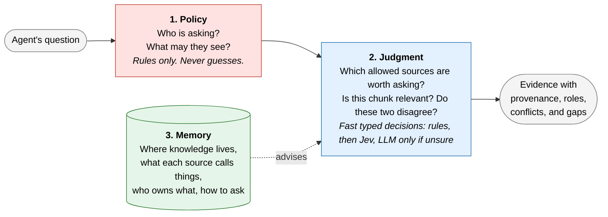

- **Policy** decides access and write rules. Deterministic. No model involved.
- **Judgment** answers small questions with probabilities, inside what policy allows. Cheap tier first, LLM only when unsure.
- **Memory** is Sanctum's own notebook *about sources*, not about content: where knowledge lives, what each source calls things (the meta-taxonomy), who owns which kind of fact, and how to query each source. It advises judgment. It never grants access and never decides what is true. It is separate from Engram.

**Research stance.** Every intelligent piece must beat a strong rules-only baseline on the same traffic before it is switched on. If rules are enough, we keep rules.

**How memory improves.** Through a closed loop: observe traffic, diagnose gaps, propose fixes, test them on a frozen benchmark, promote by risk. It learns, but it cannot change its own rules or grade its own homework ([§9.10](memory-design.md#section-9-10)).

**What is small in v0.** Memory v0 has five node types, populated only from source structure, reviewed configuration, and exact matches, for one pilot service, and ships as versioned releases. Learned priors, non-identity mappings, automatic promotion, reconciliation, and writes are backlog ([§8.9](memory-design.md#section-8-9), §18 (lab)).

**The rule to remember.** A *name* for a thing, a document *about* a thing, and a *place* where material about a thing lives are three different relations. Only reviewed names establish identity ([§8.5](memory-design.md#section-8-5)).

**How we test it.** A Sanctum Lab runs Sanctum against simulated knowledge hubs built from one synthetic world, with auto-derived gold answers, before moving to a thin slice of real traffic (§17.2 (lab)).

---

<a id="section-1"></a>

## 1. Problem

An agent's context per turn is roughly fixed. Only the ephemeral part carries knowledge, and every connected MCP server competes for it.

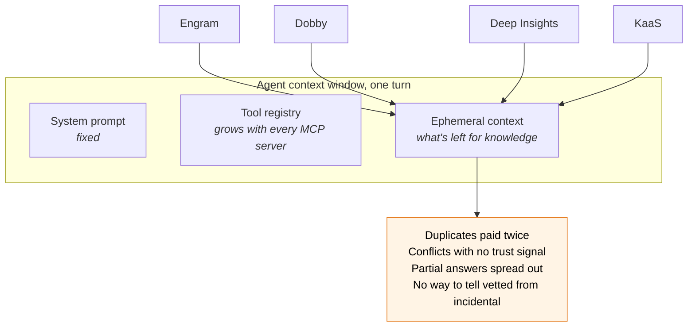

| Problem | Effect on the agent |
|---|---|
| Many tool definitions | Less room for task context (to be measured per harness) |
| Same content in several sources | Same fact paid for twice in tokens |
| Conflicting content | Agent must adjudicate with no trust or version signal |
| Partial answers spread across sources | No single call is complete |
| Uneven rigor (SME-reviewed vs. open-indexed) | Agent cannot tell authoritative from incidental |
| Fan-out latency and failures | Slow or silently incomplete turns |

Re-ranking fixes **relevance**. It does not establish **validity**, remove **redundancy**, or respect **authority**. Sanctum needs all four, and must say so when it cannot deliver them.

---

<a id="section-3"></a>

## 3. Goals and non-goals

### Goals

- G1. Return the smallest set of **authorized, valid** evidence that supports the query, within budget, and **say when it is partial or insufficient**.
- G2. Call the fewest backends likely to be needed, **without silently omitting a required source**.
- G3. Surface conflicts and provenance explicitly.
- G4. Keep the fast path cheap (≤ 300 ms Sanctum overhead in `fast` mode, measured end to end; [§14](hld.md#section-14)).
- G5. Record enough about each request to explain it and compare policies offline.
- G6. Onboard a backend through an adapter contract and a manifest, not core-path edits.

### Non-goals

- NG1. Sanctum does not decide truth. Synthesis is opt-in.
- NG2. Sanctum does not replace a backend's own retrieval or indexing.
- NG3. Sanctum never weakens a backend's write governance (e.g. Dobby's PR review).
- NG4. Sanctum does not mirror backend content.
- NG5. No model output is an authorization decision.
- NG6. The pilot is read-only.

---

<a id="section-4"></a>

## 4. Design principles

1. **Policy before prediction.** Authorized scope is computed first. Models only rank options inside it (F01).
2. **Decisions, not generations.** Every intelligent step is a typed question, and every answer can also be `unknown`, `abstained`, `unavailable`, or `invalid` (F02, F04).
3. **Each decision fails safely in its own way.** Uncertain relevance keeps a candidate. Uncertain contradiction stays unresolved. Uncertain supersession never hides evidence. Uncertain write targets cause no side effect (F05).
4. **Memory advises, never authorizes.** The graph gives priors and explanations only (F06, F07).
5. **Asynchronous reconciliation, synchronous policy and validity.** Disputes resolve later; access, versions, and known invalidity are respected now (F11).
6. **Baseline first.** One change at a time against a strong rules baseline (F20).
7. **Receipts before responses** when replay is promised (F18).
8. **Library-first.** Logical components inside the existing Sanctum service until scale says otherwise.

---

<a id="section-5"></a>

## 5. Architecture

<a id="section-5-1"></a>

### 5.1 The journey of one question

Every request passes through the same six stages. Side inputs are shown under each stage.

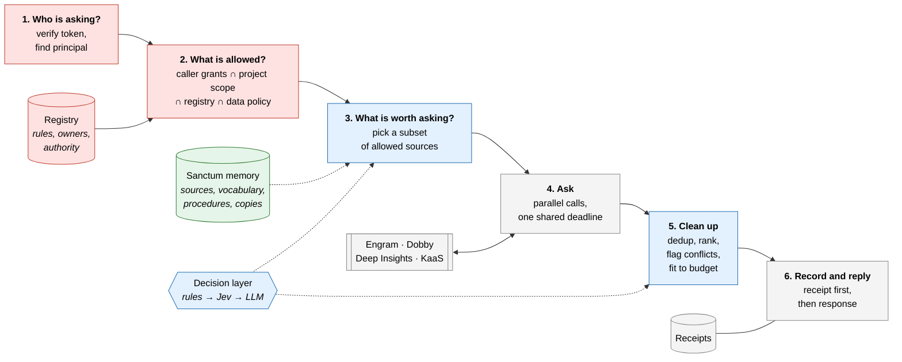

**Color key used throughout:** red = policy (never guesses), blue = judgment (typed decisions), green = memory (advises), grey = plumbing.

<a id="section-5-2"></a>

### 5.2 Three layers, three responsibilities

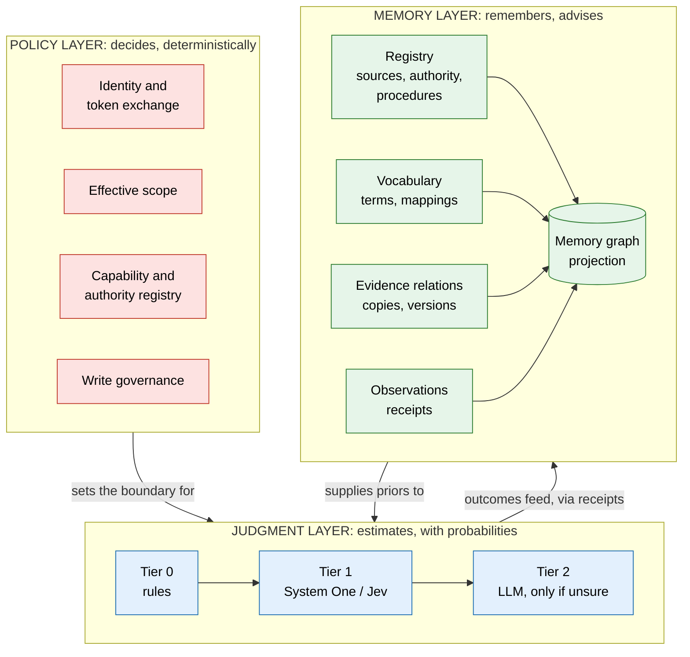

These are modules inside the existing Sanctum service in the pilot, not new services.

<a id="section-5-3"></a>

### 5.3 Components

| Component | Layer | Does | Does not |
|---|---|---|---|
| Identity and policy | Policy | Verify caller token for Sanctum's audience; derive effective scope; exchange for backend credentials | Forward the caller's token unchanged (F15) |
| Capability registry | Policy | Lists backends, adapters, owners, data classes, governance, authority | Learn anything |
| Route planner | Judgment | Chooses a subset of authorized sources under budget | Add sources outside the authorized set |
| Evidence assembly | Judgment | Versioned units; exact dedup; rank; flag conflicts; pack | Drop a conflict witness silently |
| Decision layer | Judgment | Typed questions via rules, System One, LLM | Decide access or governance |
| Sanctum memory | Memory | Source map, vocabulary, procedures, artifact relations, observations | Hold content, grant access, or share a store with Engram |
| Adapters | Plumbing | Translate the contract per backend; timeouts; caps | Invent missing provenance |
| Receipts | Plumbing | Durable record of inputs, decisions, outputs | Store full backend copies |

---

<a id="section-6"></a>

## 6. Decision layer

<a id="section-6-1"></a>

### 6.1 Why a System One model

Sanctum's decisions are small, discrete, and frequent: *is this source worth calling? is this chunk relevant? are these two passages the same?* A System One model takes a **state** plus **typed questions** (true/false, pick-one, score) and returns typed answers with probabilities in one parallel call. Jev's vendor-reported speed, cost, and schema guarantees are **claims to verify in E1**.

Two facts shape the design:

- Questions in one call see the same state and run **independently**. One cannot use another's answer (F03).
- Vendor calibration is not calibration on our traffic. We calibrate locally (F04, F05).

<a id="section-6-2"></a>

### 6.2 What a single Jev call looks like

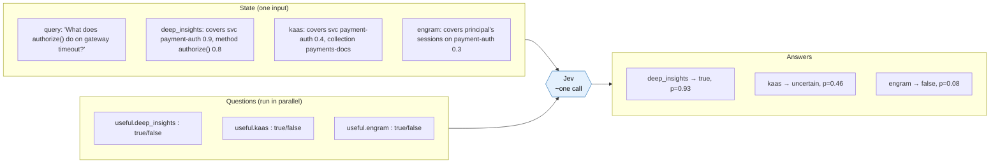

The wire protocol, question mapping and handshake rules for this call (auth, model pinning, batching, deadlines, validation, calibration binding, data classes, receipts) are specified in [System One providers and the Jev handshake](system-one-providers.md).

<a id="section-6-3"></a>

### 6.3 Decisions run in rounds

Because questions in one call cannot see each other's answers, anything that depends on an earlier answer goes in a later round.

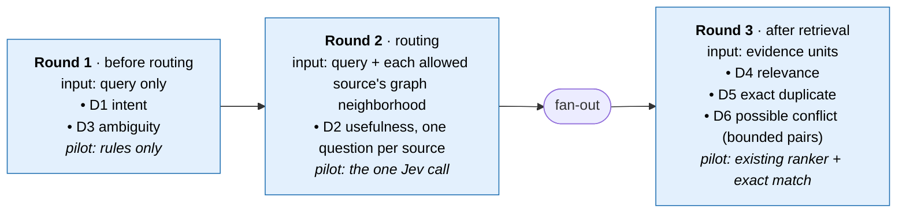

Round 3 System One decisions (D6 on rule-produced conflict pairs, D4 relevance that may reorder but never drop a rules-packed unit) are specified in [System One providers §12](system-one-providers.md#12-round-3-decisions-d6-conflict-d4-relevance).

<a id="section-6-4"></a>

### 6.4 Decision catalog

| ID | Decision | What the probability means | Pilot | If uncertain |
|---|---|---|---|---|
| D1 | Intent (`why`, `when`, `what`, `how`, `related`, `verify`), multi-label | P(intent applies) per label | Rules; Jev challenger | Balanced `general` weights |
| D2 | **Expected source usefulness** | P(source returns necessary supporting evidence \| query, authorized source) | **First Jev experiment** | Keep the source |
| D3 | Ambiguity | P(query needs clarification or decomposition), query only | Rules; Jev challenger | Escalate within budget, else `partial` |
| D4 | Relevance | Relevance score per unit | Existing cross-encoder | Keep, lower rank |
| D5 | Duplicate | Exact: same hash + version. Semantic: proposal only | Exact only | Keep both |
| D6 | Possible conflict | P(two units assert a material typed relation about the same subject and attribute) | Bounded flag on rule-produced pairs | Rule-flagged pairs stay `possible_conflict`; candidate pairs stay unflagged |
| D7 | Claim support | supported / contradicted / insufficient | Later | `insufficient` |
| D8 | Write target | Proposes among **registry-permitted** destinations | Later | No side effect |
| D9 | Supersession | Explicit version lineage first | Lineage only | Never hide evidence |

<a id="section-6-5"></a>

### 6.5 Escalation: a funnel, not a ladder everyone climbs

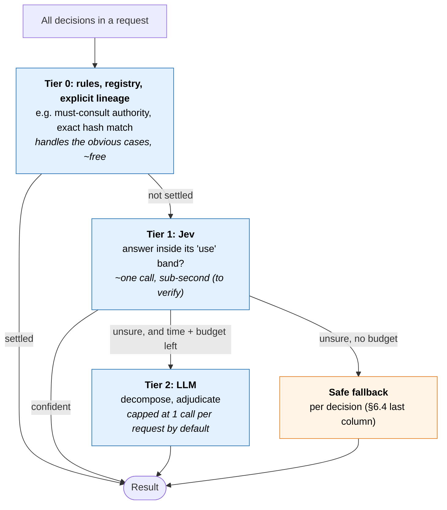

- "Use" bands are set per decision and per error cost, fitted on one data split and tested on another.
- A random sample of confident Tier 1 answers is audited to catch confident mistakes.
- The escalation budget is both a call cap and a time cap tied to the request deadline.
- Tier 1 is a provider strategy (hosted Jev, open models, or the local stand-in) behind one interface; which provider may see which state, and what it can never remove, is in [System One providers and the Jev handshake](system-one-providers.md).

<a id="section-6-6"></a>

### 6.6 Decision result contract

```text
DecisionResult
  status        = answered | abstained | unavailable | invalid
  value?        = bool | choice | score
  target        = what the probability estimates (per decision type)
  distribution? = provider distribution
  calibration?  = {map_version, population, fitted_at, valid_for_slice}
  disposition   = use | preserve_candidate | escalate | abstain
  provider, model_version, policy_version, latency_ms, cost
```

<a id="section-6-7"></a>

### 6.7 Calibration

- Labels record origin (human, task outcome, LLM agreement) and which decision they label. LLM agreement is a weak label.
- Train, calibrate, and test splits are grouped by project, task family, and time.
- Report discrimination, class-specific errors, Brier/log loss, and risk-vs-coverage, not just ECE.
- Model, rubric, options, data slice, and calibration map are versioned together.
- Question templates and state layouts are named, versioned entries bound into each calibration ([System One providers §14](system-one-providers.md#14-template-and-state-layout-registry)).

---

<a id="section-7"></a>

## 7. Evidence, authority, and time

<a id="section-7-1"></a>

### 7.1 Evidence unit

```text
EvidenceUnit
  evidence_id, source_id, artifact_id, source_version
  native_ref, span/offsets, content_hash, text, kind (code|doc|skill|memory|ticket)
  role (implemented_behavior | intended_procedure | observed_event | reference | session_history)
  applicability                                   # v5.1: required by §7.5
    branch?, environment?, effective_from?, effective_to?
    applicability_status = known | partial | unknown
  occurred_at?, recorded_at?, retrieved_at
  classification, authority_assertion_ref?
  subjects[]                                      # v5.2.1: attested subject bindings (memory §8.10)
  exact_token_count, tokenizer_id
```

Four times are kept apart: when it happened (`occurred_at`), when it is valid (`applicability.effective_from/to`), when it was recorded (`recorded_at`), when Sanctum fetched it (`retrieved_at`) (F11).

`applicability` carries the branch, environment and effective-time context that [§7.5](hld.md#section-7-5) needs before any version can be removed. Adapters fill what the source actually exposes; anything missing stays empty and `applicability_status` says so. Sanctum never fabricates version context.

<a id="section-7-2"></a>

### 7.2 Authority is a declaration about a kind of fact

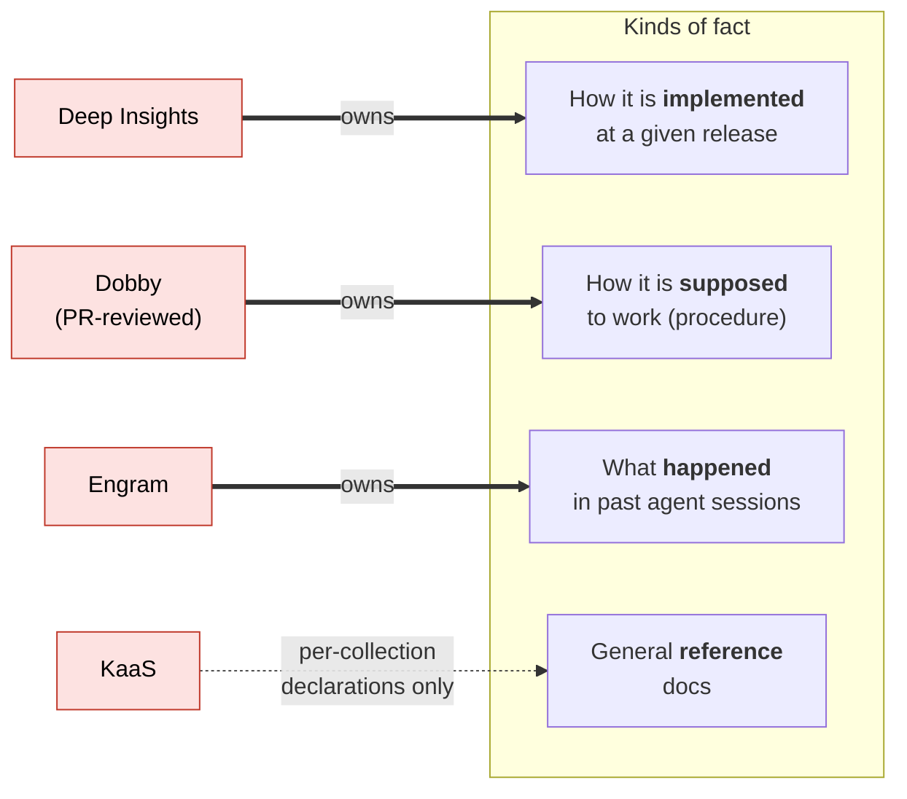

| Source | Authoritative for | Not authoritative for |
|---|---|---|
| Deep Insights | Implemented behavior at a revision | Intended policy |
| Dobby | Payments procedures and standards | Current deployed config |
| Engram | What happened in prior agent sessions | Facts about systems |
| KaaS | Nothing by default; per-collection declarations allowed | – |

When "implemented" and "intended" disagree, that is usually a real finding, not noise. Sanctum shows both with their roles.

<a id="section-7-3"></a>

### 7.3 Ranking

- **Filter first:** access, requested version or as-of date, known invalidity.
- **Rank** by one common relevance score (existing cross-encoder in the pilot).
- **Authority** is a constraint or tie-break, not a number blended into relevance.
- **Routing prior is not reused** in ranking (avoids rewarding past exposure twice).

<a id="section-7-4"></a>

### 7.4 Packing into the budget

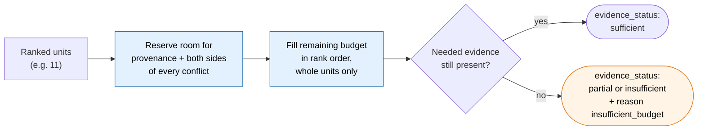

Caps per request: max candidates, max conflict pairs, max bytes, max model calls. Tokens are counted on the serialized response with a declared tokenizer.

**Status defaults (v5.2.1).** Status is judged per interpretation against the requested facts: `sufficient` when every requested fact has obtainable evidence in the response; `partial` when some do and others are missing, denied, failed or did not fit, with the specific reasons; `insufficient` only when nothing obtainable remains for the requested facts. A missing must-consult source therefore gives `partial` with `required_source_unavailable` while other requested facts are covered, never `sufficient`.

**Conflicts survive packing (v5.2.1).** A flagged conflict is a response object, not a packing side effect. When both witnesses cannot fit, the conflict record is still returned, the witness that does not fit is listed in `omitted` with reason `conflict_witness_omitted`, and the interpretation is at most `partial`. A witness never enters through ordinary filling with its flag dropped, and a D6 promotion never displaces rules-packed evidence.

<a id="section-7-5"></a>

### 7.5 Version applicability and exact copies

`VERSION_OF` establishes **lineage**, not **applicability** (M09). Before any version is removed from the working set:

- The evidence unit must carry **branch, environment, and effective time**.
- The query's time and environment must be known (explicit `as_of`, or the default "current production").
- A newer version replaces an older one **only when explicit applicability establishes supersession for this query**. An experimental branch never replaces production; a historical question keeps the historical version.
- Uncertain alternatives and conflict witnesses are **kept**, not hidden.

**Exact copies** may share one text payload, but every eligible copy keeps its own source, version, authority, and permission attribution. An accessible copy can never be used to reveal a restricted one, or to transfer authority from one source to another.

Automatic *ingestion* of lineage and copies is fine. Automatic *hiding* requires the stronger applicability rule.


---

<a id="section-11"></a>

## 11. Read path in detail

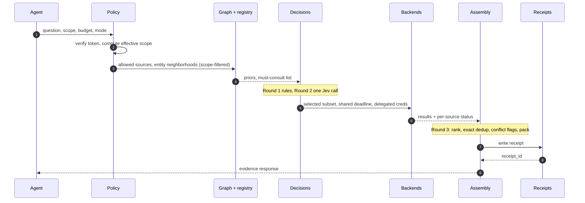

The receipt is written **before** the response in modes that promise replay (F18).

---

<a id="section-13"></a>

## 13. Write path and reconciliation (post-pilot)

- Destination permissions and review come from the registry. The model proposes; it never picks a weaker policy.
- Writes check an exact base version.
- Idempotency keys are scoped to principal and operation, bound to target, body hash, and base version.
- Multi-target writes report per-target outcomes.
- Hiding or superseding vetted evidence, even as an annotation, needs owner approval.
- First release: proposals only. Automatic acceptance only for exact equivalences with rollback.

Reconciliation triggers: new `possible_conflict`, version change on an artifact with known relations, scheduled staleness sweeps, entities with repeated conflicts.

---

<a id="section-14"></a>

## 14. Cross-cutting

<a id="section-14-1"></a>

### 14.1 Security and data

- Verify tokens for Sanctum's audience; approved token exchange for backends. No passthrough (F15).
- Credentials travel in the authenticated transport or session, never as tool arguments visible to a model (v5.1).
- Provider eligibility (hosted Jev vs. self-hosted vs. LLM) follows the **highest data class in the full state**, including graph descriptors and logs.
- Graph entities, aliases, and statistics are scoped; neighborhoods are filtered before inference.
- Evidence text is data. Model outputs are validated against allowed candidates. Feedback producers are authenticated and labeled (F16).
- Caches are keyed by principal, scope, policy, and source versions; revocation invalidates them.

<a id="section-14-2"></a>

### 14.2 Latency budget, fast mode

```mermaid
gantt
    title Sanctum overhead in fast mode (targets, to validate)
    dateFormat X
    axisFormat %L ms
    section Policy
    Token + scope + registry      :p1, 0, 20
    section Memory + rules
    Graph lookup + Round 1 rules  :g1, after p1, 20
    section Judgment
    Round 2, one Jev call         :j1, after g1, 150
    section Backends
    Fan-out (reported separately) :crit, b1, after j1, 1
    section Assembly
    Dedup + ranker + packing      :a1, after b1, 80
    section Receipt
    Durable receipt               :r1, after a1, 20
```

| Stage | Target p95 |
|---|---|
| Token + scope + registry | 20 ms |
| Graph lookup, Round 1 rules | 20 ms |
| Round 2, one Jev call | 150 ms |
| Assembly: exact dedup, existing ranker, packing | 80 ms |
| Durable receipt | 20 ms |
| **Sanctum overhead** | **≈ 290 ms** |

Backend time is reported separately. Stage p95s do not add into an end-to-end p95, so the real number comes from whole-path measurement. `escalated` and `synthesize` modes have their own SLOs.

<a id="section-14-3"></a>

### 14.3 Observability

Per request: effective scope ref, candidates, selected subset, dispositions, provider and versions, per-source status, tokens, cost, latency split (Sanctum / backend / total), degraded reasons. Dashboards include **entities with no coverage** ([Ex. 8](contracts-and-scenarios.md#example-8)), **open conflicts by entity** ([Ex. 3](contracts-and-scenarios.md#example-3)), **unresolved terms** ([Ex. 14](contracts-and-scenarios.md#example-14)), and **governance queue** (proposals awaiting review, [Ex. 14](contracts-and-scenarios.md#example-14)–15).

---

<a id="section-15"></a>

## 15. Replay levels

| Level | Lets us | Needs |
|---|---|---|
| `recompute_on_candidates` (**pilot**) | Re-run routing and ranking policies on what was retrieved | Receipt + retained evidence units |
| `exact_bundle` (later) | Reproduce exactly what was served | Retained served bundle |
| `frozen_corpus` (research) | Evaluate routers that would have called different sources | Approved sample with all-source retrieval captured |

`replay_level` on the wire takes only `none`, `recompute_on_candidates`, or `exact_bundle`. **`frozen_corpus` is a research execution profile, not a response value** (v5.1): it describes how an evaluation is run, not what a response promises. Counterfactual claims about translated queries still need paired retrieval on a recorded snapshot ([§9.10](memory-design.md#section-9-10)).

Revocation and erasure override replay.

---

<a id="section-20"></a>

## 20. Anticipated questions

**"Isn't this too big for where we are?"**
The HLD describes the target shape so decisions stay consistent. The pilot is small: rules-first, one Jev call, graph v0 on existing storage, read-only, three backends. Everything else waits on an experiment.

**"Why a graph and not a table?"**
The router's questions are multi-hop ([Ex. 1](contracts-and-scenarios.md#example-1), 4, 5). Physically, v0 may well be tables; E2b decides.

**"Is this Engram?"**
No. Engram is one of the sources. Sanctum memory is the router's own notebook about the sources, in a separate store ([§8.2](memory-design.md#section-8-2)).

**"How do we test this before real backends are ready?"**
The Sanctum Lab: simulated hubs built from one synthetic world, auto-derived gold answers, the ablation ladder as runnable configs, then a thin real slice (§17.2 (lab)).

**"Do we need an enterprise ontology?"**
No. A thin core owned by Sanctum, source vocabularies left untouched, and reviewed names and places linking them ([§8.4](memory-design.md#section-8-4), [§8.5](memory-design.md#section-8-5)).

**"Can the memory improve itself?"**
Yes, through a gated loop: it proposes, tests on a frozen benchmark, and owners approve anything risky. It cannot change authority, access, or its own evaluation set ([§9.10](memory-design.md#section-9-10), [Ex. 14](contracts-and-scenarios.md#example-14)).

**"Why not just use an LLM for routing?"**
Too slow and costly on every request. It is used once, when the cheap tier is unsure ([Ex. 6](contracts-and-scenarios.md#example-6)), and E4 checks that it's worth it.

**"Why not make everything scoped and skip the intelligence?"**
Scoped mode is supported and is where rules do most of the work ([Ex. 1](contracts-and-scenarios.md#example-1)). Inner-loop questions are often open natural language ([Ex. 6](contracts-and-scenarios.md#example-6)), so we test whether intelligence adds value over scope-plus-rules.

**"Does Sanctum decide which source is right?"**
No. It shows both sides with roles and versions ([Ex. 3](contracts-and-scenarios.md#example-3)). Resolution goes through each source's own governance.

**"Does our data leave PayPal?"**
Only for data classes approved for a hosted provider. Others use a self-hosted model or rules.

**"What happens when Jev is down?"**
Rules and graph priors with capped fan-out, response marked degraded ([Ex. 9](contracts-and-scenarios.md#example-9)).

---

<a id="section-21"></a>

## 21. Decisions needed from the group

| # | Decision | Proposed default |
|---|---|---|
| Q1 | Is this HLD standalone, or must it stay compatible with the earlier C6 contract? | Standalone; record differences explicitly |
| Q2 | Pilot journey and backends | Kestrel planning on one payments service; Deep Insights + Dobby + KaaS |
| Q3 | Who owns authority declarations | Source owners, reviewed by platform team |
| Q4 | Cost of omitting a needed source vs. calling an extra one | Set per question family with the adopter |
| Q5 | Pilot replay level | `recompute_on_candidates` |
| Q6 | Data classes approved for hosted Jev | Security review before E1 on real data; sanitized fixtures until then |
| Q7 | Owner of evaluation labels | Evaluation track, with domain reviewers |
| Q8 | Who owns canonical entities and entity types | Sanctum platform team |
| Q9 | Who approves `DENOTES` identity mappings per source | Native term's owner **and** canonical entity's owner, or explicitly delegated stewardship ([§9.7](memory-design.md#section-9-7)) |
| Q10 | Where Sanctum memory is stored | Existing Sanctum persistence; separate from Engram (E2b) |
| Q11 | Who attests the pilot service's identity, domain membership, repo binding, and native names across sources? | Service owner + one delegated steward per source |
| Q12 | Which owner approves each fact-kind authority declaration, at what scope, and how are disagreements resolved? | Source owners; platform team arbitrates |
| Q13 | May service names, native paths, descriptors, query logs, and coverage counts be stored in Sanctum and sent to Jev? | Security review; sanitized lab data until approved |
| Q14 | Maximum acceptable stale-ACL window; which change feeds exist; retention for replay | Security + source owners |
| Q15 | What do Deep Insights, Dobby, and KaaS actually expose: stable IDs, version reads, filters, deletion notices, permission-aware search? | Adapter survey in October; lab hubs mirror the answers |
| Q16 | If a required source fails or a procedure conflicts, may the pilot return `partial`, or must it fail? | Missing must-consult evidence: `insufficient` with explicit gaps, following [Example 9](contracts-and-scenarios.md#example-9). Resolve procedure-conflict status explicitly before acceptance; this remains an open decision. v5.2.1: the status default is stated in [§7.4](hld.md#section-7-4); procedure-conflict handling and per-decision failure behavior are in the [hardening backlog](hardening-backlog.md). |
| Q17 | Can an evaluation identity query all pilot sources and retain evidence? Who owns labels and the fresh holdout? | Evaluation track, outside the tuning team |
| Q18 | Who approves, deploys, and rolls back memory releases? | Sanctum platform team |

---
