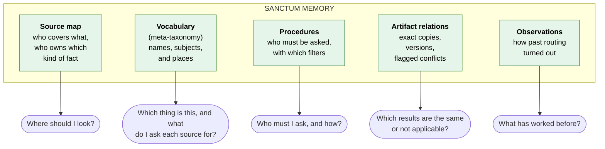
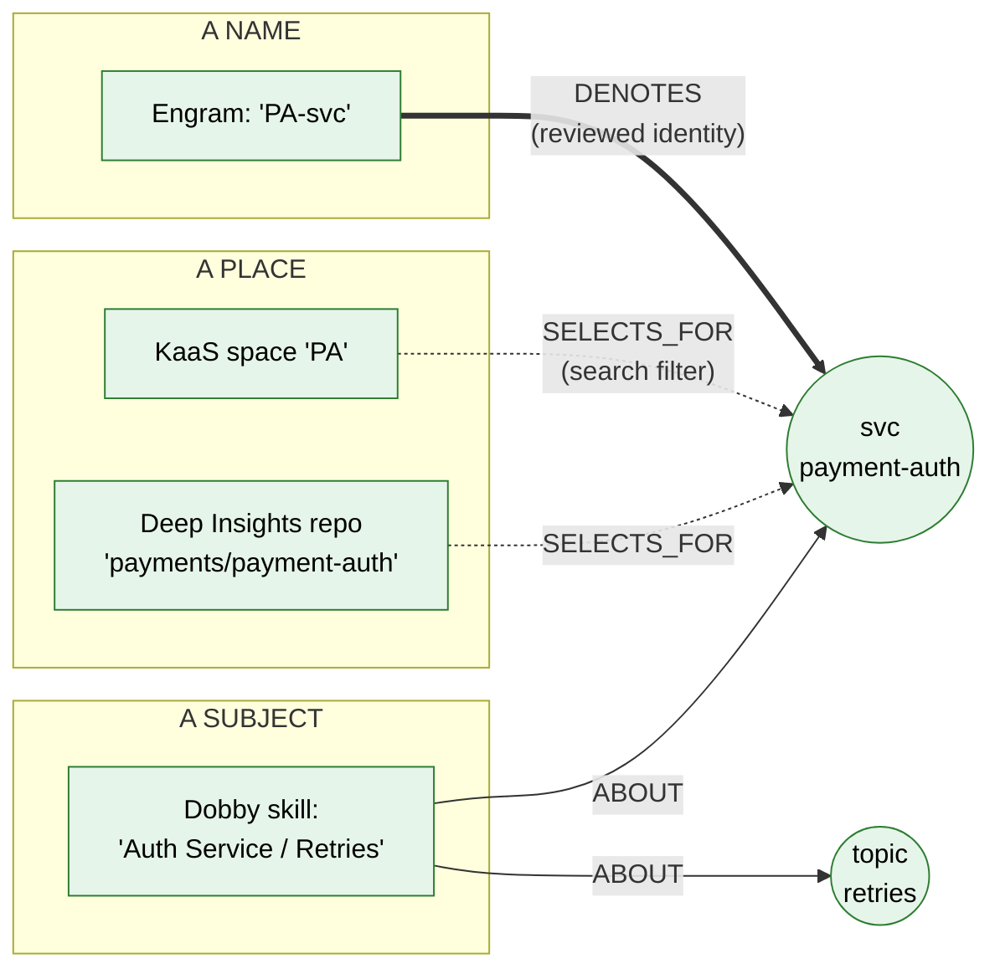
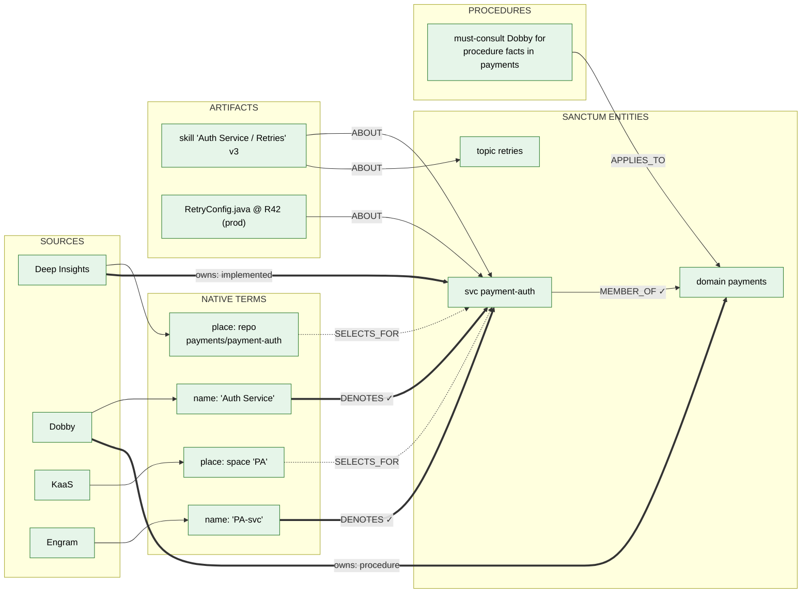
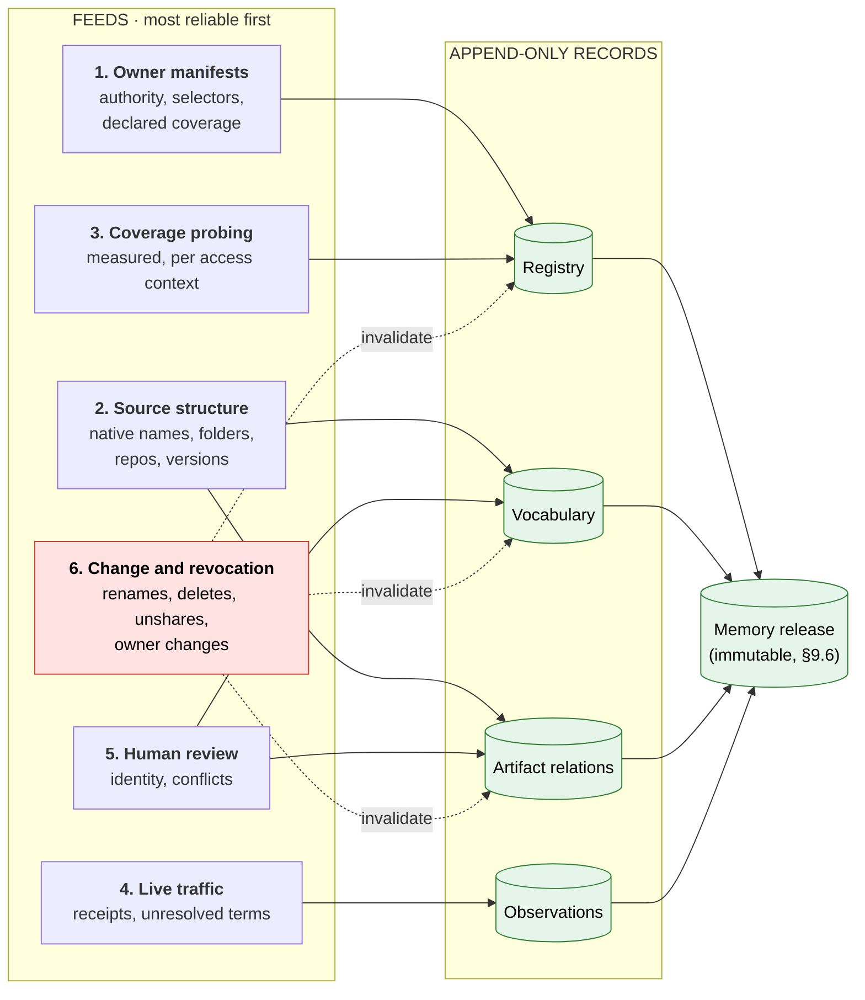
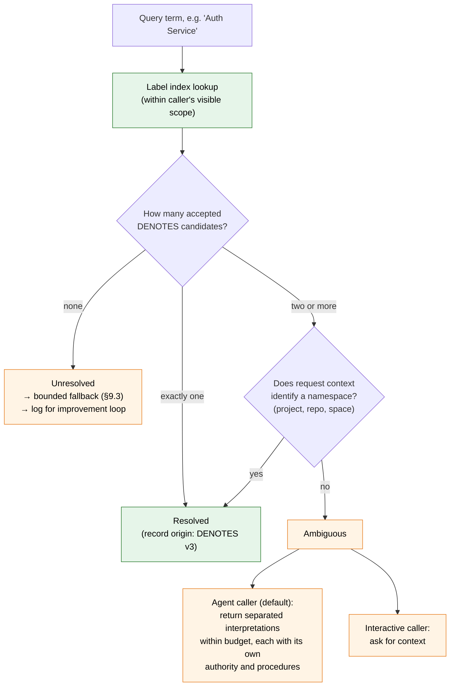
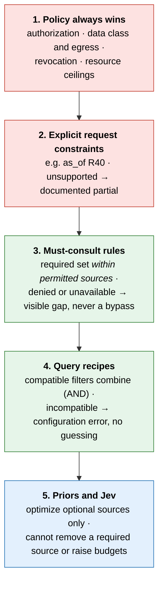
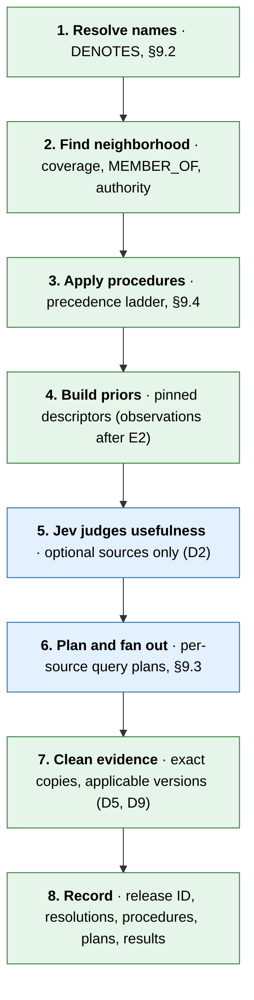
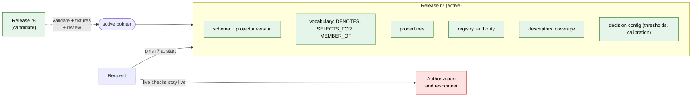
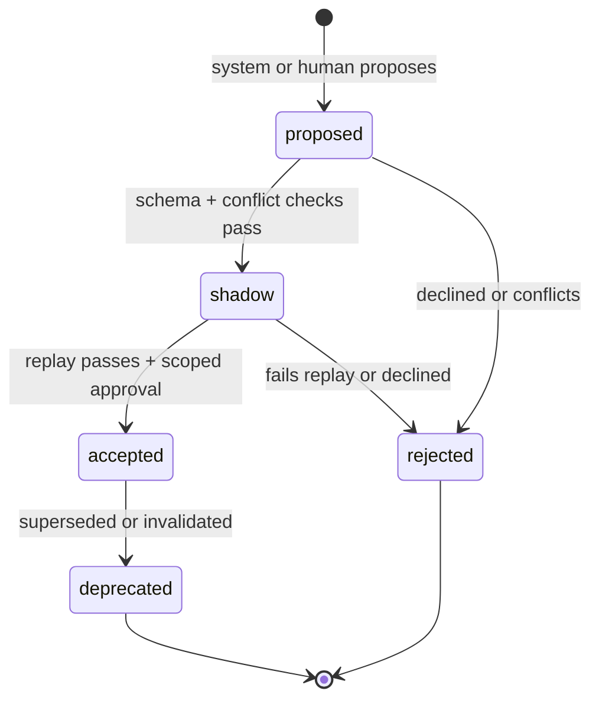
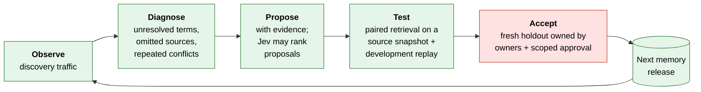

# Sanctum memory and meta-taxonomy — detailed design

[Overview and reading guide](README.md) · [Section map](section-map.md)

> Status: proposed research design, reorganized from v5.1. Lab work is experimental. Original section numbers are retained.

This page preserves the detailed memory design supporting the [HLD](hld.md). It explains what the router knows about sources, how identities differ from subjects and locations, and how mappings and procedures are governed. These are proposed architectural behaviors; individual mechanisms require the evidence described in the lab spike (lab).

Read §8 for the representation and §9 for construction, use, governance, and improvement. Schema and scenario references link to their owning pages. The physical storage choice remains an experimental question.

---

<a id="section-8"></a>

## 8. Sanctum memory: what it holds

<a id="section-8-1"></a>

### 8.1 In one sentence

Sanctum's memory remembers **where knowledge lives, what each source calls things, who owns which kind of fact, how to query each source, how copies and versions relate, and how past routing turned out**, so the router makes a better first guess. It is a librarian's notebook about the shelves, not the books.

<a id="section-8-2"></a>

### 8.2 Not to be confused with Engram

Engram is one of the knowledge sources Sanctum routes to. Sanctum's memory is a separate, lightweight store that belongs to the router.

| | **Engram** | **Sanctum memory** |
|---|---|---|
| What it is | A knowledge backend, one of the sources | The router's own notebook about the sources |
| What it remembers | What agents did: events, sessions, tools, causal chains (ADR-0009) | Where knowledge lives, what things are called, how to query each source, how routing went |
| Holds content? | Yes | No: metadata, mappings, rules, pointers |
| Used by | Agents, through Sanctum | Only Sanctum's router and evidence assembly |
| Size | Grows with every agent action | Grows with the number of sources, terms and artifacts |

Sanctum borrows **patterns** from ADR-0009 (rebuildable projection over an append-only log, provenance on everything), not data. Engram is one input feed ([§9.1](memory-design.md#section-9-1)), like the other sources.

Sanctum memory does not live inside Engram's store: the router's memory should not sit inside one of the sources it ranks, an Engram outage must not disable routing to the other sources, and the two have different access, retention and availability rules. Fixture: an Engram outage cannot disable the three-source pilot.

<a id="section-8-3"></a>

### 8.3 Five kinds of memory



| Memory | Kind | Answers | In v0? |
|---|---|---|---|
| Source map | Semantic, about sources | Where should I look? | Yes, reviewed and pinned |
| Vocabulary (meta-taxonomy) | Semantic, about names | Which thing is this? What is it called in each source? | Yes, pilot scope, reviewed identity only |
| Procedures | Procedural, about routing | Who must I ask, with what filters? | Yes, must-consult + selectors + time guard |
| Artifact relations | Structural | Which results are copies, and which version applies? | Yes, adapter-proven only |
| Observations | Episodic, about routing | What has worked before? | Logged from day one; used only after E2 |

Two distinctions keep this clear:

- **Semantic vs. procedural.** Vocabulary says what things *are* and what they are *called*. Procedures say what to *do*.
- **Sanctum's procedures vs. Dobby's.** Dobby owns business procedures *about payments*, for agents. Sanctum owns routing procedures *about sources*, for the router. A Dobby content edit does not change Sanctum routing policy.

<a id="section-8-4"></a>

### 8.4 A thin ontology in three layers

| Layer | Examples | Changes | Changed by |
|---|---|---|---|
| **Stable contract** | Node and edge types, edge endpoint rules, allowed uses ([§8.7](memory-design.md#section-8-7)), procedure grammar ([§9.4](memory-design.md#section-9-4)); fact kinds `implemented`, `procedure`, `observed`, `reference`, `session` as a versioned controlled vocabulary | Rarely | ADR |
| **Entity types** | `domain`, `service`, `api`, `method`, `repo`, `team`, `topic`, `other` | Occasionally | Proposal + review |
| **Instances and assertions** | `payment-auth`; "Engram's `PA-svc` denotes payment-auth"; must-consult rules | Constantly | Harvesting, traffic, reviewers |

- Entity type is a **property**, not a node label, so adding a type is storage-compatible.
- Storage-compatible is not behavior-compatible. **A new or reclassified type gets no operational meaning** (procedures, authority) until reviewed. Reclassifying `other` → `service` cannot silently activate a procedure (M10).
- Changing the meaning of a fact kind that affects authority needs semantic review.

<a id="section-8-5"></a>

### 8.5 Names, subjects, and places are different things

This is the most important rule in the vocabulary. A source label can be one of three very different things (M01):



| What the label is | Example | Relation | Operational use |
|---|---|---|---|
| **A name** for a thing | Engram's `PA-svc` | `Term DENOTES Entity` (reviewed identity) | Resolve which thing the query is about |
| **A subject**: something that discusses things | Dobby skill *Auth Service / Retries* (may discuss several services) | `Artifact ABOUT Entity` (possibly several) | Find relevant evidence |
| **A place** where material lives | KaaS space *PA*; a repo that may hold several services | `Term SELECTS_FOR Entity` | Build an approved search filter |
| **Native structure** | Skill folder parent/child | `Term PARENT Term` | Navigate that source only; never becomes semantic hierarchy automatically |
| **Semantic hierarchy** | service in domain | `Entity MEMBER_OF Entity` | Apply domain-level procedures and authority |

A skill *about* payment-auth is not a *name* for payment-auth. A repo *containing* payment-auth is not payment-auth. Only `DENOTES` establishes identity.

<a id="section-8-6"></a>

### 8.6 Schema v0

Five node types, unchanged in kind from v4, with sharper edges.

**Nodes**

| Node | Key properties |
|---|---|
| `Source` | source_id, backend_type, adapter capabilities, data_class, write_governance, metadata access rules, health |
| `Term` | stable key `(org, source, namespace, native_id)`, label (indexed separately), term_kind (`name` \| `place`), definition sufficient to disambiguate |
| `Entity` | stable canonical ID with versioned origin bindings (a repo rename does not create a new service), type, descriptor |
| `Artifact` | artifact_id, source_id, native_ref, version, branch/environment, effective time, content_hash, scope |
| `Procedure` | procedure_id, trigger, action (allowlisted grammar), owner, version, status |

**Edges**

| Edge | Meaning | Populated from | v0 |
|---|---|---|---|
| `Term -DENOTES-> Entity` | Reviewed identity: this native name refers to this entity | Proposal + scoped owner approval | ✓ |
| `Term -SELECTS_FOR-> Entity` | This native place holds material about the entity | Owner manifest, reviewed | ✓ |
| `Term -PARENT-> Term` | The source's own structure | Source structure | ✓ |
| `Entity -MEMBER_OF-> Entity` | Explicit membership (service in domain), with scope and provenance | Reviewed | ✓ |
| `Source -COVERS {declared, measured, descriptor, as_of}-> Entity` | Declared and measured coverage, kept separate | Manifests, probing | ✓ pinned |
| `Source -AUTHORITATIVE_FOR {fact_kind, scope}-> Entity` | Declared ownership of a kind of fact | Registry | ✓ |
| `Artifact -ABOUT-> Entity` | Artifact discusses the entity; bound per evidence unit ([§8.10](memory-design.md#section-8-10), v5.2.1) | Evidence assembly, source structure | ✓ |
| `Artifact -DUPLICATE_OF {exact}-> Artifact` | Same content; provenance kept per copy | Evidence assembly | ✓ |
| `Artifact -VERSION_OF {branch, environment, effective}-> Artifact` | Lineage with applicability | Adapters | ✓ |
| `Procedure -APPLIES_TO-> Entity` | Rule applies to questions about this entity | Registry, reviewed | ✓ |
| `Term -RELATES_TO {broad \| narrow \| related}-> Entity` | Non-identity semantic relation | Proposals | Stored, **disabled** |

**No inference.** Sanctum does not compute transitive or symmetric closure over identity. Two reviewed `DENOTES` edges never imply a third, unreviewed identity, especially across scopes. (SKOS `exactMatch` is transitive and expresses interchangeability for retrieval; Sanctum's `DENOTES` is a narrower, scoped, reviewed assertion and does not inherit that inference.)

**Pilot limits:** one service, its domain, its repo binding, one or two topics; a few dozen terms per source; one must-consult rule; source-specific selectors; a fixed time-capability guard.

**Research backlog:** operational `RELATES_TO`, `QueryPattern`, `ROUTED_TO`, `CONTRADICTS` with review status, `Claim`.

<a id="section-8-7"></a>

### 8.7 Allowed uses of each relation

One matrix, enforced in code (M03). Every candidate records *how* it was resolved.

| Relation | Resolve identity | Select authority | Trigger procedures | Build filters | Add recall candidates |
|---|---|---|---|---|---|
| `DENOTES` (accepted) | ✓ | with an independent `AUTHORITATIVE_FOR` | ✓ | via `SELECTS_FOR` | ✓ |
| `SELECTS_FOR` (accepted) | ✗ | ✗ | ✗ | ✓ | – |
| `ABOUT` | ✗ | ✗ | ✗ | ✗ | ✓ (evidence) |
| `MEMBER_OF` (accepted) | ✗ | domain-level declarations | domain-level rules | ✗ | – |
| `RELATES_TO broad/narrow` | ✗ | ✗ | ✗ | ✗ | later experiment only, labeled |
| `RELATES_TO related` | ✗ | ✗ | ✗ | ✗ | suggestions only |
| Anything `proposed`, `shadow`, `rejected` | ✗ | ✗ | ✗ | ✗ | ✗ |

**Direction convention.** Following SKOS, `A broad B` means *B is broader than A*. Imports must use the same convention; fixtures check direction.

<a id="section-8-8"></a>

### 8.8 A real neighborhood: payment-auth



**Reading it:** two sources have *names* for the service (`PA-svc`, *Auth Service*), both reviewed as denoting it. Two sources have *places* that hold material about it, used only as search filters. The Dobby skill is *about* the service and the retries topic; it is not a name. The service is an explicit member of the payments domain, which is how the domain-level must-consult rule reaches it. The [worked trace](contracts-and-scenarios.md#worked-trace) follows one question through this neighborhood end to end (v5.2.2).

<a id="section-8-9"></a>

### 8.9 Why a graph, and why not smaller?

**Why a graph shape.** The router's questions hop across relationships: *name → entity → domain → owner*, *artifact → copies → applicable version*, *entity → procedures*. A graph expresses these directly and explains each routing choice.

**Why not smaller.** v0 is small in content: five record types, one service, a few dozen reviewed terms, all in existing tables or a small cached projection. Five record types do not mean five services or a graph database.

**What would shrink it further.** E6 compares the vocabulary against a plain alias table (M12). If the table performs the same, and E2 shows priors add nothing, memory reduces to a registry, an alias table, and a duplicate/version table.

---

<a id="section-8-10"></a>

### 8.10 Attributed subjects: `Artifact ABOUT Entity` in operation (v5.2.1)

Names resolve the question's subject and places filter the search; each piece of **evidence** also needs a subject that is not guessed from paths, acronyms or headers.

**A binding.** Every evidence unit carries `subjects[]`. Each entry is a canonical entity reference, or `unknown`, with its provenance: the source's own subject field it came from, or the accepted `ABOUT` assertion in the pinned release. A place (`SELECTS_FOR`) can support grouping and ranking, but a place is not an identity and never alone makes two units the same subject. Resolving the query to an entity does not make every retrieved unit about that entity.

**Assembly compares canonical subjects.** Two units are paired as a possible conflict by the rules only when they share an attested subject and attribute; lexical signatures (path words, acronyms, front matter) are not subjects. Separated interpretations take the units attested to their entity. A composite unit (one skill about two services) carries two bindings, each used on its own.

**Unknown subjects are preserved.** A unit whose subject cannot be attested stays in the response with `subjects: [unknown]`. It is never treated as matching every subject, never silently attached to the resolved entity, and never dropped for lacking one.

<a id="section-9"></a>

## 9. Sanctum memory: how it is built, used, governed, and improved

<a id="section-9-1"></a>

### 9.1 Where the knowledge comes from

Sanctum does **not** extract facts from content. It needs *who has what, what it is called, and where it lives*, which mostly exists as structure inside the sources.



| Feed | Establishes | Does **not** establish |
|---|---|---|
| Owner manifests | Declared authority, selectors, declared coverage | Measured coverage |
| Source structure | What a source calls an item; native hierarchy; versions | Canonical identity or business authority |
| Coverage probing | Measured coverage *for a probe set, fact kind, source snapshot, and access context* | Coverage for other callers or other questions |
| Live traffic | Observations, exact copies, unresolved terms | Correctness |
| Human review | Identity and conflict decisions, **within the reviewer's delegated scope** | Anything outside that scope |
| Change and revocation | Invalidation of affected metadata | – |

**Coverage probing rules (M07).** Probes use canonical and native names, paraphrases, nearby wrong entities, unsupported topics, historical questions, and each relevant permission class. Record sample counts, failures, and unknowns. A timeout is not negative evidence; a missing probe is not zero coverage. Refresh on source, index, ACL, or mapping changes.

**Revocation (M07).** For the pilot, a periodic reconciliation plus a deny-on-revocation hook is enough; no streaming platform is needed. Unsharing a collection invalidates its descriptors, selectors, and terms.

<a id="section-9-2"></a>

### 9.2 Resolving names: identity, ambiguity, no guessing



Rules (M01, M02):

- A label lookup returns **candidates**, never a single answer by score.
- Within one applicable scope, a native name cannot denote two distinct active services. Composite concepts are represented as subjects (`ABOUT`), not identities.
- When two meanings are both legitimately accessible, Sanctum **never picks the higher-scoring one**, never unions their authority or must-consult rules, and never names candidates the caller cannot see.
- For agent callers, the default is separated interpretations (an agent mid-plan often cannot answer a clarification). Interactive callers can be asked for context.
- Scope is three separate things: the name's **namespace**, the assertion's **applicability**, and **permission** to see the metadata.
- A readable place is not proof that a name is visible (v5.2.1). Name visibility is checked against the name's own metadata permission, never inferred from the caller's access to a place that selects for the entity.
- Approval must cover both the native term's namespace and the canonical entity's ownership boundary; a steward may cover both only where explicitly delegated.

<a id="section-9-3"></a>

### 9.3 Per-source query plans

Once a question is resolved (or not), Sanctum builds a **bounded query plan per source** rather than rewriting the question (M05):

| Plan element | Rule |
|---|---|
| Original question | Always kept, including qualifiers ("not connection failures", "as of R40") |
| Resolved entity IDs | From accepted `DENOTES` only |
| Selectors | From accepted `SELECTS_FOR` and procedure recipes, if the adapter supports that filter |
| Search aliases | At most a small fixed number, chosen by preferred label per source; never OR-expand every alias |
| Raw-text attempt | Kept where useful and within budget |
| Time requirement | Passed only to adapters that support version reads; others get source status `unsupported_for_mode` with reason `unsupported_for_as_of` |

**When a term is unresolved:** in the pilot, all allowed pilot sources stay candidates within the deadline (unknown coverage is not zero coverage). Reviewed request context (project, repo) can supply a selector. Otherwise `evidence_status` is `partial` (or `insufficient`) with reason `unresolved_term`. Sanctum never invents an equivalence to make a fallback look successful.

**When a mapping is stale:** under a declared freshness rule, it is treated as uncertain and cannot impose an exclusive filter.

A deterministic post-resolution ambiguity check runs after step 1; no extra model round is added.

<a id="section-9-4"></a>

### 9.4 Procedures: a small grammar and a precedence ladder

Procedures are data interpreted by a small, allowlisted interpreter (M04). No scripts, model instructions, or raw query fragments.

```yaml
procedure_id: proc-payments-procedure-must-consult
version: 3
status: accepted
owner: sanctum-platform            # owns the routing action
attested_by: dobby-payments-stewards  # attests coverage
trigger:                            # allowlisted trigger types only
  entity_member_of: domain:payments # uses explicit MEMBER_OF
  fact_kind_needed: procedure
action:                             # allowlisted action types only
  must_consult: dobby
  selector: { skill_path_prefix: "Payments/" }
applies_in_scope: org:paypal/payments
depends_on: [ "member_of:svc-payment-auth->domain-payments@v1" ]
```

**Allowed triggers:** entity identity, explicit domain membership, fact kind needed, intent. **Allowed actions:** must-consult a source, add a selector, require a capability. Each procedure is validated at publication (schema, known IDs, reviewer authority, dependencies, bounded expansion, adapter capability) and again against the effective request policy.

**Precedence ladder**



**Time handling** in the pilot is a fixed adapter-capability guard (level 2), not a configurable procedure. This resolves the v4 inconsistency between [§8.5](memory-design.md#section-8-5) and [§9.3](memory-design.md#section-9-3).

<a id="section-9-5"></a>

### 9.5 How the router uses memory, with failure behavior



| Step | Memory read | Missing | Stale | Wrong or conflicting |
|---|---|---|---|---|
| 1. Resolve | `DENOTES`, label index | Bounded fallback, log | Uncertain; no exclusive filter | Separated interpretations; quarantine assertion |
| 2. Neighborhood | Coverage, `MEMBER_OF`, authority | Unknown coverage → keep allowed pilot candidates | Uncertain | Quarantine assertion; preserve evidence gap |
| 3. Procedures | Accepted procedures, adapter capabilities | Explicit gap | Non-executable | Configuration error per ladder; never relax policy |
| 4. Priors | Pinned descriptors | Neutral | Uncertain | Use pinned baseline; record provenance |
| 5. Usefulness | Scope-filtered descriptor snapshot | Keep optional candidates within budget | Same | D2 cannot exclude required sources |
| 6. Plan and fan out | Selectors, recipes | Original text + trusted context | Bounded alternatives or partial | Recheck permissions; report failed required reads |
| 7. Clean | Exact copies, version applicability | Keep evidence | Keep evidence | Flag, do not hide |
| 8. Record | Release manifest | Never fabricate lineage | – | Mark incomplete receipts; rollback annotates, never rewrites |

Step 5 is answered by a System One provider through a runner-side broker; the descriptor snapshot sent is the pinned, scope-filtered set, and calibration is bound to the descriptor set and memory release. See [System One providers and the Jev handshake](system-one-providers.md).

**The four indirect paths to authority.** Memory never grants credentials, but it could still act like authority through:

1. **Identity → membership → ownership:** a wrong identity applies the wrong owner. Guarded by reviewed `DENOTES` and `MEMBER_OF` ([§8.7](memory-design.md#section-8-7)).
2. **Procedure → mandatory source or filter:** guarded by the ladder ([§9.4](memory-design.md#section-9-4)).
3. **Descriptor → skipped source:** guarded by pinning descriptors and keeping D2 to optional sources ([§9.7](memory-design.md#section-9-7)).
4. **Version link → hidden conflict witness:** guarded by applicability rules ([§7.5](hld.md#section-7-5)).

<a id="section-9-6"></a>

### 9.6 Memory releases

Every request runs against **one coherent, immutable memory release** (M08).



- A request pins one release at its start. Authorization and revocation remain **live**; a release never freezes old permissions.
- Activation is an atomic pointer switch. Cache keys include release and policy context.
- In the pilot, **rollback is of the whole release**. A single mapping can be the unit of review; activation and rollback operate on its dependency closure.
- Rollback is a new audit event. Old receipts keep the release they actually used, annotated as withdrawn. Rollback never restores revoked access.
- For the pilot, a simple versioned manifest in existing storage is enough; no new control-plane service.
- A change-feed gap or error means freshness unknown, never "no changes" (v5.2.1).

<a id="section-9-7"></a>

### 9.7 Governance

**Ownership follows the layers.**

| What | Owner | How it changes |
|---|---|---|
| Source-native terms and structure | Each source | Harvested; Sanctum never edits them |
| Canonical entities, types, `MEMBER_OF` | Sanctum platform team | Review |
| `DENOTES` (identity) | Native term's owner **and** canonical entity's owner (or explicitly delegated steward) | System proposes, humans approve |
| `SELECTS_FOR` | Source owner | Review |
| Authority declarations | Source owners, reviewed by platform | Never automatic |
| Routing procedures | Sanctum platform team; coverage attested by source owners | Versioned, validated, replay-tested |
| Memory releases | Sanctum platform team | Validate, fixtures, activate, roll back |

**Lifecycle**



- **Shadow** items are computed and logged but have no operational effect ([§8.7](memory-design.md#section-8-7)).
- Rejected proposals are kept with their evidence, so the same mistake is not re-proposed.
- Items are deprecated rather than deleted, **within retention and privacy limits**; erasure overrides permanence ([§9.9](memory-design.md#section-9-9)).
- Conflicting proposals (a name that already denotes something else, or resembles another entity in scope) become governance items and are never auto-merged.

**What can change automatically, by behavioral risk (M06)**

The test is not "what kind of record is this?" but "can this change remove a source, change a required set, or expose new metadata?"

| Change | v0 |
|---|---|
| Health and availability stats | Automatic; failures produce unavailable/partial, never redefine authority |
| Exact duplicates, adapter-proven lineage | Automatic ingestion; hiding evidence needs the applicability rule ([§7.5](hld.md#section-7-5)) |
| Descriptors and coverage strengths | **Reviewed and pinned in the release** (they can cause a source to be skipped) |
| `RELATES_TO` relations | Stored as proposals; operationally disabled |
| `DENOTES`, `SELECTS_FOR`, `MEMBER_OF` | Proposed; scoped human approval |
| Procedures and thresholds | Proposed; validation + replay + review |
| New entity or edge types | Proposed; ADR |
| Authority and access | **Never automatic** |

**Descriptors (M06).** Generated from attributed fields only: entity, fact kind, artifact types, time range, observed evidence, freshness, uncertainty. Source text is data, not instructions. Descriptors cannot assert authority ("complete and authoritative"). They are scope-filtered and subject to egress rules before reaching Jev.

<a id="section-9-8"></a>

### 9.8 Does memory have enough context?

| Question shape | v0 behavior | What closes the gap |
|---|---|---|
| Names a service, method, repo | Resolves ([Example 1](contracts-and-scenarios.md#example-1)) | – |
| Uses a source-specific name | Resolves if `DENOTES` exists ([Example 5](contracts-and-scenarios.md#example-5)) | Reviewed names |
| Same name, two meanings | Separated interpretations ([Fixture 16](contracts-and-scenarios.md#fixtures-16-25)) | Request context |
| Names a concept or process | Weak | `topic` entities with coverage |
| Names nothing | LLM decomposition ([Example 6](contracts-and-scenarios.md#example-6)) | – |
| No source covers it | Honest gap ([Example 8](contracts-and-scenarios.md#example-8)) | Onboarding |

**Diagnostics, not objectives** (M13). These point at gaps; none is optimized directly, because each can be gamed (forcing wrong identities lowers the unresolved rate):

| Diagnostic | Possible cause |
|---|---|
| Unresolved-term rate | Missing names |
| Necessary-source omission | Weak coverage, missing procedure |
| Jev uncertain-band rate by entity | Thin descriptors, ambiguous intent, poor evidence, or model behavior (log hypotheses; do not assign one cause) |
| `other`-type growth | Missing entity type |

<a id="section-9-9"></a>

### 9.9 Schema evolution and reconstruction

1. **Memory is a projection of assertions.** Change the projector, rebuild.
2. **Assertions carry enough to be reinterpreted later** (M10): stable native IDs, origin namespace, input and schema versions, applicable times, capture time, reviewer, and permitted source metadata.
3. **Model proposals are materialized before projection**, with model, prompt, parser, and probe versions recorded. Rebuilding never silently re-runs nondeterministic inference.
4. **Releases and decision inputs/outputs are retained within approved policy.**
5. **A reconstruction window is declared.** Beyond it, or after permitted deletion, replay capability is reported as lost; references and hashes alone cannot reproduce missing content. Minimal non-sensitive tombstones are kept where permitted.
6. **New types and edges need reader-compatibility and semantic migration tests**, not just an additive database change.

<a id="section-9-10"></a>

### 9.10 How memory improves: a gated loop



**Jev's role (M11).** Jev can **prioritize** mapping proposals for review. It cannot establish identity. Mapping labels are *same entity*, *different entity*, *related or composite*, and *insufficient evidence* (abstain). Shared owners and similar names are clues, not proof. D2 calibration is never reused for mapping. No score is an acceptance cutoff in v0; every operational identity is reviewed. Proposal ranking as a protocol question is future design in [System One providers and the Jev handshake](system-one-providers.md).

**Keeping evaluation honest (M13).** A frozen set can still be overfit by repeated tuning against it.

- Three separate pools: **discovery** traffic (where proposals come from), **development replay** (for iteration), and an **owner-controlled acceptance holdout** refreshed with later samples. Evaluator access is logged; exposed holdouts are rotated.
- The eligible population is fixed and includes rejected, ambiguous, failed, and unresolved requests. A proposal cannot improve its numbers by declaring hard questions out of scope.
- Counterfactual claims ("this would have found evidence in a skipped source") require **paired retrieval** of the original and translated queries against a recorded source snapshot (M12). Unsupported counterfactuals are marked unmeasurable.
- The loop cannot alter policy, benchmark membership, success definitions, or its own gate.
- Report fresh-sample results after approval, not only the replay used to obtain approval.

**Signals stay separate** (F09): availability, support, adoption, and task outcome measure different things and are never merged into one score.

**In one line:** Sanctum's memory improves with use, but every improvement is proposed with evidence, tested against data it did not choose, and approved by the owners it affects. It cannot change its own rules or grade its own homework.

---
