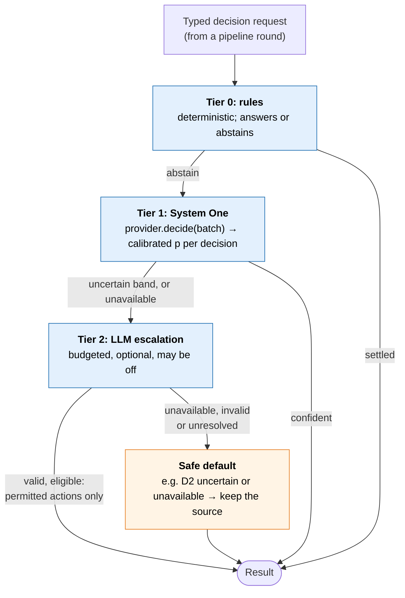
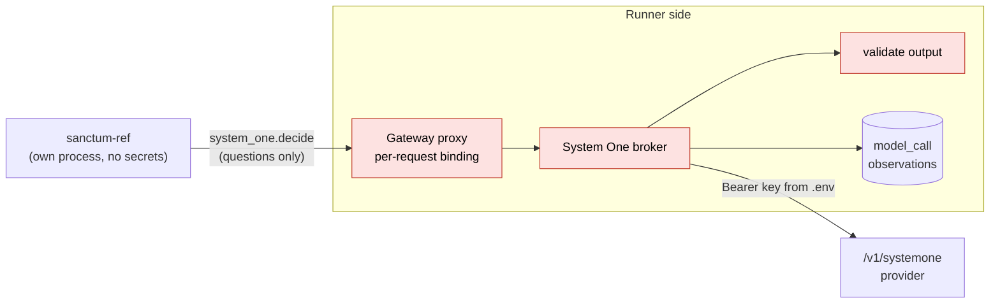
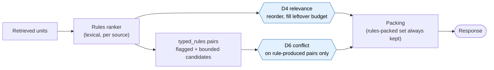

# System One providers and the Jev handshake

[Overview and reading guide](README.md) · [Section map](section-map.md) · [HLD §6 Decision layer](hld.md#section-6)

> Status: proposed design. This page states rules and interfaces only; the lab's decisions, measurements and variant statuses are kept with the lab, outside this design set.

This page specifies how Sanctum's Tier 1 (System One) decisions reach a model: the provider interface, the `/v1/systemone` wire protocol, how Sanctum decisions map to protocol primitives, and the handshake details that make a call safe, replayable and comparable across providers. The hosted closed model (TypeSafe Jev) and open models (Laya, OpenJevPro, decider-4b, Tev1, CLM, Kev) are interchangeable behind one adapter.

## Why this page exists

The HLD names a System One model but leaves the handshake implicit. An integration has to handle four things a live provider exposes: a model alias that resolves to a changing version, latency that must be measured rather than assumed, a `confidence` field that is not the top probability, and usage that some backends report and others do not. The rules below make a call safe, replayable and comparable across providers under those conditions.


## 1. The cascade and where providers sit



Tier 2 is optional and remains an interface until an LLM budget is decided. Like Tier 1, a valid and eligible Tier 2 judgment may affect only the decision's permitted actions, and anything else takes the decision's baseline-preserving default. Must-consult, the allowed set, as-of and data-class eligibility are given or settled by rules before any model is asked.

## 2. Provider interface

```text
SystemOneProvider
  name           "typesafe-jev" | "laya" | "openjevpro" | "standin" | ...
  capabilities   ProviderCapabilities
  decide(batch: DecisionBatch, deadline_ms) -> list[DecisionResult]   # HLD §6.6 contract

ProviderSpec                              # one entry per provider in configs/system_one_providers.yaml
  name, kind              http | standin | llm
  base_url | base_url_env                 # environment variable NAMES only; resolved by the broker
  model | model_env                       # requested model or alias; the resolved version is recorded
  api_key_env                             # read on the broker side only
  capabilities            ProviderCapabilities

ProviderCapabilities
  primitives              subset of {noul, choice, score}; anything else is refused, never converted
  max_questions_per_call  int            # batch size; 1 for a provider with a small input window
  max_options             int            # e.g. 20 for the OpenJevPro shim (single-letter read-out)
  max_state_chars         int            # state-size limit: a larger state is split or refused, never truncated
  batching                bool
  reports_usage           bool           # usage, including truncation metadata where the provider has it
  hosted                  bool
  data_classes_allowed    list           # e.g. [synthetic] for a hosted provider approved for synthetic data only
  conformance             supported | experimental
  confidence_thresholdable bool          # false for every provider so far: bands never use `confidence`

Profile                                   # per run: latency is measured per profile, never a gate
  deadline_ms             int            # shared by every batch of a round
  max_calls_per_round     int            # HTTP attempts, retries included
```

The **input window** is declared through `max_questions_per_call` and `max_state_chars` together: a provider whose total input (state plus every question's instructions) is small declares one question per call and a state limit that leaves room for the instructions.

| Adapter | Serves | Notes |
|---|---|---|
| `SystemOneHttpAdapter` | Any `/v1/systemone` backend: TypeSafe Jev natively; Laya via `laya-serve`; OpenJevPro, decider-4b, Tev1, CLM, Kev via shims | Config gives base URL, model id, credential reference and capabilities. Splits batches when a backend lacks batching. Never converts between primitives implicitly. |
| `StandinProvider` | Local TF-IDF plus logistic calibration | The no-network control arm |
| `LLMEscalationProvider` | Tier 2 | Interface only until an LLM budget is decided |

Providers are declared in `configs/system_one_providers.yaml`; an arm selects one by name (matrix `decision_provider: named`, plus a provider name). The pipeline never branches on provider identity: every difference is a declared capability.

### 2.1 Provider profiles

Batch efficiency and usable input size are properties of a provider profile, established by measurement; hosting location alone determines neither. Hosted Jev and local Laya on CPU illustrate two profiles. A declared character limit (`max_state_chars`) is a conservative backstop, not a precise definition of the input window.

| Concern | Profile A, e.g. Jev (hosted): batching amortises state, large input | Profile B, e.g. Laya (local CPU): per-question cost, small input |
|---|---|---|
| Batching | Batch a round's questions into one call: `state` is sent once, so batching amortises it and cost per question falls with batch size | Per-question compute dominates, so batching saves nothing; a small input window forces one item per call |
| State | Full layouts fit | Compact layouts: the same fields, shorter excerpts, qualifiers admitted first so a tight cap never drops an environment or release |
| Truncation | Split or refuse on declared limits before sending | The provider reports truncation in usage; a truncated state voids the whole call, a truncated question voids that decision; `max_state_chars` is the backstop for providers that report nothing |
| Per-batch state | Each batch carries only its own items' records, so splitting a round never sends one item's evidence with another's question | same |
| Versions | Alias resolves to a version per response; calibration binds the resolved version | Responses name only a family; the checkpoint revision is recorded in the binding and pinned by the running server |
| Per-request caps | Pair and unit caps bound cost | Caps bound latency, which grows with every item |

**Adding a third provider.** Establish and declare, before any calibration:

- which criteria shapes it accepts, especially how `score` levels are sent (ordered list or mapping);
- how total input admission is determined, including question instructions, not only state;
- how it reports truncation (state and per question), or that it reports none;
- how a response that names only a model family is associated with its checkpoint;
- which template and state-layout combinations it supports per decision.

## 3. Wire protocol: `POST /v1/systemone`

Reference: the benchmark client and the OpenJevPro shim in `jev-benchmarks` (`jevbench/client.py`, `servers/openjev_shim.py`).

```text
POST /v1/systemone
Authorization: Bearer <key>

request  { state, model, questions: { <id>: { type: choice | score | noul,
                                               instructions, criteria? } } }
response { model,                               # resolved version, e.g. <family>-<version>
           answers: { <id>: { type: noul,   noul: p_true }
                          | { type: choice, choice, probabilities: {option: p}, confidence }
                          | { type: score,  score, ... } },
           usage: { input_tokens, output_tokens } | null }
```

`criteria` carries the options for `choice` and the level descriptions for `score`. Open shims may reject a `choice` or `score` with more than `max_options` options (422).

## 4. Mapping Sanctum decisions to primitives

| Decision ([HLD §6.4](hld.md#section-6-4)) | Primitive | Question id | Role |
|---|---|---|---|
| D2 source usefulness | `noul` per optional candidate source | `d2:<source_id>` | One call per round, all optional candidates batched. `noul` = P(source returns necessary supporting evidence) |
| D1 intent (multi-label) | `noul` per label | `d1:<label>` | Shadow challenger to rules |
| D3 ambiguity | `noul` | `d3` | Shadow, query only |
| D4 relevance | `noul` per unit (`score` diagnostic only) | `d4:<unit>` | Round 3 ([§12](#12-round-3-decisions-d6-conflict-d4-relevance)). Reorder packed units and fill leftover budget only; never removes a rules-packed unit |
| D5 duplicate | none | none | Exact hash only; never a model |
| D6 possible conflict | `noul` per bounded pair (`choice` over relation types and decomposition diagnostic only) | `d6:<pair>` | Round 3 ([§12](#12-round-3-decisions-d6-conflict-d4-relevance)). Add-only on rule-produced pairs; never displaces rules-packed evidence |
| Route preference | `choice` over sources | `route` | Diagnostic only. Bands use per-source `noul`, never `choice.confidence` |
| Memory proposal ranking ([M11](memory-design.md#section-9-10)) | `choice` over mapping labels | `m11:<proposal>` | Future design. Ranks review order only; never establishes identity; D2 calibration never reused |

## 5. The handshake: thirteen points

| # | Point | Rule |
|---|---|---|
| 1 | Auth | `Authorization: Bearer <key>`. The key lives on the broker side only (secret store or `.env`), never in the SUT process, receipts, logs or manifests. |
| 2 | Model pinning | Request an exact version where the provider allows it; always record the resolved `model` from the response. Calibration is keyed by provider and resolved version and is invalid after a version change. |
| 3 | Request shape | `state` is a minimal sanitized projection built by the broker, never by the SUT. D2: query plus the pinned descriptors of the allowed optional sources. Round 3: query plus one record per evidence ref, in a named **state layout** (`r3-state-v1` text slices; `r3-state-v2` provenance-backed records with source, artifact, version, environment, subject, attribute, assertion role, verbatim excerpt and excerpt offsets; `r3-state-v2-compact` and `-compact-150` for small-context providers). Questions come from a **named, versioned template** (`configs/system_one_templates.yaml`, [§14](#14-template-and-state-layout-registry)) and carry `type`, `instructions` and, for `choice`/`score`, `criteria`. |
| 4 | Response semantics | `noul` is P(true); `choice` has `probabilities` and a separate `confidence`; `score` is an expected level. Bands use calibrated probabilities. `confidence` is recorded, not thresholded, until its definition is confirmed with TypeSafe. `usage` may be null. |
| 5 | Batching and limits | A round has a total call limit and one shared deadline across its batches. Respect `max_questions_per_call` and `max_options`; split and merge when exceeded. `score` ↔ `choice` conversion only through an explicit, tested mapping declared for that provider. |
| 6 | Deadline and retries | The call inherits the round's remaining budget. At most one retry, only if time remains and only within the round's call limit (the limit counts HTTP attempts, retries included) (the benchmark client's 5-attempt exponential backoff is wrong for the request path). Timeout or error → `unavailable`, safe default, `decision_layer_unavailable`. |
| 7 | Latency profiles | Latency is measured, and whether it gates adoption is an owner decision. Two profiles: **strict** (a short fixed deadline; records timeout frequency and fallback cost) and **relaxed** (enough time to measure prediction quality). Elapsed time includes broker, network, validation, batching and retries. p50/p95 reported per profile; quality measured under the relaxed profile is not evidence about the fast path. |
| 8 | Output validation | A bad individual answer (wrong type, a choice that was not offered, a probability outside [0, 1]) voids that decision only: it is `unavailable` and its candidate is kept. An answer for an id that was never asked, a non-JSON body, or a resolved model version that changes mid-round voids the whole call. Nothing is ever partially trusted within one answer. |
| 9 | Data classes (assumed input) | Which providers may see which data classes is an input ([HLD §5](hld.md#section-5)); given that input, eligibility follows the highest data class in the full state. A hosted provider receives only the data classes it is approved for. Names outside the caller's allowed set and other principals' data never enter `state`. |
| 10 | Observability and replay | Receipts carry provider, resolved model version, question ids, raw and calibrated p, latency, usage and a request hash. Model calls are `model_call` observations, separate from knowledge-source calls: they never count as sources attempted or as evidence-bearing retrieval. The broker keeps request/response pairs (credentials excluded) to replay the **decision layer only**, not the whole Sanctum response. |
| 11 | Calibration | See [Calibration binding](#8-calibration-binding-and-the-shadow-only-rule). The binding names the template id and the state layout (or D2 descriptor release). |
| 12 | Provider swap | Switching provider or model version requires recalibration and a rerun of the comparison. The pairing check treats provider and resolved model version as recorded effective inputs. A backend is advertised as supported only after it passes the [conformance checks](#9-conformance-checks-for-a-supported-backend). |
| 13 | What the model can and cannot lose | See [below](#7-what-the-model-can-and-cannot-lose). |

## 6. Isolation: the System One broker



The SUT asks; the broker decides what may be sent. The broker binds each call independently of the SUT's claims:

| The broker decides | From |
|---|---|
| Which request and caller the call belongs to | The proxy's per-request binding |
| Which candidate sources may be asked about, and their descriptors | The gateway's own view of the caller's allowed sources, not the SUT's list |
| The data class of the state | An assumed input from trusted run configuration; a caller saying "synthetic" is not enough |
| Provider, model, payload size, call count and deadline | Provider configuration and the round budget; the SUT's call hint may only lower the limit, and the limit counts retries |
| Round 3 item text | The broker resolves each evidence pointer itself, re-reading the artifact at its version, and only when this request's own hub calls returned it and the bound caller may read it; any failing pointer voids its question. The SUT sends pointers, never text |
| State layout and size | The template's named layout; each batch's state carries only its own items; a payload over the declared limits is split, or refused when a single item is still too large, never truncated |
| Whether the answer is valid | Handshake point 8 |
| What is recorded | A `model_call` observation per call, visible to the evaluator and apart from knowledge-source calls |

## 7. What the model can and cannot lose

| Can the model... | Answer |
|---|---|
| Remove a must-consult source? | **No.** Must-consult sources are never candidates (precedence ladder, [memory §9.4](memory-design.md#section-9-4)). |
| Drop a source when uncertain or failed? | **No.** Uncertain, unavailable or invalid → preserve the candidate. |
| Widen access, change authority, or add a source? | **No.** It only chooses among allowed optional candidates. |
| Skip an optional source that held the only necessary evidence? | **Yes.** A confident wrong "not useful" is a real loss, so harmful omissions are measured directly and source-call savings count only within the agreed evidence-quality tolerance. |
| Override a known failure to report missing mandatory evidence? | **No.** Status honesty checks run regardless of provider score. |

## 8. Calibration binding and the shadow-only rule

- Fitted on **dev only**. Calibration fitting and band (threshold) selection are separated by cross-validation over dev splits.
- Binding fields: `provider`, `model` (resolved), `model_revision` (checkpoint, when the provider reports only a family), `decision`, `template`, `descriptor_release` (D2 descriptor release, or the Round 3 state layout), `decoding`.
- A calibration is bound to: provider, **resolved model version** (and checkpoint revision where the provider reports only a family), **template id**, **state layout** (D2: descriptor release over the exact descriptor dict sent), memory release, and decoding settings. A change to any of these invalidates it.
- **Layout is part of the binding.** A Round 3 binding names the exact state layout the broker reports for the template; a binding whose layout is `none` matches only the v1 (pointer) layout, never any other. A calibration fitted on one excerpt layout must not bind to a different one.
- **Shadow-only rule:** with no usable calibration, the provider runs shadow-only: answers are logged, every candidate is preserved. Shadow comes from the absence of a usable binding: a fit whose band does not meet the tolerance is written to `configs/calibration/rejected/`, and a use band outside (0, 1) is refused; there is no never-promote sentinel.
- Bands are reported with nested case-grouped cross-validation (`sanctum_eval.calibration.nested_cv`): inner folds choose the calibrator and band, outer folds report; denominators and Wilson intervals accompany every rate.
- **No-model control before any live arm.** Each decision names its control, compared on the same items and folds: D2 a source-specific prior; D4 a predeclared source or role prior, or the existing ranker; D6 a predeclared source-pair or relation prior.
- **Activation.** A model is activated only when the decision's named metric improves over both its rules baseline and its no-model control within the unchanged error tolerance. The metric must be able to observe the effect: for D4, ordering or useful additions; for D6, eligible relations the rules missed.
- Diagnostic templates (§14) are recorded but never calibrated into a band.
- Campaigns have a hard ceiling enforced before every HTTP attempt (calls, input and output tokens; retries count; usage recorded once per exchange).
- Configuration is frozen before the acceptance run.
- Live calibration has a total call and spend cap, retries included, recorded in the fit provenance with the resolved version and usage totals.

## 9. Conformance checks for a "supported" backend

A backend is **experimental** until it passes all of these against the protocol (a local test server in CI; live smoke for hosted):

| Check | Pass condition |
|---|---|
| Shape | Returns `model` and one answer per asked id, with the asked `type` |
| Primitive fidelity | `noul` in [0, 1]; `choice` among offered options with probabilities summing to 1 ± 0.01; `score` within declared levels |
| Declared limits | Honors or rejects (422) beyond `max_questions_per_call` and `max_options`, never truncates silently |
| Errors | Timeout and 5xx are distinguishable from an empty or low-probability answer |
| Auth | Rejects a missing or wrong bearer token |
| Determinism | Same request at temperature 0 returns probabilities within a declared tolerance |
| Version reporting | Resolved `model` is stable for the same request and changes only on a real version change |
| Usage | Reports usage if `reports_usage` is declared, else null |

## 10. Retention

Broker request/response pairs are kept for the lifetime of the run directory, for **synthetic data only**. A written retention rule (duration, access, deletion) is required before any real data passes through a provider.


## 11. Batching

- **One call per decision round**, with the round's questions grouped **per request only**, never across callers.
- Split only on declared provider limits (`max_questions_per_call`, `max_options`), under one shared deadline and a per-round total call limit. A question beyond `max_options` or of an undeclared primitive is refused, never truncated or converted.
- `state` is sent once per call, so the cost per question falls as the batch grows.
- A cache keyed on the full calibration binding (provider, resolved model, template, descriptor release, query, source id) may reuse identical answers across arms and reruns at temperature 0.
- Rounds 1 and 2 may merge into one call once D1/D3 shadow exists, since both need only the query plus policy output. Round 3 items (D6 pairs, D4 units) batch per request, and each batch's state carries only its own items' records.
- `max_questions_per_call` is declared per provider from its own batch measurement; a provider whose cost per question does not fall with batch size gains nothing from larger batches.


## 12. Round 3 decisions (D6 conflict, D4 relevance)

Round 3 runs after retrieval, on evidence units ([HLD §6.3](hld.md#section-6-3)). It reuses the provider interface, adapter, broker, calibration binding and shadow-only rule unchanged; each decision adds one template, one placement, one safe default and its own calibration. D5 (duplicates) stays exact-hash only. This is experiment E3, one decision at a time.



| | D6 possible conflict | D4 relevance |
|---|---|---|
| Target | a supported typed relation between the two units' assertions about the same subject and attribute: contradiction, policy_implementation_divergence, environment_difference or version_difference (the evaluator's label definition). Different environments or versions may explain a difference; they do not exclude the relation | the unit's span overlaps a necessary-evidence span |
| Template | `d6-noul-v1` (baseline, narrower wording: "incompatible values for the same fact, scope and version"); further variants such as `d6-noul-v2-relations` are registered templates ([§14](#14-template-and-state-layout-registry)) | `d4-noul-v1`: "Does this evidence unit support an answer to the query?"; further variants are registered templates |
| Question id | `d6:<unit_a>|<unit_b>` | `d4:<unit>` |
| State | the query and both units' records in the template's layout (§14) | the query and one record per unit in the template's layout (§14) |
| Placement | after the typed rules, before packing | after the rules ranker, before packing |
| What it judges | only pairs the typed rules produced: pairs they flag, plus a bounded set of candidate pairs they dropped as noise (shared attribute and different values, but no identity overlap) | at most `d4_max_units` units per request (config), highest rules rank first |
| What it may change | promote a candidate pair to `possible_conflict`, whose witnesses are then packed from budget the rules left unused; record calibrated p for flagged pairs | the order of packed units, and which rules-excluded units fill budget the rules left unused |
| What it may never change | a rule-flagged pair is always flagged; D6 never hides, dismisses or confirms a conflict (confirmation is a reviewer's); a promotion never displaces a rules-packed unit. A flagged or promoted conflict whose witness does not fit keeps its record, with the witness listed as omitted and the response marked truncated | never removes a unit the rules-only packer includes (tested superset property); never raises the budget |
| Safe default (uncertain, unavailable, invalid, truncated) | rules-only behaviour: flagged pairs stay flagged, candidates stay unflagged, all units kept | rules order, rules-packed set |
| Cost bound | at most the pair cap per request (default 6 flagged plus 6 candidates), batched within the round's call limit and shared deadline | `d4_max_units` per request; on CPU providers latency grows with each unit, so the cap matters |
| Primary metrics | conflict witnesses kept, expected conflicts flagged, false conflicts flagged, relation-type accuracy | necessary-evidence recall within budget, precision proxy, harmful omissions, tokens returned |
| Calibration labels (evaluator side, dev only) | gold relations: a candidate pair is positive when its units witness a gold relation | necessary-evidence spans: a unit is positive when it covers a gold span |

**D4 stages.** The existing rules ranker and the System One support judgment are successive stages: the ranker orders candidates and fixes the packed set; System One may then reorder within it or fill leftover budget. Score variants are diagnostic only.

**Consequence of the invariants.** D4 can only matter where the rules leave budget unused or where order matters to the caller; D6 can only add conflict flags. Neither can make a response lose evidence the rules would have returned, so their worst case is extra tokens or extra false conflicts, which the metrics count. Each calibration is bound to decision, provider, resolved model (and checkpoint revision for Laya), template and descriptor release.

## 13. The two integrated providers

Both speak the same protocol through the same adapter and broker; neither is special-cased in the pipeline. They illustrate the two profiles of §2.1; the properties below were established for these deployments, and a different deployment of either is profiled again.

**TypeSafe Jev (`typesafe-jev`, hosted).**

| Item | Rule |
|---|---|
| Endpoint and auth | Hosted `/v1/systemone`; bearer key held on the broker side only |
| Data class | Approved for synthetic data only |
| Pinning | `jev-latest` is an alias: the resolved version comes back per response, is recorded, and keys the calibration |
| Primitives | `noul`, `choice`, `score` (score levels sent as a list ordered by level) |
| Batching | Up to the declared batch size per call; cost per question falls with batch size, so a round's questions are batched |
| Usage | Reported per call; the campaign ceiling settles on reported usage |
| Confidence | `choice.confidence` is not the top probability; recorded, never thresholded |
| Status | `experimental` until the conformance checks pass live |

**Laya (`laya-local`, self-hosted on CPU).**

| Item | Rule |
|---|---|
| Endpoint | Unsloth Decision API at `http://localhost:8888/v1/systemone`; same adapter, no key |
| Pinning | Responses report only `laya-rl-agent`; the checkpoint revision (from `/health`) is recorded in the calibration binding and provenance and is pinned by the running server, not checked per call |
| Confidence | Laya and Jev compute `confidence` differently: bands use calibrated `noul` only, calibration is per provider and never transferred |
| Truncation | Laya reports `usage.truncated`, `state_tokens_dropped` and `truncated_questions`. A truncated state voids the whole call (`truncated`); a truncated question voids that decision. `max_state_chars` remains a backstop for providers that report nothing |
| Choice temperature | The runtime warns that choice temperature is clamped for 11 or more options; D2 uses `noul` only |
| Input window | Small total input (state plus instructions): one question per call and a small `max_state_chars`, so Round 3 uses the compact layouts |
| Primitives | `noul` and `choice`; `score` is not offered and is refused without a call |
| Cost and latency | In this deployment latency grows with each added question and batching does not lower cost per question, so per-request caps on units matter more than for a profile that amortises state |
| Status | `experimental` until the conformance checks pass on repeated runs |


## 14. Template and state-layout registry

Every question template and every Round 3 state layout is a named, versioned entry (templates in `configs/system_one_templates.yaml`, state layouts in `src/sanctum_run/round3_state.py`), and a calibration binds on both. Changing a template's text or a layout's fields makes a new id; it never edits one a calibration is bound to.

**Templates.** Fields: `decision`, `type` (primitive), `state` (the state kind the broker builds), `instructions`, optional `criteria`, `polarity`, `subquestions` (one protocol question per part, `<qid>#<part>`), `descriptors` (D2: a named descriptor set), `diagnostic`. The registry names a default per decision and optional **per-provider overrides** (decision to template), so a provider with a small window can use a shorter template or a compact layout without changing any other provider's arm. Diagnostic templates (negative polarity, decomposition into parts, relation `choice`, `score`) are recorded for analysis and **never drive a band**; only a positive-polarity `noul` is ever calibrated.

**State layouts (Round 3).** All are built by the broker from rows it read itself; every non-null field occurs verbatim in the artifact's text or location.

| Layout | Record per evidence pointer | Use |
|---|---|---|
| `r3-state-v1` (pointer) | source id, version, environment, and a bounded text slice from the start of the pointed span | Baseline; its binding layout is `none` |
| `r3-state-v2` (labelled excerpt) | source id, artifact id, version, environment, subject, attribute, assertion role, excerpt, excerpt offsets | Hosted providers |
| `r3-state-v2-compact`, `-compact-150` | the v2 fields with a shorter excerpt cap, qualifiers admitted first | Small-input-window providers |

**State layouts (D2).** Each D2 template names its layout; the layouts are distinct variants with separate calibrations.

| Layout | Record per allowed optional source | Status |
|---|---|---|
| Descriptor-only | the query plus the source's pinned descriptor (named descriptor set) | In use |
| Ontology-enriched | the descriptor-only record plus permitted, provenance-backed memory metadata about the query's resolved names for that source (reviewed names, places, accepted relations); where memory has no record, coverage is stated as unknown, never as absent | Defined, not yet exercised |

The enriched layout tests one hypothesis: does memory-derived context improve routing judgment beyond descriptors alone. It admits only metadata the caller may see, carries each assertion's provenance, and is compared with the descriptor-only layout and the no-model control on the same items.

**Excerpt policy.** Within the pointed span only: select lines holding a query term or an assertion (a name assigned a value) plus their neighbours, and keep every qualifier line of the span (environment, release, version, branch, heading) whenever any line is selected. Lines stay verbatim and in original order, their artifact offsets are recorded, and the cap drops whole lines from the end, never part of a line. With no selected line, a bounded prefix of the span is kept. Subject and attribute come from deterministic, source-supported extraction (front-matter name, heading, place; an assigned name on a selected line) or are null.

A variant is in one of three states: **live** (a calibration with a usable band exists and a run may apply it), **shadow** (answers are recorded and never applied) or **diagnostic** (shadow by definition, never calibrated into a band). A variant becomes live only if its band clears the unchanged tolerance under nested case-grouped cross-validation, and only after the owner approves a live arm.


## Where this is referenced

[HLD §6.2 and §6.5](hld.md#section-6) · [Contracts Ex. 9](contracts-and-scenarios.md#example-9) · [Memory §9.5 step 5 and M11](memory-design.md#section-9-5)

Lab companion (owner decisions for the spike, measurements, variant statuses and reports): `docs/experiments/system-one-lab.md`, outside this design set.
