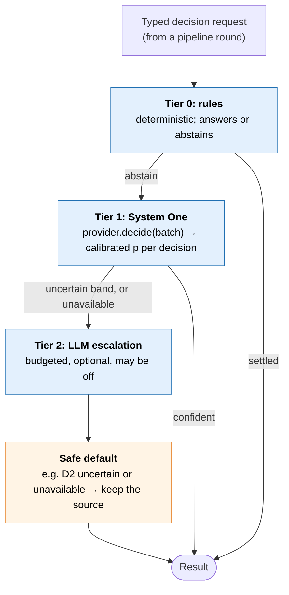
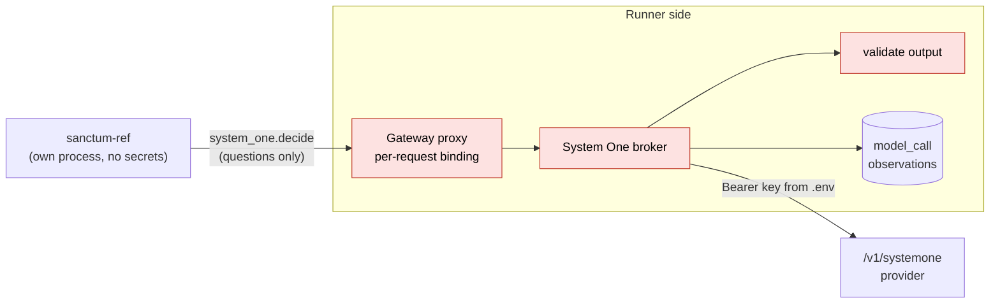

# System One providers and the Jev handshake

[Overview and reading guide](README.md) · [Section map](section-map.md) · [HLD §6 Decision layer](hld.md#section-6)

> Status: proposed design for the lab spike (experiment [E1](lab-spike.md#section-17)). Nothing here is implemented yet beyond the M6 stand-in. Every number on this page comes from **one live call** or one lab run and is marked *measured once*; none is a benchmark.

This page specifies how Sanctum's Tier 1 (System One) decisions reach a model: the provider interface, the `/v1/systemone` wire protocol, how Sanctum decisions map to protocol primitives, and the handshake details that make a call safe, replayable and comparable across providers. The hosted closed model (TypeSafe Jev) and open models (Laya, OpenJevPro, decider-4b, Tev1, CLM, Kev) are interchangeable behind one adapter.

## Why this page exists

The M6 stand-in (TF-IDF over pinned descriptors) never reached a confident "not useful" answer, so C3 equalled C2 and hypothesis H1 (does a System One model route better?) is untested. The HLD names Jev but leaves the handshake implicit. One live call already shows three things an integration must handle:

| Observation (measured once) | Consequence |
|---|---|
| `model: "jev-latest"` came back as `jev-1.13.0` | Calibration is per resolved version; the alias alone is not a stable input |
| One call with 2 questions took 531 ms end to end | Above the HLD's 150 ms Round 2 target ([§14.2](hld.md#section-14-2)); latency must be measured per profile, not assumed |
| A `choice` answer had `confidence` 0.24 while its top probability was 0.50 | `confidence` is not the top probability; thresholds must not use it until TypeSafe defines it |
| `usage`: 363 input tokens, 60 output tokens | Usage is reported by the hosted backend; open backends may report none |

## Owner decisions

| ID | Decision |
|---|---|
| D-JEV | Hosted Jev is approved **for synthetic lab data only**. Real data waits on data-class and egress approval ([HLD Q6/Q13](hld.md#section-21)). Recorded in [decisions](../decisions.md). |
| Latency | Latency is measured per profile (strict, relaxed) and is **never a gate in this spike**. |
| First scope | D2 source usefulness live (Jev and the stand-in). D1 and D3 as later shadow experiments. D4, D6 and memory proposal ranking are future design only. |
| D-MARGIN | Source-call savings count only within the agreed evidence-quality tolerance (existing decision). |

## 1. The cascade and where providers sit



Tier 2 is an interface only in this spike (no LLM budget decided). Rules keep policy: must-consult, access, as-of and data class are settled before any model is asked.

## 2. Provider interface

```text
SystemOneProvider
  name           "typesafe-jev" | "laya" | "openjevpro" | "standin" | ...
  capabilities   ProviderCapabilities
  decide(batch: DecisionBatch, deadline_ms) -> list[DecisionResult]   # HLD §6.6 contract

ProviderCapabilities
  primitives              subset of {noul, choice, score}
  max_questions_per_call  int
  max_options             int            # e.g. 20 for the OpenJevPro shim (single-letter read-out)
  batching                bool
  reports_usage           bool
  hosted                  bool
  data_classes_allowed    list           # e.g. [synthetic] for hosted Jev under D-JEV
  conformance             supported | experimental
```

| Adapter | Serves | Notes |
|---|---|---|
| `SystemOneHttpAdapter` | Any `/v1/systemone` backend: TypeSafe Jev natively; Laya via `laya-serve`; OpenJevPro, decider-4b, Tev1, CLM, Kev via shims | Config gives base URL, model id, credential reference and capabilities. Splits batches when a backend lacks batching. Never converts between primitives implicitly. |
| `StandinProvider` | Local TF-IDF plus logistic calibration (M6) | The no-network control arm |
| `LLMEscalationProvider` | Tier 2 | Interface only until an LLM budget is decided |

Providers are declared in `configs/system_one_providers.yaml`; an arm selects one by name (matrix `decision_provider: named`, plus a provider name). The pipeline never branches on provider identity: every difference is a declared capability.

## 3. Wire protocol: `POST /v1/systemone`

Reference: the benchmark client and the OpenJevPro shim in `jev-benchmarks` (`jevbench/client.py`, `servers/openjev_shim.py`).

```text
POST /v1/systemone
Authorization: Bearer <key>

request  { state, model, questions: { <id>: { type: choice | score | noul,
                                               instructions, criteria? } } }
response { model,                               # resolved version, e.g. jev-1.13.0
           answers: { <id>: { type: noul,   noul: p_true }
                          | { type: choice, choice, probabilities: {option: p}, confidence }
                          | { type: score,  score, ... } },
           usage: { input_tokens, output_tokens } | null }
```

`criteria` carries the options for `choice` and the level descriptions for `score`. Open shims may reject a `choice` or `score` with more than `max_options` options (422).

## 4. Mapping Sanctum decisions to primitives

| Decision ([HLD §6.4](hld.md#section-6-4)) | Primitive | Question id | In this spike |
|---|---|---|---|
| D2 source usefulness | `noul` per optional candidate source | `d2:<source_id>` | **Live.** One call per round, all optional candidates batched. `noul` = P(source returns necessary supporting evidence) |
| D1 intent (multi-label) | `noul` per label | `d1:<label>` | Later, shadow only: challenger to rules |
| D3 ambiguity | `noul` | `d3` | Later, shadow only: query only |
| D4 relevance | `score` or `noul` per unit | `d4:<unit>` | Future design |
| D5 duplicate | none | none | Exact hash only; never a model |
| D6 possible conflict | `noul` per bounded pair | `d6:<pair>` | Future design |
| Route preference | `choice` over sources | `route` | Diagnostic only. Bands use per-source `noul`, never `choice.confidence` |
| Memory proposal ranking ([M11](memory-design.md#section-9-10)) | `choice` over mapping labels | `m11:<proposal>` | Future design. Ranks review order only; never establishes identity; D2 calibration never reused |

## 5. The handshake: thirteen points

| # | Point | Rule |
|---|---|---|
| 1 | Auth | `Authorization: Bearer <key>`. The key lives on the broker side only (secret store or `.env`), never in the SUT process, receipts, logs or manifests. |
| 2 | Model pinning | Request an exact version where the provider allows it; always record the resolved `model` from the response. Calibration is keyed by provider and resolved version and is invalid after a version change. |
| 3 | Request shape | `state` is a minimal sanitized projection built by the broker, never by the SUT. D2: query plus the pinned descriptors of the allowed optional sources. Round 3: query plus one record per evidence ref, in a named **state layout** (`r3-state-v1` text slices; `r3-state-v2` provenance-backed records with source, artifact, version, environment, subject, attribute, assertion role, verbatim excerpt and excerpt offsets; `r3-state-v2-compact` and `-compact-150` for small-context providers). Questions come from a **named, versioned template** (`configs/system_one_templates.yaml`, [§15](#15-prompt-and-state-variants-under-test)) and carry `type`, `instructions` and, for `choice`/`score`, `criteria`. |
| 4 | Response semantics | `noul` is P(true); `choice` has `probabilities` and a separate `confidence`; `score` is an expected level. Bands use calibrated probabilities. `confidence` is recorded, not thresholded, until its definition is confirmed with TypeSafe. `usage` may be null. |
| 5 | Batching and limits | A round has a total call limit and one shared deadline across its batches. Respect `max_questions_per_call` and `max_options`; split and merge when exceeded. `score` ↔ `choice` conversion only through an explicit, tested mapping declared for that provider. |
| 6 | Deadline and retries | The call inherits the round's remaining budget. At most one retry, and only if time remains (the benchmark client's 5-attempt exponential backoff is wrong for the request path). Timeout or error → `unavailable`, safe default, `decision_layer_unavailable`. |
| 7 | Latency is measured, not gated | Two profiles: **strict** (the HLD budget; records timeout frequency and fallback cost) and **relaxed** (enough time to measure prediction quality). Elapsed time includes broker, network, validation, batching and retries. The lab calls a hosted endpoint from a laptop, so network dominates; relaxed-profile quality is not evidence about the fast path. p50/p95 reported per profile. |
| 8 | Output validation | A bad individual answer (wrong type, a choice that was not offered, a probability outside [0, 1]) voids that decision only: it is `unavailable` and its candidate is kept. An answer for an id that was never asked, a non-JSON body, or a resolved model version that changes mid-round voids the whole call. Nothing is ever partially trusted within one answer. |
| 9 | Data classes | Eligibility follows the highest data class in the full state ([§14.1](hld.md#section-14-1)). Hosted Jev: synthetic lab data only (D-JEV). Restricted names and other principals' data never enter `state`. |
| 10 | Observability and replay | Receipts carry provider, resolved model version, question ids, raw and calibrated p, latency, usage and a request hash. Model calls are `model_call` observations, separate from knowledge-source calls: they never count as sources attempted or as evidence-bearing retrieval. The broker keeps request/response pairs (credentials excluded) to replay the **decision layer only**, not the whole Sanctum response. |
| 11 | Calibration | See [Calibration binding](#8-calibration-binding-and-the-shadow-only-rule). The binding names the template id and the state layout (or D2 descriptor release). |
| 12 | Provider swap | Switching provider or model version requires recalibration and a rerun of the comparison. The pairing check treats provider and resolved model version as recorded effective inputs. A backend is advertised as supported only after it passes the [conformance checks](#9-conformance-checks-for-a-supported-backend). |
| 13 | What the model can and cannot lose | See [below](#7-what-the-model-can-and-cannot-lose). |

## 6. Isolation: the System One broker



The SUT asks; the broker decides what may be sent. The broker binds each call independently of the SUT's claims:

| The broker decides | From |
|---|---|
| Which request and caller the call belongs to | The proxy's per-request binding |
| Which candidate sources may be asked about, and their descriptors | The gateway's own view of the caller's allowed sources, not the SUT's list |
| The data class of the state | Trusted run configuration; a caller saying "synthetic" is not enough |
| Provider, model, payload size, call count and deadline | Provider configuration and the round budget |
| Whether the answer is valid | Handshake point 8 |
| What is recorded | A `model_call` observation per call, visible to the evaluator |

## 7. What the model can and cannot lose

| Can the model... | Answer |
|---|---|
| Remove a must-consult source? | **No.** Must-consult sources are never candidates (precedence ladder, [memory §9.4](memory-design.md#section-9-4)). |
| Drop a source when uncertain or failed? | **No.** Uncertain, unavailable or invalid → preserve the candidate. |
| Widen access, change authority, or add a source? | **No.** It only chooses among allowed optional candidates. |
| Skip an optional source that held the only necessary evidence? | **Yes.** A confident wrong "not useful" is a real loss. H1 therefore measures harmful omissions directly, and savings count only within D-MARGIN. |
| Override a known failure to report missing mandatory evidence? | **No.** Status honesty checks run regardless of provider score. |

## 8. Calibration binding and the shadow-only rule

- Fitted on **dev only**. Calibration fitting and band (threshold) selection are separated by cross-validation over dev splits.
- A calibration is bound to: provider, **resolved model version** (and checkpoint revision where the provider reports only a family), **template id**, **state layout** (D2: descriptor release over the exact descriptor dict sent), memory release, and decoding settings. A change to any of these invalidates it.
- **Shadow-only rule:** with no usable calibration, the provider runs shadow-only: answers are logged, every candidate is preserved. Shadow comes from the absence of a usable binding: a fit whose band does not meet the tolerance is written to `configs/calibration/rejected/`, and a use band outside (0, 1) is refused; there is no never-promote sentinel.
- Bands are reported with nested case-grouped cross-validation (`sanctum_eval.calibration.nested_cv`): inner folds choose the calibrator and band, outer folds report; denominators and Wilson intervals accompany every rate.
- Campaigns have a hard ceiling enforced before every HTTP attempt (calls, input and output tokens; retries count; usage recorded once per exchange).
- Configuration is frozen before the acceptance run.
- Live calibration has a total call and spend cap, retries included, recorded in the fit provenance with the resolved version and usage totals.

## 9. Conformance checks for a "supported" backend

A backend is **experimental** until it passes all of these against the protocol (a local test server in CI; live smoke for hosted):

| Check | Pass condition |
|---|---|
| Shape | Returns `model` and one answer per asked id, with the asked `type` |
| Primitive fidelity | `noul` in [0, 1]; `choice` among offered options with probabilities summing to 1 ± 0.01; `score` within declared levels |
| Declared limits | Honors or rejects (422) beyond `max_questions_per_call` and `max_options`, never truncates silently |
| Errors | Timeout and 5xx are distinguishable from an empty or low-probability answer |
| Auth | Rejects a missing or wrong bearer token |
| Determinism | Same request at temperature 0 returns probabilities within a declared tolerance |
| Version reporting | Resolved `model` is stable for the same request and changes only on a real version change |
| Usage | Reports usage if `reports_usage` is declared, else null |

## 10. Retention

Broker request/response pairs are kept for the lifetime of the run directory, for **synthetic data only**. A written retention rule (duration, access, deletion) is required before any real data passes through a provider.

## 11. Acceptance blockers carried into E1

| Blocker | Status |
|---|---|
| Residual status overclaims under failure on C4/C5 (dev-018, dev-052) | Must be fixed before any favorable Jev result is accepted. A Jev score cannot override a failure to report missing mandatory evidence. |
| Holdout exposure | The M5 holdout was run and rerun once, and its results were seen by the lead. The Jev claim also needs a fresh acceptance set of about 20 cases, authored by the holdout agent and unseen by the lead and SUT team before the run. |
| Key hygiene | The key was shared in chat; the owner chose to proceed on synthetic data and rotate afterwards. Verification scrubs the SUT environment by construction and scans outputs for the configured key value, not only a prefix. |

## 12. Batching

- **One call per decision round**, with the round's questions grouped **per request only**, never across callers.
- Split only on declared provider limits (`max_questions_per_call`, `max_options`), under one shared deadline and a per-round total call limit. A question beyond `max_options` or of an undeclared primitive is refused, never truncated or converted.
- `state` is sent once per call, so the cost per question falls as the batch grows.
- A cache keyed on the full calibration binding (provider, resolved model, template, descriptor release, query, source id) may reuse identical answers across arms and reruns at temperature 0.
- Rounds 1 and 2 may merge into one call once D1/D3 shadow exists, since both need only the query plus policy output. Round 3 pairs (D6) would batch per request (future).

Batch measurement, `typesafe-jev` (**measured once**, relaxed profile, laptop to hosted endpoint; full table in [the batch report](../reports/system-one-batches-typesafe-jev.md)):

| Questions per call | Warm latency ms (median of 2) | Input tokens | Output tokens | Input tokens per question |
|---|---|---|---|---|
| 1 | 375 | 392 | 26 | 392 |
| 2 | 315 | 428 | 49 | 214 |
| 5 | 303 | 534 | 115 | 107 |
| 10 | 314 | 712 | 227 | 71 |
| 20 | 278 | 1,077 | 459 | 54 |

Every call resolved `jev-latest` to `jev-1.13.0`; cold calls (new connection) took 320 to 568 ms. In this one measurement latency did not grow with batch size, and input cost per question fell about sevenfold from 1 to 20 questions. `max_questions_per_call: 20` is declared accordingly.

## 13. Local Laya on CPU (`laya-local`)

| Item | Rule or measured value |
|---|---|
| Endpoint | Unsloth Decision API at `http://localhost:8888/v1/systemone`; same adapter, no key |
| Pinning | Responses report only `laya-rl-agent`; the checkpoint revision (from `/health`) is recorded in the calibration binding and provenance and is pinned by the running server, not checked per call |
| Confidence | Laya and Jev compute `confidence` differently: bands use calibrated `noul` only, calibration is per provider and never transferred |
| Truncation | Laya reports `usage.truncated`, `state_tokens_dropped` and `truncated_questions`. A truncated state voids the whole call (`truncated`); a truncated question voids that decision. `max_state_chars` remains a backstop for providers that report nothing |
| Choice temperature | The runtime warns that choice temperature is clamped for 11 or more options; D2 uses `noul` only |
| Status | Live conformance passes against Laya 0.3.22; still `experimental` pending a second run |

Measured once (replacing vendor claims), Laya 0.3.22 English checkpoint `55cf4c4e` on an Apple M1 Pro (10 cores, 16 GB):

| Measure | Value |
|---|---|
| Server resident memory | about 1.9 GB |
| Latency per call, warm | about 0.2 to 0.34 s for 1 question, 0.58 s for 5, 0.98 s for 10, 1.82 s for 20 (about 90 ms per added question) |
| Input tokens | about 140 per question; batching does not lower cost per question on CPU |
| D2 round latency in runs (relaxed) | p50 about 530 to 760 ms, p95 up to 1.7 s |
| Calibration (dev, held-out) | Brier 0.144 (raw 0.174), ECE 0.029 (raw 0.166); skip band 0.09 |
| Effect on routing | No confident skips on dev or scenarios: Laya arms equal C2 and C4 exactly |

Full comparison with Jev: [Laya vs Jev report](../reports/system-one-laya-dev.md).

## 14. Round 3 decisions (D6 conflict, D4 relevance)

Round 3 runs after retrieval, on evidence units ([HLD §6.3](hld.md#section-6-3)). It reuses the provider interface, adapter, broker, calibration binding and shadow-only rule unchanged; each decision adds one template, one placement, one safe default and its own calibration. D5 (duplicates) stays exact-hash only. This is experiment E3, one decision at a time.


| | D6 possible conflict | D4 relevance |
|---|---|---|
| Target | a supported typed relation between the two units' assertions about the same subject and attribute: contradiction, policy_implementation_divergence, environment_difference or version_difference (the evaluator's label definition). Different environments or versions may explain a difference; they do not exclude the relation | the unit's span overlaps a necessary-evidence span |
| Template | `d6-noul-v1` (baseline, narrower wording: "incompatible values for the same fact, scope and version"); `d6-noul-v2-relations` states the aligned target ([§15](#15-prompt-and-state-variants-under-test)) | `d4-noul-v1`: "Does this evidence unit support an answer to the query?"; `d4-noul-v2-support` under test |
| Question id | `d6:<unit_a>|<unit_b>` | `d4:<unit>` |
| State | the two units' text (bounded excerpt), source ids, versions, environments | the query and one unit's text excerpt, source id and version |
| Placement | after the typed rules, before packing | after the rules ranker, before packing |
| What it judges | only pairs the typed rules produced: pairs they flag, plus a bounded set of candidate pairs they dropped as noise (shared attribute and different values, but no identity overlap) | at most `d4_max_units` units per request (config), highest rules rank first |
| What it may change | promote a candidate pair to `possible_conflict` (both witnesses then reserved in packing); record calibrated p for flagged pairs | the order of packed units, and which rules-excluded units fill budget the rules left unused |
| What it may never change | a rule-flagged pair is always flagged; D6 never hides, dismisses or confirms a conflict (confirmation is a reviewer's) | never removes a unit the rules-only packer includes (tested superset property); never raises the budget |
| Safe default (uncertain, unavailable, invalid, truncated) | rules-only behaviour: flagged pairs stay flagged, candidates stay unflagged, all units kept | rules order, rules-packed set |
| Cost bound | at most the pair cap per request (default 6 flagged plus 6 candidates), batched within the round's call limit and shared deadline | `d4_max_units` per request; on laya-local about 90 ms per unit (measured), so the cap matters |
| Primary metrics | conflict witnesses kept, expected conflicts flagged, false conflicts flagged, relation-type accuracy | necessary-evidence recall within budget, precision proxy, harmful omissions, tokens returned |
| Calibration labels (evaluator side, dev only) | gold relations: a candidate pair is positive when its units witness a gold relation | necessary-evidence spans: a unit is positive when it covers a gold span |

**Consequence of the invariants.** D4 can only matter where the rules leave budget unused or where order matters to the caller; D6 can only add conflict flags. Neither can make a response lose evidence the rules would have returned, so their worst case is extra tokens or extra false conflicts, which the metrics count. Each calibration is bound to decision, provider, resolved model (and checkpoint revision for Laya), template and descriptor release.

## 15. Prompt and state variants under test

Every question template and state layout is a named, versioned entry; a calibration binds on both. Texts live in `configs/system_one_templates.yaml` (verbatim from the [prompt review](../reviews/system-one-prompt-review-full.md)); state layouts in `src/sanctum_run/round3_state.py`. **Live** means a calibration with a usable band exists and a run may apply it; **shadow** means answers are recorded and never applied; **diagnostic** means shadow-only by definition, never calibrated into a band. Results are in the campaign reports ([summary](../reports/system-one-prompt-campaign.md)); every number there is measured once.

| Variant | Decision | Kind | Text or layout pointer | Status |
|---|---|---|---|---|
| `d2-noul-v1` | D2 | template | templates file | live: `typesafe-jev@jev-1.13.0`, `laya-local@laya-rl-agent` |
| `d2-noul-v2-loss` | D2 | template (evidence-loss rubric) | templates file; review §3 | shadow |
| `d2-descriptors-v2` | D2 | descriptor set | `configs/d2_descriptors_v2.yaml`; review §3 | shadow |
| `d6-noul-v1` | D6 | template (baseline) | templates file | live for Jev (use band 0.61); rejected for Laya |
| `d6-noul-v2-relations` | D6 | template (aligned target) | templates file; review §1 | shadow |
| `d6-noul-v3-excerpts` | D6 | template on `r3-state-v2` | templates file; review §2 | shadow |
| `d6-noul-v3-excerpts-compact`, `-compact-150` | D6 | template on `r3-state-v2-compact` / `-150` | templates file; `round3_state.py` | shadow |
| `d6-laya-positive-v1` | D6 | template (short) | templates file; review §6 | shadow |
| `d6-laya-negative-v1` | D6 | template (reversed polarity) | templates file; review §6 | diagnostic |
| `d6-decomp-v1` | D6 | two questions per pair | templates file; review §5 | diagnostic |
| `d6-choice-v1` | D6 | relation choice | templates file; review §5 | diagnostic |
| `d4-noul-v1` | D4 | template (baseline) | templates file | shadow (fits rejected) |
| `d4-noul-v2-support` | D4 | template | templates file; review §4 | shadow |
| `d4-score-v1` | D4 | score | templates file; review §4 | diagnostic |
| `r3-state-v1` | D6, D4 | state layout: text slices up to 1,200 chars per ref | `round3_state.py` | in use |
| `r3-state-v2` | D6, D4 | state layout: labeled, assertion-bearing excerpts with offsets | `round3_state.py`; review §2 | shadow |
| `r3-state-v2-compact`, `-compact-150` | D6, D4 | state layout: v2 fields, excerpt capped at 350 / 150 chars, qualifiers first | `round3_state.py` | shadow (small-context providers) |

A variant becomes live only if its band clears the unchanged tolerance under nested case-grouped cross-validation, and only after the owner approves a live arm.

## Where this is referenced

[HLD §6.2 and §6.5](hld.md#section-6) · [Contracts Ex. 9](contracts-and-scenarios.md#example-9) · [Memory §9.5 step 5 and M11](memory-design.md#section-9-5) · [Lab E1](lab-spike.md#section-17) · [Spike plan](spike-plan.md)
