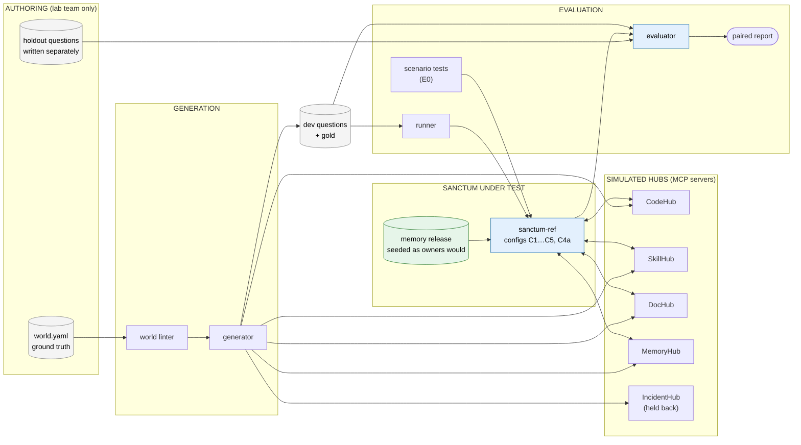
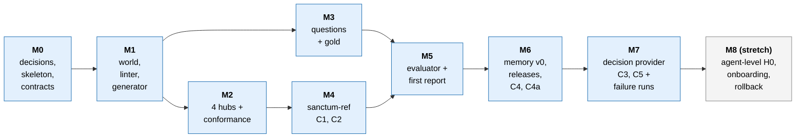

# Sanctum Lab: scaffold plan

| | |
|---|---|
| Status | Plan for review. No code written yet |
| Date | 2026-09-30 |
| Implements | HLD v5 §17.2 (Sanctum Lab), with the experiments in §17.1 and fixtures in §10 |
| Scope | "Minimum plus": the minimum lab, extended with a Jev-compatible decision interface, failure injection, memory releases, and an optional agent-level test |
| Reviewer | Codex, using `sanctum-lab-plan-review-prompt.md` |

---

## 1. What the lab is for

The lab runs Sanctum against **simulated knowledge hubs** generated from one synthetic world, so the HLD's hypotheses can be tested before real backends, permissions, and data-egress approvals are ready.

It must answer four questions, in this order:

| # | Question | Hypothesis | Configs compared |
|---|---|---|---|
| 1 | Does the contract hold on the hard cases (scope, ambiguity, conflicts, versions, failures)? | E0 | All, via scenario tests |
| 2 | Do rules beat today's fan-out? | Baseline | C1 vs. C2 |
| 3 | Does memory v0 (reviewed names, places, procedures) beat rules, and is the value in the vocabulary or the graph? | H5 / E6 | C2 vs. C4 vs. C4a (alias table) |
| 4 | Does a usefulness model help routing? | H1 / E1 | C2 vs. C3; C4 vs. C5 |

Stretch: agent-level H0 (C0 vs. C2 vs. C4), fifth-hub onboarding, release swap and rollback.

**What the lab cannot prove:** real coverage, real query mix, real latency, or Jev's accuracy on real text. A real read-only slice follows (§11).

---

## 2. Architecture



### 2.1 The isolation rule

The system under test (SUT) **never** reads `world.yaml`, the generator's intermediate files, or any gold label. It sees only what a real Sanctum would see:

- the hubs' MCP tools and capability manifests,
- an owner-style registry manifest per hub (authored separately, §5.3),
- a memory release seeded the way owners would seed it (§6.4),
- the caller's request.

This is enforced by process (separate directories, separate container or virtualenv for the SUT, no shared filesystem mounts) and checked by a test that fails if the SUT's import graph or file access touches `world/` or `gold/`.

Without this rule, the lab would measure how well Sanctum reads the answer key.

---

## 3. Decisions to confirm before starting

| # | Decision | Proposed default | Why |
|---|---|---|---|
| D1 | Where the lab lives | New repo `sanctum-lab`, separate from the Sanctum repo | Keeps test harness and SUT independent |
| D2 | What the SUT is | `sanctum-ref`: a reference implementation of the HLD pipeline inside the lab, exposed through the same MCP contract as Sanctum. When the real Sanctum gateway implements the contract, the runner points at it instead | The Sanctum repo is still sparse; the lab should not wait for it |
| D3 | Language and libraries | Python 3.11+; MCP Python SDK (FastMCP) for hubs and SUT; Pydantic for contracts; SQLite FTS5 (BM25) for hub search; PyYAML | Small, familiar, fast to iterate |
| D4 | Ranker in the baseline | BM25 score normalization within source, plus an optional local cross-encoder behind a flag | Avoids a network dependency in the minimum |
| D5 | Tokenizer | One declared tokenizer (e.g. `tiktoken` cl100k) used everywhere | Budget numbers must be comparable across configs |
| D6 | Usefulness model for C3/C5 | A local stand-in (embedding similarity + logistic calibration) behind the `DecisionProvider` interface; Jev plugs into the same interface when access is approved | Lab data is synthetic, so Jev egress is lower risk, but vendor access still needs approval |
| D7 | Holdout author | Someone not building `sanctum-ref` | Prevents tuning to the test |
| D8 | LLM use in generation | Optional paraphrasing of rendered text, with a check that each paraphrase still asserts its facts | Reduces the "templated text is too easy to search" problem |

---

## 4. Repository layout

```
sanctum-lab/
  README.md
  pyproject.toml
  contracts/                  # shared Pydantic models (the HLD's contracts)
    evidence.py               # EvidenceUnit, EvidenceResponse (HLD §7.1, §12.2)
    decision.py               # DecisionRequest, DecisionResult (HLD §6.6)
    memory.py                 # Term, Entity, Artifact, Procedure, Release (HLD §8.6, §9.6)
    hub.py                    # capability manifest, tool I/O shapes
  world/                      # AUTHORING ONLY. SUT must not read
    world.yaml
    templates/                # text templates per hub and artifact kind
    filler/                   # parameters for noise services and documents
  gen/
    lint.py                   # world linter
    render.py                 # world → hub corpora
    paraphrase.py             # optional, with fact check
    questions.py              # question templates → dev questions + gold
  gold/                       # AUTHORING ONLY. SUT must not read
    dev/                      # generated
    holdout/                  # hand-written by a separate author
  hubs/
    common/                   # FTS index, ACL check, failure knobs, admin API
    codehub/  skillhub/  dochub/  memoryhub/  incidenthub/
  owners/                     # what real owners would provide
    manifests/                # per-hub registry manifests (authority, selectors, capabilities)
    memory_seed/              # reviewed names, places, membership, procedures
  sut_ref/                    # sanctum-ref
    policy/  registry/  memory/  decisions/  adapters/  assembly/  receipts/
    configs/                  # C1.yaml … C5.yaml, C4a.yaml
    server.py                 # MCP: sanctum.retrieve
  run/
    runner.py                 # question × config → responses + receipts
    scenarios/                # E0 scenario tests (Examples 1–15, Fixtures 16–25)
  eval/
    metrics.py
    stats.py                  # paired, clustered intervals
    leak_scan.py
    report.py
  agent/                      # stretch: agent-level H0
  ci/
    isolation_test.py         # SUT must not touch world/ or gold/
```

---

## 5. The world

### 5.1 World file schema (sketch)

```yaml
world_version: 1
seed: 20260930

principals:
  - id: kestrel-payments        # agent working on payments
    groups: [payments-eng]
  - id: kestrel-identity
    groups: [identity-eng]
  - id: admin-probe
    groups: [payments-eng, identity-eng, restricted-incidents]

entities:                       # ground truth identity
  - id: svc.payment-auth
    type: service
    member_of: domain.payments
  - id: svc.identity-auth
    type: service
    member_of: domain.identity
  - id: topic.retries
    type: topic

releases: [R40, R41, R42]
environments: [prod, experiment]

facts:                          # what is actually true
  - id: f.retry-limit.impl
    entity: svc.payment-auth
    fact_kind: implemented
    attribute: max_retries
    values:
      - { value: 3, from: R40, env: prod }
      - { value: 5, from: R42, env: prod }
      - { value: 7, from: R42, env: experiment }
  - id: f.retry-limit.procedure
    entity: svc.payment-auth
    fact_kind: procedure
    attribute: max_retries
    values:
      - { value: 3, from: R40 }            # procedure never updated: planted conflict

hubs:
  codehub:
    names: {}                               # code uses repo paths, not names
    places:
      - { native: "repo:payments/payment-auth", selects_for: svc.payment-auth }
      - { native: "repo:identity/auth", selects_for: svc.identity-auth }
    capabilities: { version_reads: true, filters: [repo, ref] }
  skillhub:
    names:
      - { native: "Auth Service", namespace: "Payments", denotes: svc.payment-auth }
      - { native: "Auth Service", namespace: "Identity", denotes: svc.identity-auth }   # homonym
    capabilities: { version_reads: true, filters: [path_prefix] }
  dochub:
    places:
      - { native: "space:PA", selects_for: svc.payment-auth, acl: [payments-eng] }
      - { native: "space:Identity", selects_for: svc.identity-auth, acl: [identity-eng] }
      - { native: "space:Incidents", acl: [restricted-incidents] }
    capabilities: { version_reads: { "space:PA": false }, filters: [space] }
  memoryhub:
    names:
      - { native: "PA-svc", denotes: svc.payment-auth }
    capabilities: { version_reads: false, filters: [principal] }

artifacts:                      # rendered into hubs; each asserts facts
  - id: a.retryconfig
    hub: codehub
    path: "payments/payment-auth/RetryConfig.java"
    versions:
      - { ref: R40, env: prod, asserts: [f.retry-limit.impl@R40] }
      - { ref: R42, env: prod, asserts: [f.retry-limit.impl@R42] }
      - { ref: exp-branch, env: experiment, asserts: [f.retry-limit.impl@R42/experiment] }
    about: [svc.payment-auth, topic.retries]

planted:                        # the linter checks each is present
  - homonym: { name: "Auth Service", entities: [svc.payment-auth, svc.identity-auth] }
  - conflict: { facts: [f.retry-limit.impl, f.retry-limit.procedure], at: R42 }
  - exact_duplicate: { artifact: a.retry-policy, hubs: [dochub, codehub] }
  - composite_subject: { artifact: a.skill.auth-retries, about: [svc.payment-auth, svc.identity-auth] }
  - coverage_gap: { entity: svc.fx-quote }
  - injection: { artifact: a.dochub.poisoned }
  - restricted: { space: "space:Incidents" }
  - version_branching: { artifact: a.retryconfig }

filler:
  services: 26                  # plausible noise services
  artifacts_per_service: [40, 120]
```

### 5.2 Scale

The corpus must be large enough that fan-out and token budgets matter; with a tiny corpus, "call everything" wins trivially.

| Item | Target |
|---|---|
| Core services (planted situations) | 4–6 |
| Filler services | ~26 |
| Artifacts across hubs | ~3,000 |
| Releases | 3, plus one experiment branch |
| Principals | 3–4 with different groups |

### 5.3 Owner manifests are authored, not derived

`owners/manifests/` and `owners/memory_seed/` are written the way real owners would write them: from what each hub exposes, plus declared authority. They are allowed to be **incomplete** (a missing name, a stale selector) because real memory will be. The linter reports the gap between owner seeds and ground truth, but that report is visible only to the lab team, never to the SUT.

### 5.4 World linter

Fails the build if:

- a planted situation is missing or not rendered,
- a fact has no artifact asserting it (unless it is a planted gap),
- a question's gold cannot be derived,
- an ACL-restricted artifact's text or name appears in an unrestricted artifact,
- a paraphrase no longer asserts its facts (when D8 is on).

### 5.5 Rendering

- Templates per hub and artifact kind (Java-ish code, skill markdown, Confluence-ish pages, session notes).
- Each rendered artifact carries hidden provenance (which facts it asserts) in the **generator's** index only, never in hub-visible text or metadata.
- Vocabulary is hub-specific: SkillHub writes "Auth Service", MemoryHub writes "PA-svc", CodeHub uses repo paths. Hubs do not share a vocabulary, on purpose.
- Deterministic by seed.

---

## 6. Simulated hubs

### 6.1 Tools per hub

Tool names and shapes mimic the real systems so adapters transfer later.

| Hub | Tools | Notes |
|---|---|---|
| CodeHub | `search_code(query, repo?, ref?, top_k)`, `get_file(path, ref)`, `list_repos()` | Version reads by ref |
| SkillHub | `search_skills(query, path_prefix?, top_k)`, `get_skill(path, version?)`, `list_tree(prefix?)` | Exposes its native tree and names |
| DocHub | `search(query, space?, top_k)`, `get_page(page_id)`, `list_spaces()` | Chunks; no version reads for `space:PA` |
| MemoryHub | `search_sessions(query, top_k)`, `get_session(id)` | Scoped to the calling principal |
| IncidentHub | `search_incidents(query, service?, since?)`, `get_incident(id)` | Held back for onboarding |

### 6.2 Shared behavior

| Behavior | Implementation |
|---|---|
| **Honest search** | SQLite FTS5 with BM25; no synonyms, no stemming beyond FTS defaults, no knowledge of other hubs' names. An unknown alias genuinely misses |
| **Identity** | Each call carries a hub-scoped token. `sanctum-ref` obtains it from a tiny lab token service by exchanging the caller token (simulating HLD §14.1; no passthrough) |
| **ACL** | Filter at query time by principal groups; restricted items never appear in results, counts, or error messages |
| **Versions** | Artifacts stored per version with branch and environment; hubs without version reads return current only and declare it |
| **Capabilities** | `capabilities.json` per hub, matching the adapter contract (HLD §12.3) |
| **Failure knobs** | Per tool: latency distribution, timeout rate, error rate, partial results; set by config and seed |
| **Admin API (lab only)** | Rename a path, unshare a space, revoke a principal, change an owner, publish a new version. Emits a change event for the revocation feed (HLD §9.1). Not reachable by the SUT except through the change feed |

### 6.3 Hub conformance tests

Every hub passes the same suite before use: scope isolation, no leakage in counts or errors, version reads as declared, honest miss on an unknown alias, deterministic results by seed, failure knobs behave as configured.

### 6.4 Memory seed (what C4 gets)

Seeded as owners would, and published as release `r1`:

- reviewed `DENOTES` names (including both "Auth Service" namespaces),
- `SELECTS_FOR` places (repo and space selectors),
- `MEMBER_OF` for pilot services,
- one must-consult procedure (SkillHub for payments procedure facts),
- declared authority per hub and fact kind,
- pinned descriptors written from hub-visible structure.

Deliberately incomplete: at least one hub-specific name is **missing**, so unresolved-term behavior and (later) the improvement loop can be tested.

---

## 7. Sanctum under test (`sanctum-ref`)

### 7.1 Contract

One MCP tool:

```
sanctum.retrieve(
  caller_token, query, scope?, mode = scoped | explore | verify,
  as_of?, budget_tokens, deadline_ms
) -> EvidenceResponse   # HLD §12.2
```

Plus a receipt written for every call (HLD §9.6, §15), including release ID and config ID.

### 7.2 Pipeline modules and what each config enables

| Module | HLD | C1 | C2 | C3 | C4 | C4a | C5 |
|---|---|---|---|---|---|---|---|
| Token verify, scope | §5, §14.1 | ✓ | ✓ | ✓ | ✓ | ✓ | ✓ |
| Fan-out to all allowed hubs | – | ✓ | | | | | |
| Rules routing (intent rules, capability checks) | §6.3 | | ✓ | ✓ | ✓ | ✓ | ✓ |
| Must-consult from registry | §9.4 | | ✓ | ✓ | ✓ | ✓ | ✓ |
| D2 usefulness provider | §6.4 | | | ✓ | | | ✓ |
| Memory resolution (`DENOTES`, ambiguity) | §9.2 | | | | ✓ | | ✓ |
| Alias table resolution (flat) | M12 | | | | | ✓ | |
| Per-source query plans | §9.3 | | | | ✓ | ✓ | ✓ |
| Procedures + precedence ladder | §9.4 | | | | ✓ | ✓ | ✓ |
| Exact dedup, version applicability | §7.5 | | ✓ | ✓ | ✓ | ✓ | ✓ |
| Ranker + packing with conflict reservation | §7.3–7.4 | concat | ✓ | ✓ | ✓ | ✓ | ✓ |
| Conflict flags (rules: same entity + attribute, different value) | §6.4 D6 | | ✓ | ✓ | ✓ | ✓ | ✓ |
| Memory releases, pinning | §9.6 | | | | ✓ | ✓ | ✓ |

C4a uses the same registry, procedures, and query plans as C4, but resolves names from a flat alias table (label → entity) with no namespaces, no ambiguity handling, and no `SELECTS_FOR` distinction. This is the M12 control: if C4a matches C4, the value is in having aliases, not in the richer memory model.

### 7.3 Decision provider interface

```
DecisionProvider.decide(DecisionRequest) -> DecisionResult   # HLD §6.6
providers: rules | standin | jev (optional) | llm (optional, escalation)
```

- `standin`: embedding similarity between the query and each source's pinned descriptor, with a logistic calibration fitted on dev questions only.
- `jev`: same interface, enabled only with approved access. Synthetic data only.
- Every result carries `status`, `disposition`, and `target`; uncertain D2 answers keep the source (HLD §6.4).

### 7.4 What `sanctum-ref` does not do

No writes, no reconciliation, no online learning, no LLM decomposition in the minimum (vague questions are expected to return `partial`).

---

## 8. Questions and gold

### 8.1 Question schema

```yaml
id: q-alias-007
family: hub_specific_name
principal: kestrel-payments
scope: project:payments-auth-retry-fix
mode: scoped
as_of: null
text: "What are the PA-svc retry limits on a gateway timeout?"
gold:
  interpretations:
    - entity: svc.payment-auth
      necessary_artifacts: [a.retryconfig@R42, a.skill.auth-retries@v3]
      acceptable_source_sets: [[codehub, skillhub], [codehub, skillhub, dochub]]
      required_sources: [skillhub]        # from the must-consult rule
      expected_conflicts: [[a.retryconfig@R42, a.skill.auth-retries@v3]]
  expected_status: sufficient
  must_not_appear: [space:Incidents/*, svc.identity-auth]   # leakage and wrong entity
```

### 8.2 Families and counts

| Family | Dev (generated) | Holdout (hand-written) |
|---|---|---|
| Named service or method | 10 | 6 |
| Hub-specific names | 8 | 6 |
| Same name, two meanings | 6 | 4 |
| Historical (`as_of`) | 6 | 4 |
| Conflicting sources | 6 | 4 |
| Verify a claim | 4 | 3 |
| Vague | 4 | 3 |
| No source has it | 6 | 3 |
| Needs two or more hubs | 6 | 4 |
| Restricted content | 4 | 3 |
| **Total** | **60** | **40** |

Plus 25 **scenario tests** (Examples 1–15, Fixtures 16–25) run as deterministic contract tests, not scored as questions.

### 8.3 Gold rules

- Dev gold is derived from `world.yaml` by the generator.
- Holdout questions are written by a separate author from the world file and hub corpora, then gold is derived and checked by the same generator logic.
- Holdout includes questions where rules alone **should** win, and questions where no configuration can succeed (to check honest `insufficient`).
- Some dev questions are phrased with paraphrases and typos, not only template wording.

---

## 9. Evaluation

### 9.1 Metrics (retrieval level)

| Metric | Definition |
|---|---|
| Necessary-evidence recall | For each interpretation, fraction of `necessary_artifacts` present in the response within budget |
| Complete support rate | Share of questions where all necessary artifacts for the correct interpretation(s) are present |
| Harmful omission | A required source was not called, or a necessary artifact was missing without a matching gap reported |
| Wrong-entity activation | Receipt shows resolution to an entity outside gold interpretations **and** a procedure, selector, or authority was applied from it |
| Ambiguity handled | For homonym questions: separated interpretations returned, none blended |
| Conflict witnesses kept | Both sides of each expected conflict present and flagged |
| Status correctness | `evidence_status` and per-source statuses match gold |
| Leakage | Any restricted artifact ID, text, name, or count in response, receipt, or decision inputs (scanner over all outputs); must be zero |
| Sources called, tokens returned | From receipts; tokens by the declared tokenizer |
| Latency | Sanctum overhead vs. hub time, p50/p95 |

### 9.2 Statistics

- **Paired** comparisons: every config answers every question.
- Intervals by bootstrap **clustered by entity and family**, since questions about the same entity are correlated.
- Report per family, not only pooled.
- Hard gates (leakage, scope, wrong-entity on fixtures) are pass/fail regardless of averages.
- 60 + 40 questions support directional results and debugging, not tight population estimates; the report says so.

### 9.3 Report

One markdown/HTML report per run: config matrix, per-family table, paired deltas with intervals, gate results, and links to receipts for every failure. Each run records world version, seed, memory release, config, and code commit.

### 9.4 Agent level (stretch, H0)

A small agent answers each question three ways: direct access to all hub tools (C0), Sanctum C2, Sanctum C4. Answers are graded against gold facts (value extraction plus an LLM grader spot-checked by hand). Measures correctness, turns, and context tokens. Requires LLM budget; runs only after retrieval-level results are stable.

---

## 10. Milestones



Each milestone ends in a demo that fits the weekly demo track.

| Milestone | Deliverables | Acceptance | Demo |
|---|---|---|---|
| **M0** Decisions and skeleton | D1–D8 confirmed; repo; Pydantic contracts; CI with isolation test | Contracts round-trip; isolation test fails on a deliberate violation | Walk the contracts against HLD sections |
| **M1** World | `world.yaml` with all planted situations; linter; renderer; filler | Linter passes; every planted situation rendered; deterministic by seed; paraphrase check if D8 on | Show one fact rendered four ways across hubs |
| **M2** Hubs | Four hubs + IncidentHub; token service; capabilities; failure knobs; admin API | Conformance suite green for every hub; honest miss on unknown alias demonstrated | Same query, four hubs, four vocabularies |
| **M3** Questions | 60 dev with gold; holdout author assigned and 40 holdout drafted | Every question has derivable gold; schema-valid; holdout stored where `sanctum-ref` developers cannot see it | Walk three question families and their gold |
| **M4** `sanctum-ref` C1, C2 | Scope, token exchange, adapters, rules routing, must-consult, dedup, applicability, packing, rule-based conflict flags, receipts | Scenario tests for Examples 1–4, 8–10 pass on C2 | Example 1 traced end to end |
| **M5** Evaluator | Runner, metrics, leak scanner, paired stats, report | First C1 vs. C2 report on dev; leak scanner catches a deliberately planted leak | First paired report |
| **M6** Memory v0 | Memory store, seed, release `r1`, pinning, resolution with ambiguity, query plans, procedures + ladder, alias-table control | Fixtures 16–20, 23, 24 pass; C4 and C4a reports on dev | Example 5 and Fixture 16 live |
| **M7** Decisions and failures | `DecisionProvider` with rules and stand-in; optional Jev; failure-injection runs | C3 and C5 reports; degradation scenarios (Example 9) pass under injected failures | Example 9 under failure |
| **M8** Stretch | Agent-level C0/C2/C4; IncidentHub onboarding; release swap and rollback during requests | H0 report; Example 12 and Fixture 23 pass | Agent with and without Sanctum |

**Holdout is run once per milestone from M5 on**, by the holdout owner, and the results are reported but not used to tune.

---

## 11. From lab to a real slice

When M6 results are stable:

1. Survey real adapters (HLD Q15): what Deep Insights, Dobby, and KaaS actually expose. Update hub capability manifests to match, and re-run.
2. Point `sanctum-ref` adapters at the real hubs, read-only, with a lab principal.
3. Run the harvested Kestrel questions with hand-labeled gold through the same evaluator.
4. Compare lab and real results per family. Where they diverge, fix the lab before trusting it further.

---

## 12. Risks

| Risk | Effect | Mitigation |
|---|---|---|
| SUT reads the answer key | Inflated results | Isolation rule and CI test (§2.1) |
| Templated text is too easy to search | Overstates recall; understates the vocabulary problem | Paraphrase with fact check; hub-specific vocabulary; filler noise |
| Corpus too small | Fan-out wins trivially; budgets never bind | ~3,000 artifacts; realistic budgets |
| Designers write both the world and the tests | Lab flatters the design | Separate holdout author; rules-should-win questions; impossible questions |
| Owner seeds copied from ground truth | Memory looks perfect | Seeds authored from hub-visible structure; deliberately incomplete |
| Stand-in is not Jev | C3 results do not transfer | Same interface; label results "stand-in"; rerun with Jev when approved |
| Mock hubs diverge from real ones | Lab results do not transfer | Mirror real tool shapes; update from adapter survey; real slice (§11) |
| Too few questions | Noisy results | Report intervals and families; treat as directional |
| Scope creep into building Sanctum | Lab never finishes | `sanctum-ref` implements only the modules in §7.2; no writes or learning |

---

## 13. Traceability to HLD v5

| Lab element | HLD |
|---|---|
| Configs C1–C5, C4a | §16.2 ladder, §17.1, M12 |
| Scenario tests | §10 Examples 1–15, Fixtures 16–25 |
| Contracts | §6.6, §7.1, §12.2, §12.3 |
| Memory seed and releases | §8.5–§8.7, §9.2–§9.6 |
| Metrics and gates | §16.3, §16.4 |
| Token exchange and ACLs | §14.1 |
| Change feed | §9.1 |
| Real slice | §17.2, Q15 |

---

## 14. Open questions

1. Should `sanctum-ref` eventually become the real Sanctum implementation, or stay a test double?
2. Is there a budget for LLM calls (paraphrasing, agent-level tests, grading)?
3. Who is the holdout author?
4. Can we get Jev access for synthetic data, and under what terms?
5. Should the lab run in CI on every change, or nightly?
