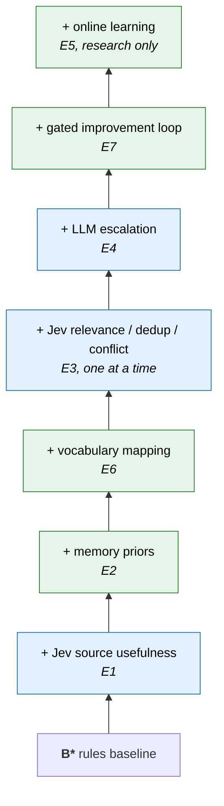
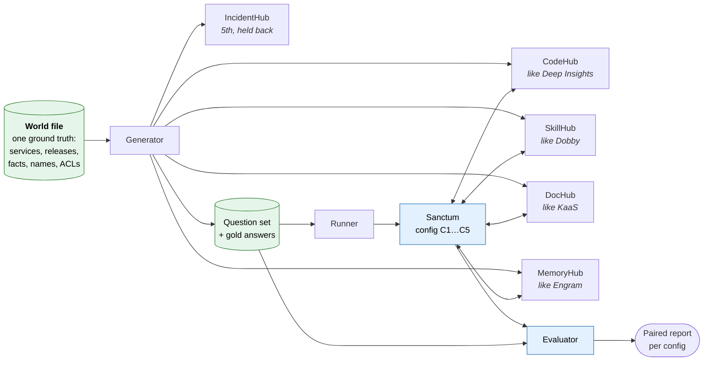

# Sanctum Lab — hypothesis-validation spike

[Overview and reading guide](../../design/intelligence-layer/README.md) · [Section map](../../design/intelligence-layer/section-map.md)

> Status: proposed research design, reorganized from v5.1. Lab work is experimental. Original section numbers are retained.

The lab is a spike supporting the architectural proposal. It investigates underlying hypotheses using controlled synthetic knowledge hubs, fair baselines, explicit failure cases, and inspectable evidence. A negative or inconclusive result is useful: it can justify keeping rules or simplifying the proposed design.

## What an experiment establishes

Each report should identify its H/E question, configuration comparison, frozen inputs, measurements, failure gates, per-family results, limitations, and architectural implication. Separate contract correctness from retrieval quality and agent-level benefit. Synthetic results do not establish real query coverage, production latency, or production readiness.

The detailed protocol follows: §2 owns the hypothesis register; §16 owns the evaluation framework; §17 owns experiments and the simulated-hub design. [Execution and progress](spike-plan.md) links to the existing lab package rather than copying its changing milestone status.

## Related lab artifacts and precedence

- [Existing scaffold plan](lab-spike.md): detailed world, hub, runner, and evaluation design. Its header still says no code exists and some vocabulary predates v5.1; treat it as planning history where it conflicts with current artifacts.
- [Lab package README](../../README.md): package scope and current documented implementation.
- [Milestone register](../milestones.md): owns the package's milestone numbering and exit criteria.
- [Discrepancy register](../discrepancy-register.md): proposed contract differences requiring resolution.
- [Measurement plan](../measurement-plan.md): executable evaluation conventions.

Use the v5.1 configurations below when interpreting comparisons. Package differences remain explicit proposals until resolved; implementation alone does not amend the architecture.

---

## 2. Research hypotheses

| ID | Hypothesis | Experiment | If false |
|---|---|---|---|
| H0 | A unified layer gives agents better evidence per token than connecting to each hub directly | E0b | Rethink Sanctum's scope before adding intelligence |
| H1 | A System One model picks useful sources better, cheaper, or faster than rules, without losing needed evidence | E1 | Keep rules; keep the decision interface for later |
| H2 | Routing memory improves routing over a static registry | E2 | Keep the registry; drop learned priors |
| H3 | A System One model helps relevance, duplicate, and conflict detection over existing rankers and exact matching | E3 | Keep the existing ranker and exact dedup |
| H4 | Escalating uncertain decisions to an LLM is worth the cost | E4 | Preserve extra evidence instead |
| H5 | Reviewed vocabulary (names and places) finds necessary evidence that untranslated queries miss | E6 | Keep a plain alias table |
| H6 | Gated improvement proposals improve held-out routing over time | E7 | Keep memory hand-curated |

Online learning (E5) comes only after a reliable reward signal exists.

---

## 16. Evaluation

### 16.1 The strong baseline (B*)

**Registry + scope + deterministic intent rules + must-consult authority + existing cross-encoder + exact dedup + bounded packing.**

### 16.2 The ablation ladder

Every experiment changes exactly one rung.

A rung is kept only if it beats the rung below it on the same traffic.

### 16.3 Metrics

| Category | Metric |
|---|---|
| Evidence | Full supporting evidence within budget; harmful omissions; conflict witnesses kept |
| Routing | Source calls per query; necessary-source omission rate |
| Memory | Wrong-entity activation; identity precision **and** coverage; ambiguity handled correctly; required-source gaps reported; translated-query evidence recall; scope violations; descriptor freshness; release reproducibility. Unresolved rate and accepted/reverted counts are diagnostics only |
| Cost and speed | Model + backend cost; p50/p95/p99 by mode |
| Decision quality | Discrimination, class-specific errors, risk vs. coverage, ECE |
| Task | Task success, turns per task, context tokens per task |

### 16.4 Gates

1. **Contract gates** (must pass regardless of quality): no unauthorized access or egress, no governance bypass, declared replay behavior, explicit partial results. The examples and fixtures in [§13](../../design/intelligence-layer/contracts-and-scenarios.md#section-13) become test cases.
2. **Quality gates:** non-inferiority within a predeclared margin, paired clustered intervals.
3. **Economic gates:** cost per successful task, backend load, latency by mode.

---

## 17. Experiments

### 17.1 Experiment catalog

| ID | Question | Change vs. B* | Decision rule |
|---|---|---|---|
| E0b | H0: is a unified layer better than direct hubs? | Agent-level: agent with direct hub access vs. agent using Sanctum (C0 vs. C2/C4, [§17.2](lab-spike.md#section-17-2)) | Proceed only if evidence per token and answer quality improve |
| E0 | Is the harness trustworthy? | None; run [§13](../../design/intelligence-layer/contracts-and-scenarios.md#section-13) examples as fixtures | Every fixture has an explicit, deterministic outcome |
| E1 | H1: does Jev route better? | Replace D2 scoring only | Adopt if non-inferior on evidence and better on cost/latency (latency is measured per profile, not a gate in the spike; see [System One providers](../../design/intelligence-layer/system-one-providers.md)) |
| E2 | H2: do observation priors help? | Toggle observation-derived priors; vocabulary, rules, queries and source snapshots fixed | Non-inferior on evidence within an owner-agreed margin plus a predeclared benefit; intervals reported; small samples are inconclusive |
| E2b | Storage | Same queries on tables+cache vs. graph DB | Pick on latency, rebuild cost, access enforcement |
| E3 | H3: ranking / dedup / conflicts | One at a time ([System One §12](../../design/intelligence-layer/system-one-providers.md#12-round-3-decisions-d6-conflict-d4-relevance): D6, then D4; D5 exact only) | Adopt per component |
| E4 | H4: escalation | Add Tier 2 on the uncertain band | Adopt if risk-vs-coverage improves per cost |
| E5 | Online learning | Logged exploration inside authorized set | Only after reward definitions are validated |
| E6 | H5: does the vocabulary help? | With vs. without resolution and translation, same registry, authority, budget, ranker; paired retrieval on source snapshots; ablate resolution, selection, translation; compare with a plain alias table | Every live identity reviewed; zero wrong-entity activation on fixtures; recall gain on alias questions without loss on canonical and homonym cases |
| E7 | H6: does the improvement loop help? | Frozen release vs. candidate release on the same paired workload; separate discovery, development, and fresh acceptance pools; review cost counted | Zero contract failures; independently measured benefit on fresh samples; rollback exercised before promotion |

### 17.2 Sanctum Lab: testing with simulated knowledge hubs

The hypotheses can be tested before real backends, permissions, and data-egress approvals are ready, by running Sanctum against **simulated knowledge hubs** built from one synthetic "world."

**What the lab can prove:** that the mechanics work (policy, resolution, procedures, releases, failure behavior), and whether each rung of the ablation ladder beats the one below it on cases we understand. **What it cannot prove:** real coverage, the real query mix, real latency, or Jev's accuracy on real text. The lab kills bad ideas cheaply; a thin real slice (harvested Kestrel questions against read-only Deep Insights, Dobby, and KaaS) confirms the survivors.

#### The world

One fictional org, written once as a structured file. Everything else is generated from it, so gold answers are derived automatically.

| Planted situation | Tests |
|---|---|
| Services `payment-auth`, `identity-auth`, `ledger`, `checkout` | Normal routing |
| Both auth services are called "Auth Service" in some hubs | Ambiguity ([Fixture 14](../../design/intelligence-layer/contracts-and-scenarios.md#fixtures-14-21)) |
| Each hub uses its own name for payment-auth (`PA-svc`, *Auth Service*, space *PA*) | Vocabulary ([Example 5](../../design/intelligence-layer/contracts-and-scenarios.md#example-5)) |
| Retry limit changes 3 → 5 in release R42; the skill still says 3 | Conflict ([Example 3](../../design/intelligence-layer/contracts-and-scenarios.md#example-3)) |
| Releases R40–R42, plus an experimental branch | Versions ([Example 4](../../design/intelligence-layer/contracts-and-scenarios.md#example-4), [Fixture 20](../../design/intelligence-layer/contracts-and-scenarios.md#fixtures-14-21)) |
| Same policy page in DocHub and the CodeHub wiki | Exact duplicates ([Example 2](../../design/intelligence-layer/contracts-and-scenarios.md#example-2)) |
| A skill that discusses two services | Composite subjects ([Fixture 15](../../design/intelligence-layer/contracts-and-scenarios.md#fixtures-14-21)) |
| A new service no hub covers | Honest gaps ([Example 8](../../design/intelligence-layer/contracts-and-scenarios.md#example-8)) |
| A page containing instructions to "ignore other sources" | Untrusted content (an untrusted-content case) |
| A restricted space visible only to some principals | Scope and disclosure (Fixtures 16, 21) |

#### The hubs

Each hub is a small MCP server that mimics the **shape and vocabulary** of the real system, so that swapping a simulated hub for the real one later is an adapter change, not a redesign.

| Hub | Mimics | Content | Capabilities to simulate |
|---|---|---|---|
| CodeHub | Deep Insights | Repos, files per release and branch | Code search, fetch by version |
| SkillHub | Dobby | Skill tree in markdown, its own names | Skill search; PR-governed flag |
| DocHub | KaaS | Chunked pages in spaces | Keyword/embedding search; no version reads for some spaces |
| MemoryHub | Engram | Session notes using `PA-svc` | Session search, scoped to principal |
| IncidentHub | future source | Incident reports | Held back to test onboarding ([Example 10](../../design/intelligence-layer/contracts-and-scenarios.md#example-10)) |

All hubs share four properties:

- **Honest search.** Real keyword retrieval (e.g. SQLite FTS or BM25), so an unknown alias genuinely misses. A hub that "understands" everything would hide the problem Sanctum is meant to solve.
- **Per-principal ACLs**, so scope and disclosure can be tested.
- **Failure knobs:** latency, timeouts, errors, per hub.
- **Declared capabilities** (version reads, filters), matching the adapter contract ([§14.4](../../design/intelligence-layer/contracts-and-scenarios.md#section-14-4)).

#### The question set

About 120 questions across families, each with gold labels derived from the world file:

| Family | Count | Gold label |
|---|---|---|
| Named service or method | 20 | Necessary artifacts; acceptable source sets |
| Hub-specific names | 15 | Resolved entity; necessary artifacts |
| Same name, two meanings | 10 | Expected set of interpretations |
| Historical (`as_of`) | 10 | Applicable version |
| Conflicting sources | 10 | Both witnesses; conflict flag |
| Verify a claim | 10 | supported / contradicted / insufficient |
| Vague, needs decomposition | 10 | Sub-questions' artifacts; `partial` allowed |
| No source has it | 10 | `insufficient` with sources tried |
| Needs two or more hubs together | 15 | Full necessary set |
| Restricted content | 10 | No leakage; correct gap |

The question set is split into **development** and **holdout**. The holdout is written by someone who is not tuning Sanctum. It includes cases where plain rules *should* win, so the lab cannot only reward added intelligence.

#### Configurations (the ablation ladder, runnable)

| Config | What it is | Tests |
|---|---|---|
| C0 | An agent connected **directly** to all hubs, no Sanctum | Baseline for H0 |
| C1-naive | Fan out to all, concatenate | Descriptive only; excluded from causal claims |
| C1-fair | Bounded fan-out to all allowed hubs, **same assembly as C2** | Routing baseline (Q2) |
| C2 | B*: scope + rules + must-consult + ranker + exact dedup + packing | Rules baseline |
| C3 | C2 + usefulness provider (D2); names the provider (stand-in or Jev) | H1 |
| C4 | C2 + memory v0 (names, places, procedures, releases) | Memory package (H5) |
| C4a-equivalent | Same memory records and semantics as C4, stored as tables | Storage-abstraction control; must produce the same plans |
| C4a-label-only | Flat, unscoped label → entity lookup | **Semantics ablation:** do namespaces, ambiguity handling and names-vs-places matter? |
| C5 | C4 + usefulness provider | Combined |

All primary arms share authentication, assembly, ranker, budgets, tokenizer, corpus and failure profile, so each comparison changes one thing (lab review L01, L02). A C2 or C4 win is a finding only if the lab could also have shown the opposite.

#### Two levels of test

- **Retrieval level** (no agent): each config answers each question with an evidence response. Fast, deterministic, cheap. Measures evidence quality, routing, tokens, latency, and contract behavior.
- **Agent level:** a small agent answers each question using C0, C2, or C4. Measures answer correctness, turns, and context tokens. This is the only way to test **H0**, the premise behind Sanctum itself.

#### What gets measured

| Metric | Why |
|---|---|
| Necessary evidence within budget | Did we get what the answer needs? |
| Harmful omission | Did we skip something required? |
| Wrong-entity activation | Did a name resolve to the wrong thing and apply its rules? |
| Conflict witnesses kept | Did both sides survive packing? |
| Status correctness | Were statuses and reason codes (`partial`, `insufficient`, `unresolved_term`, …) reported honestly? |
| Sources called, tokens returned | Cost to the agent |
| Scope violations and metadata leaks | Must be zero |
| Latency (Sanctum vs. hubs) | Overhead |

#### Minimum to test the hypothesis

| Tier | Build | Answers |
|---|---|---|
| **Minimum** | Frozen contracts; tiny hand-audited world; four hubs with honest search, ACLs, versions; independent evaluator proven by mutation tests; C1-fair, C2, C4, C4a-label-only; ~60 dev questions shaped by the harvested Kestrel questions; adapter survey of the real hubs | Does the contract hold? Do rules beat fair fan-out? Does memory v0 beat rules, and do its semantics matter? |
| **Next** | Hybrid (keyword + embedding) DocHub profile before any H5 conclusion; failure and release-race scenarios; independent scenario bundles and a sealed acceptance set; pinned cross-encoder B* | H5 with a RAG-like hub; Q1 under failure |
| **Later** | Usefulness provider (C3, C5); agent-level C0 vs. C2 vs. C4 | H1, H0 |
| **Then** | IncidentHub onboarding; improvement-loop simulation (start memory missing a name, check the loop proposes it and the holdout confirms it); memory release swap and rollback | Onboarding, H6, M08 |
| **Real slice** | Harvested Kestrel questions against read-only real hubs, same evaluator | Whether lab results transfer |

#### Keeping the lab honest

- The Sanctum under test never sees the world file, gold, or hidden provenance; runtime images are built from allowlists and checked with canaries.
- Gold is generated from the world file **and** independently audited against rendered text and real hub calls.
- The acceptance set is owned by someone outside the tuning loop and run only after a freeze; any set used for fixes becomes development data.
- Hub search stays honest; the lab never gives hubs knowledge of Sanctum's vocabulary.
- Every run records config, memory release, world version, and seed.
- Results report intervals and per-family breakdowns, not only averages. An inconclusive result is an allowed outcome.

The [existing scaffold plan](lab-spike.md) contains further lab design detail. Read it with the version and discrepancy guidance at the top of this page; its older wording does not override this v5.1 protocol.

---
