# Sanctum spike execution and follow-on decisions

[Overview and reading guide](README.md) · [Section map](section-map.md)

> Status: proposed research design, reorganized from v5.1. Lab work is experimental. Original section numbers are retained.

This page separates spike execution from possible subsequent engineering. It makes no new delivery-date or production commitment. Owners and target dates require team agreement.

## Current evidence and status

The [package README](../../README.md) describes M0 contracts/evaluator, M1 synthetic world, and M2 simulated hubs and runner, and lists the reference SUT (C1-naive, C1-fair, C2) as built at M3. These are documentation claims inspected during restructuring, not newly verified runtime results. The [milestone register](../milestones.md) owns package milestone numbering and exit criteria. Consult run artifacts and reviews before marking a milestone complete.

The older [scaffold plan](../design/sanctum-lab-plan.md) still says no code exists. Do not use that header as a current progress statement or duplicate it into Confluence.

## Spike sequence and decision gates

| Phase | Work | Evidence required to proceed | Owner / date |
|---|---|---|---|
| Contract and evaluator foundation | Freeze request/response interpretation, scenario IDs, baselines, and discrepancy decisions | Golden fixtures, negative/mutation checks, explicit unsupported capabilities | To be assigned |
| Synthetic world and hubs | Render independently auditable evidence; implement honest retrieval, ACLs, versions and observed calls | Reproducible corpus, source-backed gold, hub conformance and isolation evidence | To be assigned |
| Rules baseline | Run C1-fair and C2 with the same assembly, budgets and ranker | Per-question evidence, omission and status checks; repeatable paired runs | To be assigned |
| Memory hypothesis | Add C4 and the equivalent-table and label-only controls | Memory fixtures; equivalent semantics check; hybrid DocHub before H5 conclusions | To be assigned |
| Decision-provider hypothesis | Compare C3/C5 against matching rules baselines ([System One providers and the Jev handshake](system-one-providers.md)) | Named provider, calibration bound to the resolved model version, bounded failures, harmful omissions, latency per profile and cost; M6 overclaim blockers fixed; fresh acceptance set | To be assigned |
| Broader experiments | Agent-level H0, onboarding, release changes, improvement proposals | Independent acceptance evidence for each claim; safe failure and rollback behavior | To be assigned |
| Spike conclusion | Summarize supported, rejected and unresolved hypotheses | Reproducible reports, limitations and recommendations back to the HLD | To be assigned |

Failure behavior is part of each affected phase's acceptance, even when broader failure-injection experiments are scheduled later. An experiment used to tune the system is development evidence; fresh acceptance evidence needs independent ownership.

## Follow-on work requiring a separate decision

1. **Read-only real-data slice:** agree adopter, source capabilities, identity, data/egress approvals, evidence retention, and evaluator access before running it.
2. **Pilot engineering:** use spike and real-slice findings to choose the useful mechanisms, operational requirements, owners, resources, and promotion criteria.
3. **Production adoption:** decide rollout, monitoring, rollback, and service commitments after evidence and approvals. Writes and reconciliation retain their deferred status.

## Earlier calendar sketch — retained for traceability

The October–December diagram below is the original v5.1 planning sketch. Its “NOW”, “NEXT”, dates, and rollout language are historical proposal labels, not current progress or agreed deadlines. The phase gates above describe how to interpret it. The proposal's one-service pilot and the lab's fictional multi-service corpus serve different purposes.

---

## 18. Plan

```mermaid
flowchart LR
    subgraph OCT["NOW · October"]
        direction TB
        o1["Pilot charter:<br/>Kestrel on one payments service<br/>Deep Insights + Dobby + KaaS"]
        o2["Registry with authority,<br/>scope, adapter contract"]
        o3["Evidence unit + receipts"]
        o4["B* baseline + labels<br/>(from harvested Kestrel questions)"]
        o5["Jev adapter; E0 + E1 in shadow"]
        o6["Memory v0 seeded by hand:<br/>reviewed names and places,<br/>must-consult, first release"]
        o7["<b>Sanctum Lab minimum</b>:<br/>world file, 4 simulated hubs,<br/>~60 questions, C1/C2/C4"]
    end
    subgraph NOV["NEXT · November"]
        direction TB
        n1["Memory v0 projection;<br/>E2 + E2b"]
        n4["E6 in the lab, then real slice<br/>Loop diagnostics in shadow<br/>(proposals only)"]
        n5["Lab next tier: Jev, failure<br/>injection, agent-level E0b"]
        n2["Conflict flags in responses;<br/>E3"]
        n3["Escalation; E4"]
    end
    subgraph DEC["LATER · December+ (if gates pass)"]
        direction TB
        d1["Enforce routing for pilot<br/>cohort behind a flag"]
        d2["Review-only reconciliation<br/>proposals"]
        d3["Gated improvement loop with<br/>owner approval; E7"]
        d4["Write-path design note;<br/>learning research"]
    end
    OCT --> NOV --> DEC
```

**Weekly demo track.** Each week, trace one [§10](contracts-and-scenarios.md#section-10) example live: scope → sources called and skipped with reasons → evidence with roles → conflicts → receipt. Then re-run it with one change (a failure, a policy change, a new source).

---
