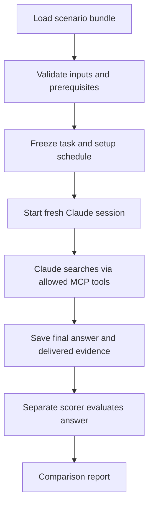

# Reusable agent harness

The harness runs the experiment: start Claude, give it a question, record its searches and answer, then hand those records to the scorer. **Headless** means the command-line agent runs without an interactive chat window.

The current path uses an empty workspace and evidence tools. Claude does not edit a checked-out repository in these experiments.

## One task, from start to finish



A scenario bundle is the experiment kit: evidence, public questions, private expected facts and plan criteria, connection settings and limits. Claude receives the question, not the private answer criteria. It chooses its own searches and may retrieve repeatedly within the limits.

## Bundle contract

```text
scenario/
  experiment.yaml
  corpus/manifest.json
  corpus/hubs/<hub>/artifacts.jsonl
  corpus/hubs/<hub>/capabilities.json
  connections/principals.json
  public/tasks.jsonl
  public/instructions.txt
  private/gold.jsonl
  runtime/                     # when a Sanctum arm is configured
```

All referenced paths stay within the bundle’s root. File hashes record exact inputs so changes cannot pass unnoticed. Each public question and its private criteria share a `task_id`.

The criteria contain required facts, evidence or missing-evidence obligations, and any task-specific plan checklist. A diversity matrix records the task mix. See the complete [shipping example](../../examples/agent-bundles/shipping/experiment.yaml).

### What you choose

- **Workspace mode:** currently evidence-only with an empty workspace.
- **Agent:** Claude Code, exact model, effort and authentication mode.
- **Tool setup:** direct hubs or Sanctum-only.
- **Limits:** rounds, calls, evidence tokens, deadline and inference allowance.
- **Execution:** repetitions and random seed, with fresh sessions.

### What the harness verifies

- Paths stay inside the bundle; file hashes match.
- Questions and private criteria link correctly and satisfy task-mix checks.
- The installed CLI and its isolation/round controls match their verification records.
- A Sanctum setup names a reviewed memory release and verified runtime configuration.
- Dispatch is explicitly allowed and any required acceptance gates are satisfied.

[bundle.py](../../src/sanctum_run/bundle.py) checks the offline inputs. Passing it alone does not enable model calls. [agent_contract.py](../../src/sanctum_run/agent_contract.py) and [agent_runtime.py](../../src/sanctum_run/agent_runtime.py) check execution prerequisites.

## Controller and evidence path

The controller is the code that manages a run. It does four jobs:

| Job | Implementation |
|---|---|
| Record the task, setup and repetition to execute, using a fixed random seed | [agent_schedule.py](../../src/sanctum_run/agent_schedule.py) |
| Start the gateway and selected agent adapter | [agent_runner.py](../../src/sanctum_run/agent_runner.py) |
| Create isolated home, configuration and workspace directories; start the agent CLI; enforce limits | [agent_session.py](../../src/sanctum_run/agent_session.py) |
| Relay MCP messages through the session’s local socket | [agent_bridge.py](../../src/sanctum_run/agent_bridge.py) |

An adapter translates the harness’s commands into the chosen agent’s command-line behavior. Claude Code is the implemented native adapter.

The direct arm exposes authorized hub tools. The Sanctum arm exposes only `sanctum_retrieve`; Sanctum then calls hubs through the gateway. [delivery.py](../../src/sanctum_run/delivery.py) normalizes both paths into citable passages and charges all displayed evidence metadata against shared limits. Full-file and search results must become observed, versioned evidence before citations can earn credit.

### Sessions and authentication

Every attempt starts fresh so earlier conversations cannot influence later answers.

- The bundle selects API authentication **or** subscription authentication.
- Subscription mode uses Claude Code’s cached first-party OAuth credential; it does not fall back to an API key.
- Verification records identify the exact installed CLI, model and authentication mode.

These controls cover the evidence-only experiment. They are not a hostile-code sandbox for future tasks that edit and execute repositories.

## Durable outputs

| Record | Meaning |
|---|---|
| `schedule.json` | Immutable task/arm/repetition plan and input hashes |
| `attempts.json` | Locked dispatch/terminal ledger; unresolved attempts cannot be replayed |
| `attempts/<id>/events.jsonl` | Native agent events |
| `attempts/<id>/result.json` | Terminal status, effective tools, observed MCP calls, delivered evidence and accounting |
| `attempts/<id>/answer.json` | Original final answer text |
| `structured-answer.json` | Optional strictly parsed sidecar; original text remains authoritative |

The fixture agent tests orchestration, not Claude capability. Future Codex/Pi adapters and local editing/testing workflows need separate implementation and containment.

[Back to start](README.md). Next: [runbook](runbook.md), [scoring](scoring.md), [extending](extending.md).
