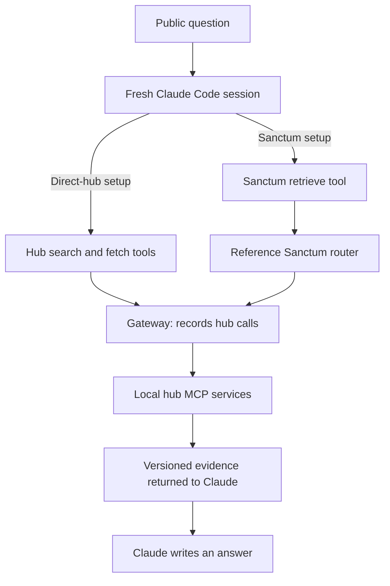
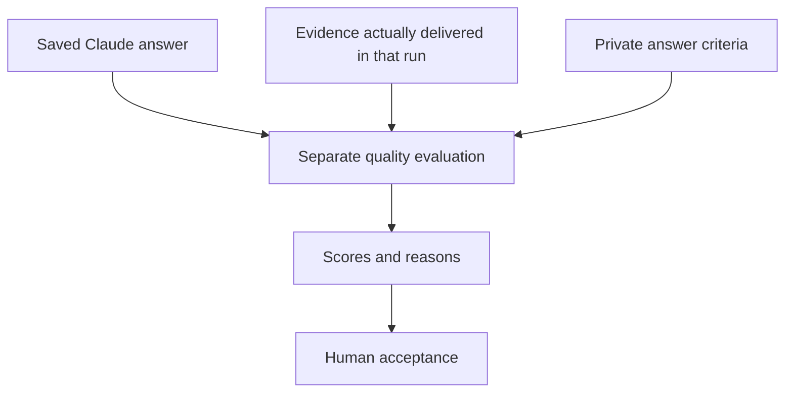

# Architecture: how a question becomes an answer

Claude writes the answer. Sanctum finds evidence for it. The hubs serve that evidence, and a separate scorer evaluates the saved answer afterward.

For example, Claude might be asked: “What happens when fraud checking times out, and what should we test?” In the Sanctum setup, Claude asks Sanctum for evidence rather than choosing hub tools itself.

## What is set up in this reference implementation?

There are three stages: prepare information, run a question, and evaluate the answer. The preparation tools run before the experiment. The scorer runs afterward.

| Stage | Component | Its job |
|---|---|---|
| Prepare | Synthetic world and corpus tooling | Create versioned evidence and separate private evaluation facts |
| Prepare | Hierarchy mapper and ingester | Put artifacts into hubs and attach repository, service, domain and team links |
| Prepare | Memory harvest and review pipeline | Propose evidence-backed subject links and assemble reviewed routing memory |
| Answer | Hub services | Search and fetch code, documents, procedures and prior-session records |
| Answer | Gateway | Carry hub calls with the intended caller identity and record what happened |
| Answer | Reference Sanctum router | Resolve subjects, choose sources, retrieve passages and pack evidence |
| Answer | Routing-memory store | Supply reviewed names, subjects and search locations to the router |
| Answer | System One broker and provider | Obtain and record source-usefulness decisions; Jev is the hosted provider in these experiments |
| Answer | Agent harness and Claude Code | Start isolated sessions, expose tools, enforce limits and save Claude’s answer |
| Evaluate | Reference evaluator | Check Sanctum retrieval responses directly against private world facts |
| Evaluate | Agent scorer and report tools | Check Claude’s saved answers and compare experimental setups |

A **reference implementation** is the executable design we use to investigate behavior. It includes simulated local hubs and experimental controls; it is not a deployment of real enterprise connectors.

## What is local, and what calls a model service?

Hub evidence, indexes, memory releases, scenario bundles and run records are stored locally. Routing memory is loaded into the Python process from reviewed files; there is no external graph database.

Real Claude Code runs and hosted Jev decisions call their respective services. LLM corpus authoring and semantic judging also make external calls when those workflows are used. The offline tutorial uses a fixture agent and needs neither Claude nor Jev inference.

## How the setup becomes a runnable experiment

1. Prepare and audit the corpus, then load it into the hubs.
2. Build and review the routing-memory release used by Sanctum.
3. Package public questions, private scoring criteria and exact input versions into a scenario bundle.
4. Verify the configured agent, System One provider, authentication and execution controls.
5. Freeze a schedule, run fresh sessions, then score saved answers separately.

The [quickstart](quickstart.md) demonstrates the smaller checked-in fixture. The [runbook](runbook.md) explains prerequisites for real model runs. The larger PDLC inputs live locally and are not recreated by cloning the repository.

## The agent experiment

An **arm** means one setup being compared. Each run uses a fresh Claude Code session with one of these tool setups:

The arrows show the evidence path. Only one setup is exposed to Claude in a given run. MCP is the protocol used to call tools; it is not the storage system.

Claude chooses its searches and can ask follow-up questions within the run’s limits. The harness supplies a task, not a script of searches.

## Inside Sanctum

Sanctum resolves the question’s intent and subjects, selects sources, searches them, and returns a compact set of passages with citation details. Its [routing memory](routing-memory.md) supplies reviewed names and search scopes. [System One](system-one.md), using Jev in the hosted experiments, supplies source-usefulness decisions. The configured mode determines how those decisions affect selection.

System One calls pass through a runner-owned broker. That broker holds provider credentials and records model calls. Claude does not call Jev directly. MemoryHub is a separate hub containing prior-session evidence; it is different from Sanctum’s routing memory.

## Scoring happens outside the answer path

The private criteria never go to Claude or Sanctum. Finishing a run proves that execution finished; it does not prove that the answer is correct.

## The other path: test retrieval without Claude

The lab also tests Sanctum directly. The lab runner sends a retrieval request to the reference Sanctum process, which calls the gateway and hubs. The world evaluator then checks the returned evidence and recorded hub calls against private gold. This path evaluates retrieval; it does not evaluate a Claude-written design plan.

## Where the boundaries are enforced

| Boundary | Implementation |
|---|---|
| Claude sees the question and delivered evidence | Empty workspace, isolated configuration and restricted MCP tools |
| Hub calls carry the intended caller identity | Gateway-owned tokens and audience checks |
| Sanctum has no access to private scoring criteria | Separate process environment and transport, checked by isolation tests |
| The judge receives no explicit arm labels | Neutral evidence aliases; tool, arm and cost metadata removed |
| Execution and answer quality stay separate | Saved run records, semantic scoring and human acceptance |

Removing arm labels reduces obvious judging bias; it does not guarantee that a judge cannot infer a setup from answer content.

## Find the code

| Responsibility | Entry point |
|---|---|
| Start an agent run and gateway | [agent_runner.py](../../src/sanctum_run/agent_runner.py) |
| Expose the selected MCP tool setup | [agent_mcp.py](../../src/sanctum_run/agent_mcp.py) |
| Start Sanctum as a separate process | [process_sut.py](../../src/sanctum_run/process_sut.py) |
| Retrieve and pack evidence | [sanctum_ref](../../src/sanctum_ref/__main__.py) |
| Run the direct retrieval experiment | [runner.py](../../src/sanctum_run/runner.py) |
| Score direct retrieval responses | [metrics.py](../../src/sanctum_eval/metrics.py) |

Next: [corpus and hubs](corpus-and-hubs.md). Commands: [runbook](runbook.md). [Back to start](README.md).
