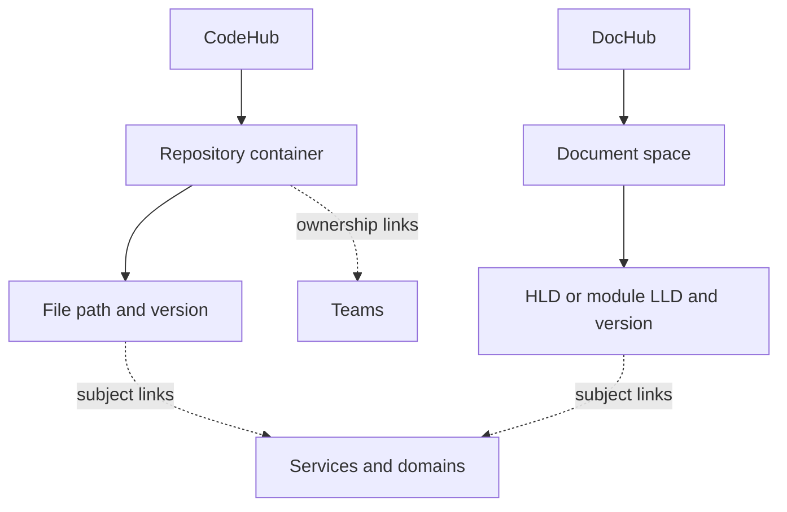
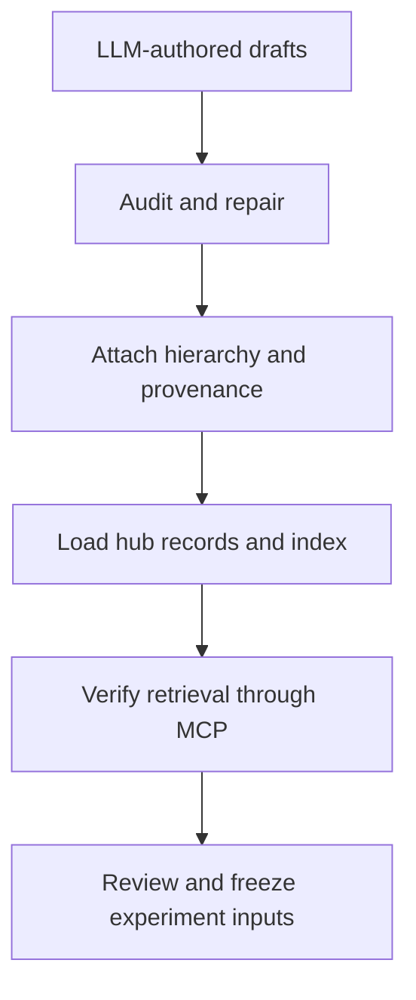

# Corpus and knowledge hubs

A hub is a searchable source of evidence. The pilot’s four hubs group information by **type**, while business domains such as Payments and Fraud cut across them.

The current corpus has 120 synthetic artifacts: 25 code, 49 documents, 16 procedures and 30 memories. The code lives in six repository containers across five domains: Payments, Identity, Platform, Ledger, and Fraud and Risk. The 25 code artifacts are files or fragments, not 25 repositories.

## What each hub contains

| Pilot hub | Evidence | Typical home |
|---|---|---|
| CodeHub | Code, schemas, configuration and tests | Repo container → file path → version |
| DocHub | Designs, contracts, proposals and discussions | Document space → document/module path → version |
| SkillHub | Testing, rollout and recovery procedures | Guidance collection → procedure path |
| MemoryHub | Prior investigations, sessions and handoffs | Session collection → session ID |

## How the hierarchy works

The solid arrows show where an item lives. The dotted arrows show associations. A file or document can concern multiple services and domains; a repository can have multiple team links. A document-to-repo link helps navigation, but does not prove the document describes current code behavior.

SkillHub uses guidance collections and procedure paths. MemoryHub uses session collections and session IDs. IncidentHub exists in the base lab but is outside this pilot.

## What runs locally

The hubs are working MCP services backed by local JSONL files and an SQLite FTS5 text-search index. They simulate knowledge sources rather than connect to live production repositories.

## What an artifact record contains

Each hub has two input files under `hubs/<hub_id>/`:

| File | Contents |
|---|---|
| `artifacts.jsonl` | One artifact record per line |
| `capabilities.json` | The operations and source behavior the hub declares |

An artifact has an ID, version, text, title, kind, path, location, environment, access rules and metadata. The exact field names are defined by [HubRow](../../src/sanctum_hubs/corpus.py).

The source, artifact ID and version together identify an item. A content hash identifies its exact text. The manifest records file hashes so a run can detect changed inputs.

**Example:** a handler file in CodeHub has a repository and path as its home. Its metadata can link it to Payment Authorization, Payments, Fraud and a team. A timeout proposal in DocHub can link to that same repository and service while keeping its own document path, version and draft status.

The 18 added design documents provide one high-level design (HLD) and two module-level designs (LLDs) per repository. Their draft status is preserved.

[map_pdlc_hierarchy.py](../../tools/map_pdlc_hierarchy.py) assigns navigation containers and cross-links. [ingest_pdlc_corpus.py](../../tools/ingest_pdlc_corpus.py) preserves those mappings in metadata and converts audited drafts into HubRow records. A document-to-repo association does not make that document authoritative for current code behavior.

## How artifacts enter the hubs

“Ingestion” means converting audited drafts into hub records, loading them and checking that MCP can retrieve them. It does not make their content authoritative or accept the evaluation criteria.

### Checks at each step

| Transition | Artifact and responsible role | Check |
|---|---|---|
| Author drafts | LLM author packets and raw outputs; corpus author | Local-context grounding, introduced claims and cost receipts |
| Audit and repair | Audited candidate and review receipts; corpus reviewer | Interfaces, versions, contradictions, realism and leakage |
| Package and load | `build/pdlc-pilot/`; ingestion operator | Design/source review hashes, hierarchy, unique IDs, hub schema |
| Verify retrieval | MCP verification receipt; lab operator | Every artifact can be fetched with the intended caller identity |
| Accept/freeze evaluation | Experiment readiness and task-gold records; independent evaluator | Separate gold acceptance and pinned snapshots; loading alone is insufficient |

## Which script does what?

| Tool | Job |
|---|---|
| [generate_pdlc_corpus.py](../../tools/generate_pdlc_corpus.py) | Author drafts through OpenAI or Gemini, with bounded jittered retries and spend reservations |
| [map_pdlc_hierarchy.py](../../tools/map_pdlc_hierarchy.py) | Assign homes and repository/service/domain/team cross-links |
| [ingest_pdlc_corpus.py](../../tools/ingest_pdlc_corpus.py) | Convert audited drafts into hub records while preserving mappings |
| [servers.py](../../src/sanctum_hubs/servers.py) | Serve source-specific MCP search and fetch tools |
| [access.py](../../src/sanctum_hubs/access.py) | Enforce caller access-control lists (ACLs) |
| [versions.py](../../src/sanctum_hubs/versions.py) | Control which artifact versions can be read |

Important limits:

- Model IDs and price records are explicit authoring inputs, not a claim that historical settings remain current.
- The PDLC ingester writes only `build/pdlc-pilot` and requires local audited inputs.
- A fresh checkout does not automatically recreate the PDLC corpus. Start with the checked-in shipping fixture or supply audited inputs.
- Mutations and failure injection are runner/admin operations, not agent tools.

Next: [routing memory](routing-memory.md), [extending](extending.md), [runbook](runbook.md). [Back to start](README.md).
