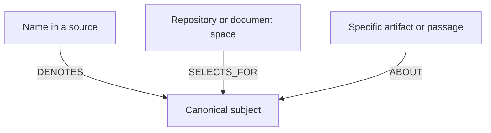
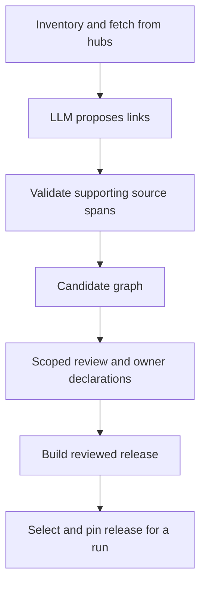

# Sanctum routing memory

Routing memory is Sanctum’s map: what names mean, which subjects exist, and where to look for information about them. MemoryHub holds the actual notes from prior sessions and investigations.

For example, a name in a code source can identify Payment Authorization. A repository can be a useful place to search for that subject. A particular handler file can discuss the same subject. Those are three different links.

This diagram explains the link meanings; it is not a dump of the current graph. An ABOUT link says a specific artifact discusses a subject. It does not say every file in its repository discusses that subject. Bindings include the artifact’s version and content hash, so they apply to the evidence that was actually reviewed.

## Link types and implementation

| Relation or record | Meaning | Runtime treatment |
|---|---|---|
| DENOTES | A scoped native name identifies a canonical entity | Accepted names support resolution |
| SELECTS_FOR | A source place is a useful search scope for an entity | Accepted selectors guide retrieval |
| MEMBER_OF | An explicit entity/domain membership | Trusted declarations guide context |
| ABOUT | An artifact or passage discusses a subject | Accepted, version/hash-bound subjects affect evidence identity |
| Procedures and authority assertions | Reviewed routing obligations and fact-kind authority | Scoped owner declarations and review required |
| PARENT / related associations in harvest | Navigation/context structure | Do not assume every harvested edge is traversed at runtime |
| RELATES_TO | Relationship retained for review | Stored, deliberately unused operationally |

### How proposals are grounded

The [harvest connector](../../src/sanctum_ref/harvest.py) lists artifacts in pages and fetches exact versions. It checks that the inventory stayed stable while collecting it.

An LLM can propose links from those artifacts. Validators check source IDs, hashes and the exact passage supporting each proposal. Unsupported proposals are set aside for review. A plausible LLM sentence is not enough to establish a link or declare ownership.

### How the graph is implemented

It is a local in-memory graph. [RelationStore](../../src/sanctum_ref/memory.py) stores entities in dictionaries keyed by ID. Its adjacency-style lists record which relationships leave a subject. Edge types such as `DENOTES` are relationship labels that the code validates.

For ABOUT links, a separate lookup matches source, artifact, version and content hash. `TableStore` offers the same queries using flat tables. Neither backend requires an external graph database.

The candidate files contain proposed nodes and assertions. Runtime projection means converting accepted, supported records into the lookup structures Sanctum can use. A stored link is not necessarily a link the router follows.

## From collected evidence to usable memory

The candidate is a draft. A runtime release contains the supported records accepted for use. Building a candidate does not change which release Sanctum uses. Source-owner policy must be declared explicitly; an LLM cannot create it from prose.

### Responsibilities and checks

| Step | Responsible role | Artifact / check |
|---|---|---|
| Declare source policy | Source owner, or explicitly scoped synthetic lab curator | Owner registry, membership, authority and routing declarations |
| Collect and propose | Harvest connector / LLM author | Stable inventory snapshot and grounded candidate assertions |
| Decide assertion status | Delegated reviewer | Candidate snapshot hash, reviewer identity and source/edge/entity grants |
| Assemble release | Release operator | `review_bundle` / `project_release`; unspecified proposals stay unreviewed |
| Select runtime release | Experiment operator | Explicit memory release argument or `ACTIVE` pointer; runtime pins and scoped review bindings checked |
| Accept an evaluation | Independent evaluator | Corpus/task acceptance separate from runtime memory selection |

### What “active” means

A graph is active for a run when that run selects its reviewed release. [agent_runtime.py](../../src/sanctum_run/agent_runtime.py) checks the release and matching review, reviewer permissions and owner-policy versions before starting Sanctum.

The harvest pipeline does **not** change the global `ACTIVE` pointer. Experiments should select a specific release explicitly. Changing `ACTIVE` would affect later reference runs that do not name a release.

The pilot's reviewed release is synthetic lab policy. Some assertions remain unreviewed; unknown subjects stay unknown. Owner declarations cannot be inferred from prose or invented to fill a graph gap. Each record retains who may see it and which source version supports it.

[Back to start](README.md). Next: [System One](system-one.md), [runbook](runbook.md), [HLD artifacts](../../design/intelligence-layer/README.md).
