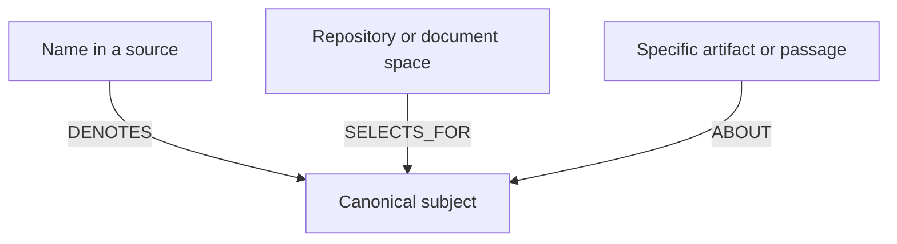
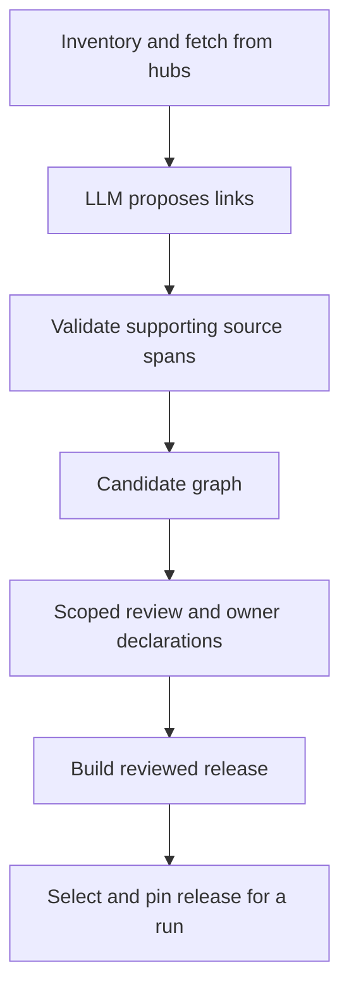

# Sanctum routing memory

Routing memory is Sanctum’s map: what names mean, which subjects exist, and where to look for information about them. MemoryHub holds the actual notes from prior sessions and investigations.

For example, a name in a code source can identify Payment Authorization. A repository can be a useful place to search for that subject. A particular handler file can discuss the same subject. Those are three different links.

This diagram explains the link meanings; it is not a dump of the current graph. An ABOUT link says a specific artifact discusses a subject. It does not say every file in its repository discusses that subject. Bindings include the artifact’s version and content hash, so they apply to the evidence that was actually reviewed.

## Link types, with examples

A **canonical subject** is the shared identity used across sources, such as Payment Authorization. A **selector** is a search scope, such as a repository or document space. Names can differ across hubs while referring to the same subject.

The examples illustrate the meanings; they are not a claim that these exact strings occur in the current release.

| Link | Plain meaning | Example |
|---|---|---|
| DENOTES | This name identifies this subject | A service’s short name means Payment Authorization |
| SELECTS_FOR | This place is worth searching for this subject | The payment-authorization repository |
| ABOUT | This specific artifact discusses this subject | A handler file at a reviewed version |
| MEMBER_OF | This subject belongs to a declared group | Payment Authorization belongs to Payments |

Other records have narrower uses:

- **Authority and procedures:** explicit, reviewed declarations about reliable fact sources and routing obligations.
- **PARENT:** navigation/context links collected during harvest; do not assume every link is followed by the router.
- **RELATES_TO:** retained for review, deliberately unused operationally.

### How proposals are grounded

The [harvest connector](../../src/sanctum_ref/harvest.py) lists artifacts in pages and fetches exact versions. It checks that the inventory stayed stable while collecting it.

An LLM can propose links from those artifacts. Validators check source IDs, hashes and the exact passage supporting each proposal. Unsupported proposals are set aside for review. A plausible LLM sentence is not enough to establish a link or declare ownership.

### How it is stored — for implementers

It is a local in-memory graph. [RelationStore](../../src/sanctum_ref/memory.py) stores entities in dictionaries keyed by ID. Its adjacency-style lists record which relationships leave a subject. Edge types such as `DENOTES` are relationship labels that the code validates.

For ABOUT links, a separate lookup matches source, artifact, version and content hash. `TableStore` offers the same queries using flat tables. Neither backend requires an external graph database.

The candidate files contain proposed nodes and assertions. Runtime projection means converting accepted, supported records into the lookup structures Sanctum can use. A stored link is not necessarily a link the router follows.

## From collected evidence to usable memory

The candidate is a draft. A runtime release contains the supported records accepted for use. Building a candidate does not change which release Sanctum uses. Source-owner policy must be declared explicitly; an LLM cannot create it from prose.

### Who reviews what?

| Responsibility | Role | Output |
|---|---|---|
| Declare membership, authority and routing policy | Source owner or authorized synthetic-lab curator | Owner-policy records |
| Propose grounded links | Connector and LLM author | Candidate graph with supporting evidence |
| Accept or reject links | Reviewer authorized for those sources and link types | Review tied to the exact candidate version |
| Build the usable memory version | Release operator | Reviewed release |
| Choose memory for an experiment | Experiment operator | Bundle pointing to that release |
| Accept task criteria and results | Independent evaluator | Separate evaluation acceptance |

Reviewer permissions are sometimes called **grants**. They specify which sources, entities and link types the reviewer may accept. Release checks verify those permissions as well as the input hashes.

### What “active” means

A graph is active for a run when that run selects its reviewed release. Building a candidate does not activate it.

- [agent_runtime.py](../../src/sanctum_run/agent_runtime.py) checks the release, review, reviewer permissions and owner-policy versions.
- The harvest pipeline does **not** change the global `ACTIVE` pointer.
- Experiments should choose a specific release. Changing `ACTIVE` affects later reference runs that do not name one.
- Unreviewed assertions remain unreviewed; unknown subjects remain unknown.
- Each record retains its visibility rules, source version and supporting evidence.

The pilot’s owner policy is explicitly synthetic lab policy. It cannot be inferred from prose or invented to fill a gap.

[Back to start](README.md). Next: [System One](system-one.md), [runbook](runbook.md), [HLD artifacts](../../design/intelligence-layer/README.md).
