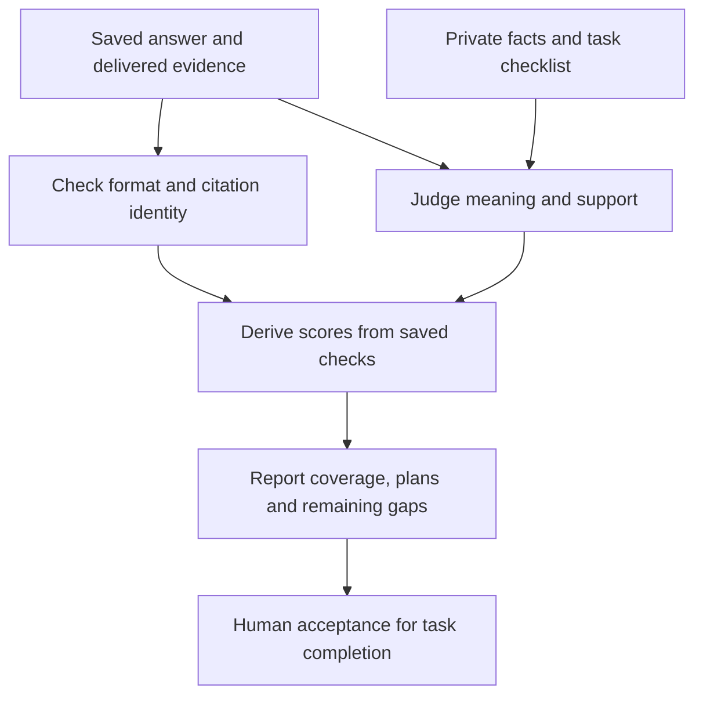

# Scoring and interpreting results

The scorer asks whether Claude answered the question correctly **using the evidence it actually received**. It compares meaning, not exact wording. Finishing a run and completing a task are separate outcomes.

## A simple example

Suppose a task requires five equally weighted facts. Claude explains four correctly and cites evidence that supports them. Fact coverage is 4/5, or **80%**. This does not mean that 80% of tasks were completed.

If the task also asks for a rollout plan, the answer must satisfy that checklist too. A high fact score can still leave the task incomplete.

The software checks citation identity. The semantic judge checks whether the cited passage actually supports the claim. A citation can point to the right file but still fail to support the sentence.

Commands are in the [runbook](runbook.md).

## Reference/world scoring

[sanctum_eval.metrics](../../src/sanctum_eval/metrics.py) evaluates retrieved evidence, conflicts, source obligations and safe grounded success using private gold plus observed traces. World gold is derived from authored world facts; M0 uses hand-authored fixture gold. These metrics evaluate the retrieval response, not a Claude-written design plan. See [measurement-plan.md](../measurement-plan.md) for the reference experiment's detailed measurement definitions.

## Agent mechanical and semantic scoring

The answer format has `schema_version`, prose `answer`, `claims` with IDs/text/citations, `uncertainties` and `unmet_requirements`. Phrasing need not match an answer key. [agent_score.py](../../src/sanctum_run/agent_score.py) uses distinct checks:

| Check | What earns credit |
|---|---|
| Protocol and citations | Parseable envelope; correct source/artifact/version/span/hash; passage actually delivered to this attempt |
| Required facts | Judge finds the meaning established, supported by declared claims and entailing delivered citations |
| Boundary facts | Precise missing-evidence diagnosis, relevant observed investigation and configured source obligations; generic refusal is insufficient |
| Whole-answer grounding | Inspect prose beyond the declared claim list for fabricated or uncited facts and contradictions |
| Plans | Score each dimension 0 absent/wrong, 1 partial with named gap, 2 all task-specific mandatory items coherently met |
| Completion | All required facts, supported citations, full required plan, uncertainties/caller obligations, no material unsupported claims or unresolved contradictions, observed retrieval and no declared unmet requirements |

## What do plan scores 0, 1 and 2 mean?

Each task defines its own mandatory items before the run. For a testing dimension, those might include the scenarios and expected outcomes that must be covered.

| Score | Meaning | Example |
|---|---|---|
| 0 | Missing or wrong | No test plan, or tests for the wrong behavior |
| 1 | Partly meets the checklist | Covers the normal case but omits a required timeout case |
| 2 | Meets every mandatory item in that dimension coherently | Covers all required cases and their expected results |

Two is the top checklist score, not a bug or a count of tests. It does not mean the whole answer passed.

## How design tasks are judged

A high-level design (HLD) is judged on responsibilities, boundaries, dependencies and reasoned tradeoffs. A low-level design (LLD) is judged on interfaces, data and state flow, error handling, compatibility and testability.

The private rubric names the required items for that task. It allows multiple sound proposed designs. Claims about the existing system need supporting evidence; proposed choices must be clearly labeled as proposals.

## Supported, partial and out-of-scope tasks

| Task type | What a good answer does |
|---|---|
| Supported | Establishes required facts from available evidence and completes the requested work |
| Partially supported | Explains what is known and identifies the specific missing information |
| Out of scope | Identifies what the corpus cannot establish, after the relevant investigation; avoids inventing an answer |

A generic “I cannot answer” is not sufficient for a boundary task. The answer must explain the actual evidence limit.

### Details of the saved judgment

Semantic packets include the public task, private criteria, neutral evidence inventory and investigation context, without arm/tool/cost identifiers. Each review is bound to a packet hash; schemas require per-item labels and reasons. Mechanically valid citations are not automatically semantically supporting citations.

## Failures and acceptance

Only a strict outer JSON fence may be removed. Invalid JSON is a zero-credit protocol failure, retained in the denominator. Do not rewrite an agent answer, manufacture a citation or rerun a poor answer to improve the result.

The quality driver permits one policy-declared format retry for malformed judge output, preserving the first response and error. It does not supply missing semantic labels. The latest follow-up also records a narrowly scoped format repair that removed plan annotations where the frozen checklist was empty; see its [recovery record](../experiments/pdlc-rubric-followup-results.md#scoring-recovery-and-verification). After an exhausted schema retry, the driver records an unknown review failure and continues other judgments. The report remains incomplete where grades are missing; no agent-quality zero is invented. Calibration disagreement is a gate to investigate, not permission to pick the nicer grade.

A task is provisionally complete only when all its required facts and applicable plan items pass, citations support the claims, uncertainty and caller obligations are satisfied, and no material unsupported claims, unresolved contradictions or declared unmet requirements remain. The attempt must have completed with observed retrieval.

Evidence delivery limits are reported separately. A limit flag alone does not prove that an otherwise complete answer failed.

`provisional_task_complete` means the automated checks passed. `task_complete` additionally requires the matching human acceptance. Human acceptance requires a pinned human-reviewer registry and a receipt bound to the answer, gold, attempt and review. Independent acceptance of task gold is another prerequisite. The current PDLC judge is Sonnet 5.5 low judging Sonnet answers: same-model bias and post-run scoring-policy repairs must be disclosed. Human spot checks and all boundary-gold acceptance are still pending; this is exploratory development scoring.

## How we check whether grading is wrong

Compare three things: the source passage, Claude’s answer, and the judgment. If Claude omitted a required fact, that is an answer gap. If Claude stated the fact correctly with supporting evidence but received no credit, investigate grading before changing Jev or memory.

The [follow-up results](../experiments/pdlc-rubric-followup-results.md) remain exploratory. Fact-versus-recommendation labeling disagreements are under investigation; do not treat every lost mark as a proven routing failure.

## Comparison rules

[report_agent_run.py](../../tools/report_agent_run.py) validates saved bindings and, with a quality policy, recomputes scores from saved reviews before aggregation. Report supported-fact coverage, citation support, unsupported claims, plan scores, provisional completion, reliability, cost and latency together. Keep supported, partial and out-of-scope strata separate so successful refusals cannot hide weak supported answers.

Average repetitions within each task/arm, then compare paired task differences. The seeded bootstrap resamples tasks, not individual facts or repeated runs. Thirty tasks within one scenario support directional findings; they do not resolve a narrow noninferiority margin or establish production adoption. Missing or invalid comparisons are labeled rather than silently dropped.

[Back to start](README.md). Next: [runbook](runbook.md), [rubric fixtures](../../tests/fixtures/agent-score-cases.json), [quality review dispositions](../experiments/quality-scoring-review-dispositions.md).
