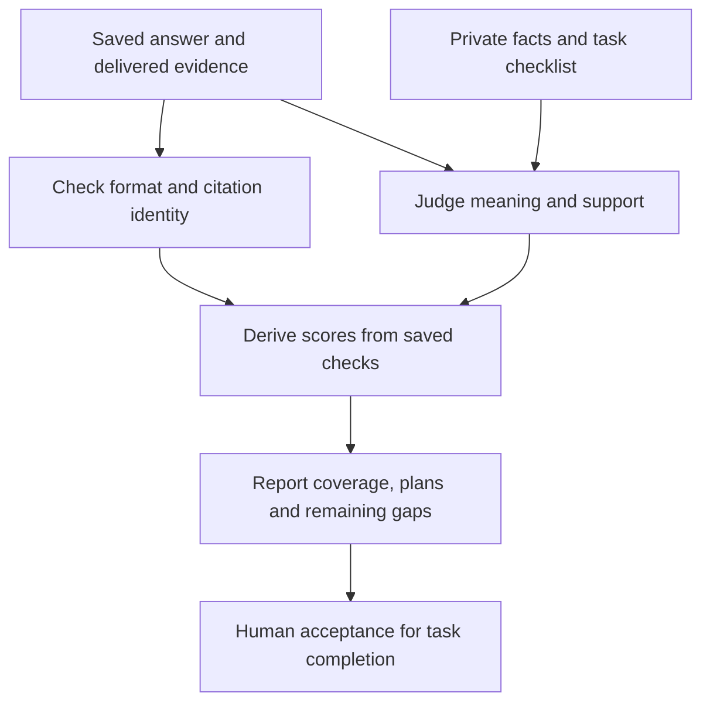

# Scoring and interpreting results

The scorer asks whether Claude answered the question correctly **using the evidence it actually received**. It compares meaning, not exact wording. Finishing a run and completing a task are separate outcomes.

## A simple example

Suppose a task requires five equally weighted facts. Claude explains four correctly and cites evidence that supports them. Fact coverage is 4/5, or **80%**. This does not mean that 80% of tasks were completed.

If the task also asks for a rollout plan, the answer must satisfy that checklist too. A high fact score can still leave the task incomplete.

The software checks citation identity. The semantic judge checks whether the cited passage actually supports the claim. A citation can point to the right file but still fail to support the sentence.

Commands are in the [runbook](runbook.md).

## Reference/world scoring

[sanctum_eval.metrics](../../src/sanctum_eval/metrics.py) evaluates retrieved evidence, conflicts, source obligations and safe grounded success using private gold plus observed traces. World gold is derived from authored world facts; M0 uses hand-authored fixture gold. These metrics evaluate the retrieval response, not a Claude-written design plan. See [measurement-plan.md](../measurement-plan.md) for the reference experiment's detailed measurement definitions.

## Agent mechanical and semantic scoring

The answer format has `schema_version`, prose `answer`, `claims` with IDs/text/citations, `uncertainties` and `unmet_requirements`. Phrasing need not match an answer key. [agent_score.py](../../src/sanctum_run/agent_score.py) uses distinct checks:

| Check | What earns credit |
|---|---|
| Protocol and citations | Parseable envelope; correct source/artifact/version/span/hash; passage actually delivered to this attempt |
| Required facts | Judge finds the meaning established, supported by declared claims and entailing delivered citations |
| Boundary facts | Precise missing-evidence diagnosis, relevant observed investigation and configured source obligations; generic refusal is insufficient |
| Whole-answer grounding | Inspect prose beyond the declared claim list for fabricated or uncited facts and contradictions |
| Plans | Score each dimension 0 absent/wrong, 1 partial with named gap, 2 all task-specific mandatory items coherently met |
| Completion | All applicable items in the completion checklist below |

## What do plan scores 0, 1 and 2 mean?

Each task defines its own mandatory items before the run. For a testing dimension, those might include the scenarios and expected outcomes that must be covered.

| Score | Meaning | Example |
|---|---|---|
| 0 | Missing or wrong | No test plan, or tests for the wrong behavior |
| 1 | Partly meets the checklist | Covers the normal case but omits a required timeout case |
| 2 | Meets every mandatory item in that dimension coherently | Covers all required cases and their expected results |

Two is the top checklist score, not a bug or a count of tests. It does not mean the whole answer passed.

## How design tasks are judged

A high-level design (HLD) is judged on responsibilities, boundaries, dependencies and reasoned tradeoffs. A low-level design (LLD) is judged on interfaces, data and state flow, error handling, compatibility and testability.

The private rubric names the required items for that task. It allows multiple sound proposed designs. Claims about the existing system need supporting evidence; proposed choices must be clearly labeled as proposals.

## Supported, partial and out-of-scope tasks

| Task type | What a good answer does |
|---|---|
| Supported | Establishes required facts from available evidence and completes the requested work |
| Partially supported | Explains what is known and identifies the specific missing information |
| Out of scope | Identifies what the corpus cannot establish, after the relevant investigation; avoids inventing an answer |

A generic “I cannot answer” is not sufficient for a boundary task. The answer must explain the actual evidence limit.

### Details of the saved judgment

Semantic packets include the public task, private criteria, neutral evidence inventory and investigation context, without arm/tool/cost identifiers. Each review is bound to a packet hash; schemas require per-item labels and reasons. Mechanically valid citations are not automatically semantically supporting citations.

## Failures: preserve the original answer

| Situation | What happens | What must not happen |
|---|---|---|
| Agent answer is invalid JSON or violates the protocol | Zero-credit failure remains in the totals | Rewrite the answer, manufacture citations, or selectively rerun the agent |
| Judge reply has the wrong format | One policy-declared retry; preserve both replies | Fill in missing semantic labels |
| Judge still fails after retry | Mark grading unknown; report the missing grade | Treat missing judgment as an agent-quality zero |
| Calibration or grading disagrees | Investigate | Choose the more favorable grade |

Only a strict outer JSON fence may be removed from the agent response. A **judge packet** is the saved question, private criteria and delivered-evidence context supplied to the judge; its hash ties the review to exact inputs.

## Completion: automated versus accepted

A task has two completion levels. Automated checks give the first; a matching human acceptance gives the second.

| Level | Field | Requirement |
|---|---|---|
| Passed automated checks | `provisional_task_complete` | Every applicable item below passes |
| Human accepted | `task_complete` | Automated completion plus recorded acceptance of that exact answer and review |

**Automated checklist — all must hold:**

- Every required fact is established with the required support.
- Citations are valid and support their claims.
- Every mandatory plan item is coherently met.
- Uncertainty and caller obligations are satisfied.
- No material unsupported claims or unresolved contradictions remain.
- The run completed with observed retrieval.
- The answer declares no unmet requirements.

**Acceptance requirements:**

- Human acceptance matches the answer, gold, attempt and semantic review.
- The human reviewer is registered and differs from the semantic adjudicator.
- Independent acceptance of task gold is a separate prerequisite.

Evidence-delivery limits are reported separately. A limit flag alone does not prove that an otherwise complete answer failed.

For dated judge configurations, grading repairs and acceptance status, see the [results index](../experiments/README.md). Keep these campaign-specific details out of the general scoring rules.

## How we check whether grading is wrong

Compare three things: the source passage, Claude’s answer, and the judgment. If Claude omitted a required fact, that is an answer gap. If Claude stated the fact correctly with supporting evidence but received no credit, investigate grading before changing Jev or memory.

Do not treat a lost mark as a proven routing failure until the evidence, answer and scoring decision have been checked.

## Comparison rules

[report_agent_run.py](../../tools/report_agent_run.py) verifies saved input bindings and recomputes scores from saved reviews before aggregation.

- Report fact coverage, citation support, unsupported claims, plans and provisional completion separately.
- Keep supported, partial and out-of-scope tasks separate; successful refusals must not hide weak supported answers.
- Average repetitions within each task/setup, then compare paired task differences.
- Resample whole tasks for uncertainty intervals, not individual facts or repeated answers.
- Label missing or invalid comparisons rather than silently dropping them.
- Keep operational reliability, cost and latency alongside quality; they are different outcomes.

Thirty tasks within one scenario support directional findings. They cannot resolve a narrow quality margin or establish production adoption. See [experiment method](../experiments/method/README.md) for campaign setup.

[Back to start](README.md). Next: [runbook](runbook.md), [rubric fixtures](../../tests/fixtures/agent-score-cases.json), [quality review dispositions](../experiments/quality-scoring-review-dispositions.md).
