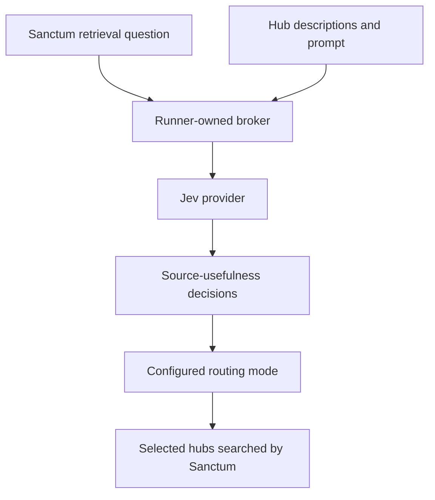
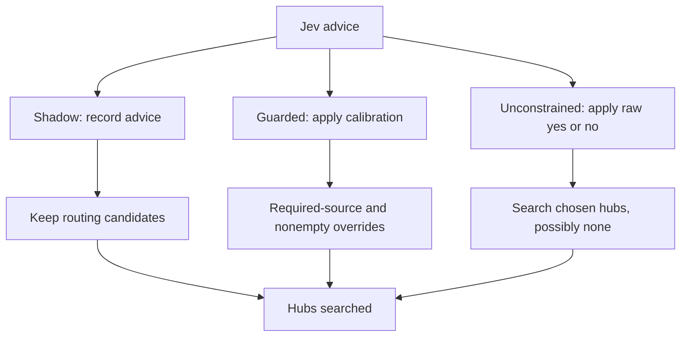

# System One: what Jev decides

System One is Sanctum’s decision layer. Earlier hosted experiments used Jev to choose hubs. The new entire-flow experiment also enables passage relevance and conflict assessment. Claude still writes the answer.

A **hub description** is the text Jev reads about a source’s contents. Changing that text changes the information available to Jev, even when the hub’s actual documents stay the same.

## The call path

The broker holds provider credentials and saves model-call records. Sanctum calls through the gateway; Claude has no Jev tool or provider key.

The diagram above shows hub selection; the additional relevance and conflict steps are described below.

## Which Jev advice actually affects routing?

The lab retains three experimental behaviors. A real Jev call alone does not tell you which one ran.

| Mode | Selection behavior | Result record |
|---|---|---|
| Shadow | Record advice; keep candidates when skip decisions are uncalibrated | [Original comparison](../experiments/pilot-0-quality-results.md) |
| Guarded | Apply calibrated filtering; required-source and nonempty rules can override it | [Guarded findings](../experiments/pdlc-jev-guarded-results.md) |
| Unconstrained | Select on raw usefulness probability ≥ 0.5; no selection overrides | [Unconstrained findings](../experiments/pdlc-jev-unconstrained-results.md) |

Calibration means checking decisions on separate development examples before choosing a threshold. The unconstrained mode deliberately uses raw decisions without that fitted threshold.

**In unconstrained mode:**

- Jev considers all eligible pilot hubs, rather than a rule-selected shortlist.
- Sanctum searches the hubs Jev selects. That can be none.
- No rule adds a hub back, and no calibration adjusts the raw decision.
- Memory can translate names and search scopes; it cannot add or remove a hub.
- Access checks, process isolation and run limits still apply.
- Missing model answers are recorded as unavailable; they do not trigger rules-based selection.

Experiment setup and budgets are in the [method guide](../experiments/method/README.md). Outcomes are in the [results index](../experiments/README.md).

## Passage relevance and conflict assessment

The Claude runner can now enable two additional reference decisions, independently or together:

- **D4 relevance:** Jev scores retrieved passages. Scores affect ordering and can add qualifying passages into spare budget; rule-packed evidence remains.
- **D6 conflicts:** Jev assesses candidate passage pairs. Positive decisions add possible conflicts; existing rule flags remain.

The [entire-flow experiment](../experiments/pdlc-jev-entire-flow-plan.md) uses explicit raw application, rather than silently falling back to shadow mode without calibration. These capabilities were not enabled in the earlier Claude campaign results. Its [48 scored runs](../experiments/pdlc-jev-entire-flow-results.md) show mixed quality: adding both hurt partial-evidence coverage, while conflict-only scored highest without promoting any conflict pairs. No new default was promoted.

Runtime `round3` settings declare `mode` (`d4`, `d6`, `both` or `none`), `policy` (`raw` or `calibrated`) and optional per-decision `templates`. Earlier bundles omit this field and remain unchanged. Raw mode accepts only non-diagnostic positive `noul` templates.

## Provider configuration and verification

Runtime bundles record the provider, descriptors, prompts, calibration files where applicable, resolved model and verification proof. A pinned model means a specific verified identifier, not a name that can silently resolve to a different model later.

Use native agent and broker records to establish what actually ran. Test providers exercise the connection without proving real model inference.

If a provider is unavailable, inspect the recorded error and the configured fallback. Earlier guarded behavior preserves candidates on uncertainty. Do not assume that behavior describes every experimental mode.

## Budgets and credentials

System One calls are accounted separately from Claude’s tool calls. Budgets belong to a campaign’s bundle, not to a routing mode globally.

| PDLC campaign | Broker calls per attempt | Input-token reservation per attempt |
|---|---:|---:|
| Original shadow and guarded | 2 | 10,000 |
| Unconstrained and four-variant follow-up | 32 | 500,000 |

Read the [method guide](../experiments/method/README.md#resource-limits) for the agent’s separate limits. New experiments must verify their own settings.

Unknown provider usage remains unknown and must be reconciled. An unissued request is different from a dispatched request whose usage receipt is missing.

Keys and authentication tokens stay in ignored local inputs. They are not corpus evidence or memory-release content. The hosted experiments use synthetic evidence.

## Find the code

| Responsibility | Entry point |
|---|---|
| Provider contract and budgets | [protocol.py](../../src/sanctum_systemone/protocol.py) |
| Broker, credentials and call records | [system_one_broker.py](../../src/sanctum_run/system_one_broker.py) |
| Decision implementations | [providers](../../src/sanctum_ref/providers/__init__.py) |
| Apply routing mode | [pipeline.py](../../src/sanctum_ref/pipeline.py) |

Verification: [provider tests](../../tests/test_system_one_providers.py), [broker tests](../../tests/test_system_one_broker.py), [runtime tests](../../tests/test_agent_runtime.py).

Next: [agent harness](agent-harness.md). [Back to start](README.md).
