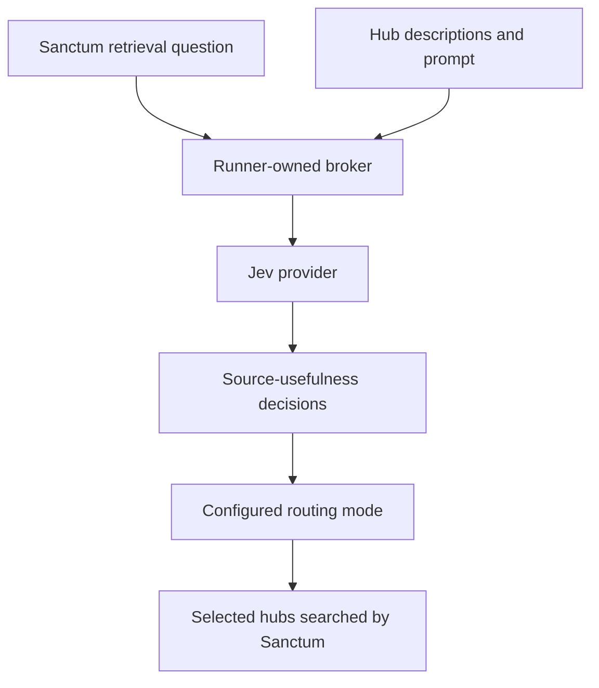

# System One: what Jev decides

System One is Sanctum’s decision layer. In the hosted experiments, Jev judges which hubs are likely to help answer a retrieval question. It selects evidence sources; Claude still writes the answer.

A **hub description** is the text Jev reads about a source’s contents. Changing that text changes the information available to Jev, even when the hub’s actual documents stay the same.

## The call path

The broker holds provider credentials and saves model-call records. Sanctum calls through the gateway; Claude has no Jev tool or provider key.

## Which Jev advice actually affects routing?

The lab retains three experimental behaviors. A real Jev call alone does not tell you which one ran.

| Mode | What happens to Jev’s advice? | What it tests |
|---|---|---|
| Original shadow mode | Advice is recorded; uncalibrated skip advice does not remove sources | Sanctum with Jev calls and overhead, without that source-pruning effect |
| Calibrated guarded mode | Jev can prune candidates, but required-source and nonempty-source rules can override it | Jev filtering within the earlier routing rules |
| `jev_unconstrained` | Jev considers all eligible hubs and can choose all, some or none; no forced-source or nonempty override | Jev’s source-selection choices, including mistakes |

Calibration means checking decisions on separate development examples before choosing a threshold. Earlier modes use scoped calibration. The unconstrained mode deliberately applies raw decisions without that calibration gate.

“Unconstrained” refers to hub selection. Caller access checks, process isolation and run budgets still apply. In that mode, memory may help resolve names and translate searches, but it cannot force or exclude a hub. Selecting zero hubs is a possible recorded outcome.

The [active-Jev plan](../experiments/pdlc-jev-active-plan.md) preserves the transition between modes. The [unconstrained results](../experiments/pdlc-jev-unconstrained-results.md) and [four-variant follow-up](../experiments/pdlc-rubric-followup-results.md) record completed experiments. The follow-up’s richer descriptions and memory changes have not been promoted.

## Provider configuration and verification

Runtime bundles record the provider, descriptors, prompts, calibration files where applicable, resolved model and verification proof. A pinned model means a specific verified identifier, not a name that can silently resolve to a different model later.

Use native agent and broker records to establish what actually ran. Test providers exercise the connection without proving real model inference.

If a provider is unavailable, inspect the recorded error and the configured fallback. Earlier guarded behavior preserves candidates on uncertainty. Do not assume that behavior describes every experimental mode.

## Budgets and credentials

System One calls have their own accounting, separate from Claude’s tool calls. The pilot runtime requires positive per-attempt call and input-token limits; its configured allowance is at most two broker calls and a 10,000-input-token reservation per attempt. Other experiments must read their own bundle limits.

Unknown provider usage remains unknown and must be reconciled. An unissued request is different from a dispatched request whose usage receipt is missing.

Keys and authentication tokens stay in ignored local inputs. They are not corpus evidence or memory-release content. The hosted experiments use synthetic evidence.

## Find the code

| Responsibility | Entry point |
|---|---|
| Provider contract and budgets | [protocol.py](../../src/sanctum_systemone/protocol.py) |
| Broker, credentials and call records | [system_one_broker.py](../../src/sanctum_run/system_one_broker.py) |
| Decision implementations | [providers](../../src/sanctum_ref/providers/__init__.py) |
| Apply routing mode | [pipeline.py](../../src/sanctum_ref/pipeline.py) |

Verification: [provider tests](../../tests/test_system_one_providers.py), [broker tests](../../tests/test_system_one_broker.py), [runtime tests](../../tests/test_agent_runtime.py).

Next: [agent harness](agent-harness.md). [Back to start](README.md).
